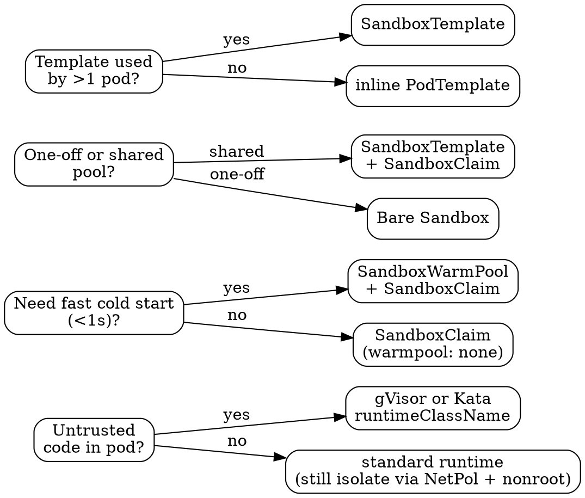

# Agent Sandbox — Kubernetes Operator for AI Agent Runtimes

[`kubernetes-sigs/agent-sandbox`](https://github.com/kubernetes-sigs/agent-sandbox) is a SIG Apps subproject that provides a Kubernetes-native primitive for **isolated, stateful, singleton workloads** — the shape needed for AI agent runtimes, code interpreters, computer-use browsers, dev sandboxes, and per-user Jupyter notebooks. It fills the gap between `Deployment` (stateless, replicated) and `StatefulSet` (numbered, replicated) by modelling a long-lived pod that can be paused, resumed, scheduled for expiry, and optionally pre-warmed.

Current API version is `v1alpha1`. Latest release at the time this skill was written is **v0.3.10** (April 2026). The project launched at KubeCon Atlanta in November 2025, so most training data predates it — prefer this skill over guessing.

## The Four CRDs

| CRD               | API group                             | Purpose                                                                                                            | Who creates it                               |
| ----------------- | ------------------------------------- | ------------------------------------------------------------------------------------------------------------------ | -------------------------------------------- |
| `Sandbox`         | `agents.x-k8s.io/v1alpha1`            | The singleton pod + headless service + PVCs. Supports `replicas: 0` (paused) or `1` (running).                     | Users directly, or `SandboxClaim` controller |
| `SandboxTemplate` | `extensions.agents.x-k8s.io/v1alpha1` | Reusable pod blueprint + shared `NetworkPolicy` per template.                                                      | Platform / infra team                        |
| `SandboxClaim`    | `extensions.agents.x-k8s.io/v1alpha1` | Ticket-style request that binds to a template and adopts a warm pool pod or creates fresh. Carries `shutdownTime`. | Application backend                          |
| `SandboxWarmPool` | `extensions.agents.x-k8s.io/v1alpha1` | Pool of pre-warmed `Sandbox` CRs (as of v0.3.10 — no longer bare pods). HPA-friendly via scale subresource.        | Platform / infra team                        |

The extensions CRDs are the normal way to use the operator in production. Raw `Sandbox` is available, but you lose warm pools, claim lifecycle, and network policy management.

## Install

No Helm chart exists yet (tracked in upstream issue #483). Use the release manifests:

```sh
export VERSION="v0.3.10"
kubectl apply -f https://github.com/kubernetes-sigs/agent-sandbox/releases/download/${VERSION}/manifest.yaml
kubectl apply -f https://github.com/kubernetes-sigs/agent-sandbox/releases/download/${VERSION}/extensions.yaml
```

Controller lands in namespace `agent-sandbox-system`. Cluster-scoped RBAC (no namespace-scoped deployment yet — issue #484). For production Kustomize, overlay the Deployment args — defaults are very conservative.

**Minimum controller args for any serious workload:**

```yaml
args:
  - --extensions # enables Template/Claim/WarmPool
  - --kube-api-qps=100
  - --kube-api-burst=200
  - --sandbox-concurrent-workers=25
  - --sandbox-claim-concurrent-workers=100
  - --sandbox-warm-pool-concurrent-workers=50
  - --sandbox-template-concurrent-workers=10
```

Defaults are `1` worker per controller and `10` burst QPS. That will throttle out instantly under any multi-tenant load.

## Which Shape Do You Need?



## Hello World

The absolute minimum — bare `Sandbox`, no template, no claim:

```yaml
apiVersion: agents.x-k8s.io/v1alpha1
kind: Sandbox
metadata:
  name: hello
spec:
  podTemplate:
    spec:
      containers:
        - name: app
          image: ghcr.io/example/agent-runtime:latest
      restartPolicy: Never
```

Apply it, then `kubectl get sandbox hello -o jsonpath='{.status.serviceFQDN}'` to get the cluster DNS. Hit the runtime at `{serviceFQDN}:<containerPort>`.

## Template → Claim → Warm Pool (the real shape)

```yaml
# 1. One-time: the template (shared across all claims)
apiVersion: extensions.agents.x-k8s.io/v1alpha1
kind: SandboxTemplate
metadata:
  name: code-interp
spec:
  networkPolicyManagement: Managed # or "Unmanaged" if Cilium owns networking
  podTemplate:
    spec:
      runtimeClassName: gvisor # isolation for untrusted code
      automountServiceAccountToken: false # default true in k8s, defaults false here
      securityContext:
        runAsNonRoot: true
        runAsUser: 1000
      containers:
        - name: runtime
          image: ghcr.io/example/runtime:v1
          ports:
            - containerPort: 8080
  networkPolicy:
    # default-deny applies; add explicit rules here
    egress:
      - ports:
          - protocol: UDP
            port: 53
          - protocol: TCP
            port: 53
---
# 2. One-time: the warm pool (scaled by HPA)
apiVersion: extensions.agents.x-k8s.io/v1alpha1
kind: SandboxWarmPool
metadata:
  name: code-interp-pool
spec:
  replicas: 3
  sandboxTemplateRef:
    name: code-interp
---
# 3. Per request: the claim (adopts a warm pod, sets expiry)
apiVersion: extensions.agents.x-k8s.io/v1alpha1
kind: SandboxClaim
metadata:
  name: session-abc123
spec:
  sandboxTemplateRef:
    name: code-interp
  warmpool: default # "none" | "default" | "<pool-name>"
  lifecycle:
    shutdownTime: "2026-04-20T18:00:00Z"
    shutdownPolicy: Delete # Delete | DeleteForeground | Retain
```

`SandboxClaim.status.sandbox.name` resolves to the assigned `Sandbox` within sub-second when a warm pool pod is available. `SandboxClaim.status.conditions[Ready]=True` means the pod answered its readiness probe.

Lowercase `.name` — **not** `.Name`. This changed in v0.3.10 and old code may still reference the capitalized form.

## CLI Cheat Sheet

| Task                          | Command                                                                                                                          |
| ----------------------------- | -------------------------------------------------------------------------------------------------------------------------------- |
| List sandboxes in a namespace | `kubectl get sandboxes.agents.x-k8s.io -n <ns>`                                                                                  |
| List claims                   | `kubectl get sandboxclaims.extensions.agents.x-k8s.io -n <ns>`                                                                   |
| Inspect a claim               | `kubectl describe sandboxclaim <name> -n <ns>`                                                                                   |
| Find the pod for a claim      | `kubectl get pods -n <ns> -l agents.x-k8s.io/claim-uid=<uid>`                                                                    |
| Tail controller logs          | `kubectl logs -n agent-sandbox-system deploy/agent-sandbox-controller -f`                                                        |
| Pause a sandbox               | `kubectl patch sandbox <name> -p '{"spec":{"replicas":0}}' --type=merge`                                                         |
| Resume                        | `kubectl patch sandbox <name> -p '{"spec":{"replicas":1}}' --type=merge`                                                         |
| Force expiry                  | `kubectl patch sandboxclaim <name> -p '{"spec":{"lifecycle":{"shutdownTime":"'$(date -u +%Y-%m-%dT%H:%M:%SZ)'"}}}' --type=merge` |
| Controller metrics            | `kubectl port-forward -n agent-sandbox-system svc/agent-sandbox-controller-metrics 8080:8080` then `curl :8080/metrics`          |

Short name: `swp` for `SandboxWarmPool`. Use `kubectl api-resources --api-group=agents.x-k8s.io` to list aliases.

## Pod Lifecycle & `replicas: 0/1`

`spec.replicas` is constrained to `0` or `1`. It is **not** a scaling primitive.

| `replicas`    | Effect                                                                 |
| ------------- | ---------------------------------------------------------------------- |
| `1` (default) | Pod running, PVCs attached, Service resolves                           |
| `0`           | Pod deleted; PVCs + Service + Sandbox CR preserved. This is **pause**. |

Setting `replicas: 0` then back to `1` re-creates a pod that mounts the same PVCs, giving effective resume semantics. Useful for idle sessions that get reconnected.

`shutdownTime` (on either `Sandbox` or `SandboxClaim`) hits a wall clock — when it passes, `shutdownPolicy` determines what happens. The two resources take **different enums**:

| Policy             | On `Sandbox`                                                 | On `SandboxClaim`                                                                                                                                                                              |
| ------------------ | ------------------------------------------------------------ | ---------------------------------------------------------------------------------------------------------------------------------------------------------------------------------------------- |
| `Delete`           | Sandbox (and its Pod / Service / PVCs) deleted               | Claim deleted, cascading to backing Sandbox                                                                                                                                                    |
| `DeleteForeground` | _(not valid — Sandbox enum is `Delete\|Retain` only)_        | Foreground-cascade delete — the Claim remains with a `deletionTimestamp` until its backing Sandbox + Pod are fully terminated, so external systems can watch shutdown progress. New in v0.3.10 |
| `Retain`           | Pod / Service deleted, Sandbox CR kept with `Expired` status | Backing Sandbox deleted, Claim kept with `Expired` status                                                                                                                                      |

**Defaults are not symmetric.** `Sandbox.spec.lifecycle.shutdownPolicy` is a pointer and nil-maps to retain-on-expiry behavior (the controller only deletes when `Delete` is explicit). `SandboxClaim.spec.lifecycle.shutdownPolicy` is a plain string and its empty value is treated as `Delete`. If you want a Sandbox to self-delete on expiry, set `Delete` explicitly.

## Network Policy — Secure-by-Default

Since v0.2.1, when `networkPolicyManagement: Managed` **and** `spec.networkPolicy` is omitted, the controller applies a **secure-by-default** posture:

- **Ingress:** only from pods labeled `app: sandbox-router` (the SDK's router service).
- **Egress:** allowed to `0.0.0.0/0` **except** RFC1918 (`10.0.0.0/8`, `172.16.0.0/12`, `192.168.0.0/16`) and link-local (`169.254.0.0/16`, covers the node metadata server). Cluster-internal services and the Kubernetes API are effectively blocked.
- **DNS:** the controller rewrites the pod's `dnsPolicy` to `None` and injects `dnsConfig.nameservers: [8.8.8.8, 1.1.1.1]`. You do **not** need to add a port 53 egress rule in this default mode — resolution happens against public DNS over the allowed external egress.

You opt out of this posture by setting **any** custom `spec.networkPolicy`. Once you do, you own the ruleset end-to-end and the DNS-injection shortcut no longer applies — add `UDP/TCP 53` egress explicitly, plus any cluster-internal destinations you need.

Per-template, not per-sandbox: one shared NetworkPolicy covers every `Sandbox` from the template, with per-sandbox isolation enforced via the `agents.x-k8s.io/claim-uid` label selector.

**Common footgun:** Istio / Datadog / Alloy sidecars need explicit `ingress` rules whenever you provide a custom `networkPolicy`. Default-deny blocks their health-check ports silently and the pod looks stuck at "not ready."

See `references/patterns.md` for worked network policy examples including the custom-policy case.

## Isolation Runtime Selector

| `runtimeClassName`  | Kernel       | Cold start | Untrusted code? | Notes                                                                                                              |
| ------------------- | ------------ | ---------- | --------------- | ------------------------------------------------------------------------------------------------------------------ |
| _(unset)_           | Shared       | ~100ms     | Never           | Only for fully trusted workloads                                                                                   |
| `gvisor`            | User-space   | ~500ms     | Yes             | Standard answer. Works on most clouds. Direct `kubectl port-forward` incompatible — use the sandbox-router service |
| `kata-qemu`         | Dedicated VM | ~1-2s      | Yes             | Requires nested virt. GKE needs N2 Intel + Ubuntu nodes (not COS, not N2D)                                         |
| `kata-vm-isolation` | Dedicated VM | ~1-2s      | Yes             | AKS-flavored Kata. Similar constraints                                                                             |

Warm pools effectively zero out cold-start cost by pre-paying it — a `SandboxClaim` adopts a ready pod in sub-millisecond dispatch latency (per KEP-174).

## Client SDKs at a Glance

### Python — `pip install k8s-agent-sandbox`

```python
from k8s_agent_sandbox import SandboxClient
from k8s_agent_sandbox.models import SandboxGatewayConnectionConfig

client = SandboxClient(connection_config=SandboxGatewayConnectionConfig(
    gateway_name="sandbox-gateway",
    gateway_namespace="agent-sandbox-system",
))
sbx = client.create_sandbox(template="code-interp", namespace="default")
result = sbx.commands.run("python -c 'print(2+2)'")
sbx.files.write("out.txt", b"hello")       # plain filename, not full path
sbx.terminate()
```

Three connection modes, importable from `k8s_agent_sandbox.models`: `SandboxGatewayConnectionConfig` (prod, via cloud LB), `SandboxLocalTunnelConnectionConfig` (dev, auto-tunnels via `kubectl port-forward`), `SandboxDirectConnectionConfig` (in-cluster, takes `api_url`). All reach the pod through the `sandbox-router` service — one-time cluster setup.

### Go — `go get sigs.k8s.io/agent-sandbox/clients/go/sandbox`

```go
s, err := sandbox.New(ctx, sandbox.Options{
    TemplateName: "code-interp",
    Namespace:    "default",
})
if err != nil { return err }
if err := s.Open(ctx); err != nil { return err }
defer s.Close(ctx)

res, _ := s.Run(ctx, "ls /workspace")
data, _ := s.Read(ctx, "/workspace/out.txt")
s.Write(ctx, "in.txt", payload)             // Write takes a plain filename only — not a path
```

`Options` doesn't expose `SandboxClaim` lifecycle or warm-pool policy fields as of v0.3.10. If you need to set `shutdownTime` or pin to a specific warm pool, patch the `SandboxClaim` after `Open()` via the `K8sHelper` client.

Sentinel errors to branch on: `ErrNotReady`, `ErrOrphanedClaim`, `ErrPortForwardDied`, `ErrSandboxDeleted`, `ErrClaimFailed`. All defined in `types.go`. Full catalog in `references/clients.md`.

## Anti-Patterns

| Anti-Pattern                                                         | Why it bites                                                                                       | Fix                                                                                                                                                                    |
| -------------------------------------------------------------------- | -------------------------------------------------------------------------------------------------- | ---------------------------------------------------------------------------------------------------------------------------------------------------------------------- |
| Setting `spec.replicas: 3` to scale                                  | Silently ignored beyond `0\|1` — CRD validation rejects the manifest                               | Use multiple `SandboxClaim`s or scale a `SandboxWarmPool`                                                                                                              |
| Writing `SandboxClaim.status.sandbox.Name` (capital N)               | Broke in v0.3.10. Lowercase `name` is current                                                      | Code against `.name`; keep a fallback to `.Name` only during a staged upgrade                                                                                          |
| Shared `PodDisruptionBudget` across warm-pool and claim-backed pods  | Controller hits a sync race during image rollout, ArgoCD PostSync hooks block, warm pool staleness | Scope PDB with `matchExpressions: agents.x-k8s.io/claim-uid Exists` — claim-backed only                                                                                |
| Deploying warm pool sandboxes on a single node                       | Pod anti-affinity absent, AZ failure takes the whole pool                                          | Add `topologySpreadConstraints` on `topology.kubernetes.io/zone`                                                                                                       |
| `automountServiceAccountToken: true` in a SandboxTemplate            | Default is `false` here. Setting `true` hands agents a cluster API token                           | Leave it `false`; if the agent needs API access, issue a scoped JWT via an app-layer bridge                                                                            |
| Forgetting DNS in a **custom** `networkPolicy.egress`                | Pod can't resolve anything; every external call hangs                                              | Always open UDP+TCP 53 when you override the default policy. The secure-by-default posture handles DNS for you by injecting public nameservers; custom policies do not |
| `automountServiceAccountToken` + `runAsUser: 0` in hardened template | Defeats the whole isolation story                                                                  | `runAsNonRoot: true`, drop all capabilities, `readOnlyRootFilesystem: true`                                                                                            |
| Patching sandbox images via `kubectl set image`                      | Controller owns the pod — mutations get reconciled away                                            | Update the `SandboxTemplate`, then trigger a warm pool refresh                                                                                                         |
| Direct `kubectl port-forward` on a gVisor sandbox                    | Incompatible with user-space networking                                                            | Go through the `sandbox-router` service, or use the SDK's tunnel mode                                                                                                  |
| Relying on stable warm-pool pod names                                | Warm pool adopts then re-labels via `agents.x-k8s.io/pod-name` annotation                          | Always discover pods via `agents.x-k8s.io/claim-uid` label                                                                                                             |

## Upgrade Hazards

| From → To        | What breaks                                                                                                                                                                                                                                                                                                                                                                                                                            |
| ---------------- | -------------------------------------------------------------------------------------------------------------------------------------------------------------------------------------------------------------------------------------------------------------------------------------------------------------------------------------------------------------------------------------------------------------------------------------- |
| v0.1.x → v0.2.1  | Controller moved StatefulSet → Deployment. `kubectl delete statefulset agent-sandbox-controller -n agent-sandbox-system` **before** applying v0.2.1 manifests. Metrics port changed 80 → 8080. NetworkPolicy became default-deny — pods that used to reach cluster services now can't                                                                                                                                                  |
| v0.2.x → v0.3.10 | `SandboxWarmPool` now creates `Sandbox` CRs, not bare Pods. Pre-existing pool pods are orphans (labeled `agents.x-k8s.io/pool`, no owner ref) — clean them up manually. `SandboxClaim.status.sandbox.Name` → `.name` (case). Watch for regression [#611](https://github.com/kubernetes-sigs/agent-sandbox/issues/611): if a managed pod is deleted externally, the controller enters an error loop until the `Sandbox` CR is recreated |

## References

For deep field-level CRD reference (every spec/status field, annotations, labels, validation rules), see `references/crds.md`.

For production patterns — warm pool HPA setup, PDB scoping, image rollout refresh, Karpenter integration, multi-tenant isolation, observability, load testing — see `references/patterns.md`.

For the Python and Go client SDKs — all connection modes, timeouts, error catalog, snapshot/resume, router deployment — see `references/clients.md`.

## What This Skill is NOT

- **Not a Kubernetes tutorial.** It assumes familiarity with CRDs, controllers, pods, services, NetworkPolicy, and RBAC.
- **Not a replacement for the upstream docs** at https://agent-sandbox.sigs.k8s.io/docs/. Use this for decision-making shortcuts; fetch upstream when you need the authoritative API surface.
- **Not specific to Gradial.** This is the operator itself. Gradial's `packages/server/sandbox` and `apps/sandbox-worker` are consumers built on top.
- **Not for stateless agent execution.** If you just need a short-lived function call without persistent workspace or stable identity, a Kubernetes `Job` or a third-party service (E2B, Modal) is lighter.
- **Not a multi-tenancy isolation story by itself.** The operator gives you the primitives; you still need pod-level `runtimeClassName`, namespace separation, quota, and network policy discipline to actually isolate tenants.
