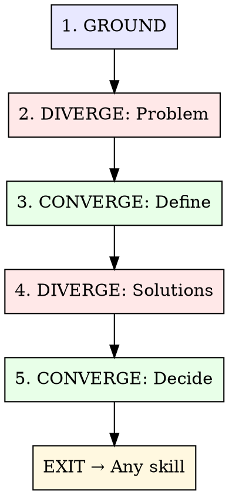

# Collaborative Brainstorming

Structured ideation using the Double Diamond model, grounded in persistent memory. Mined from 100+ real brainstorming sessions across production projects.

**Core insight:** AI excels at divergent phases (volume, cross-domain connections). Humans excel at convergent phases (judgment, selection). This skill separates the two and uses Sibyl as institutional memory to prevent re-exploring solved problems.

## The Process



---

## Phase 1: GROUND (Memory-First)

**Before generating a single idea, search what we already know.**

### Actions

1. **Search Sibyl** for related patterns, past decisions, known constraints:
   - `sibyl search "<topic keywords>"` — find prior art
   - `sibyl search "<related architecture>"` — find relevant patterns
   - Check for existing tasks/epics on this topic

2. **Surface constraints** — what's already decided? What's non-negotiable?
   - Tech stack locked? Budget constraints? Timeline?
   - Existing patterns we must follow?

3. **Present prior art** — show the user what Sibyl knows before ideating:
   > "Sibyl has 3 relevant entries: [pattern X from project Y], [decision Z from last month], [gotcha W]. Want to factor these in?"

### Gate

If Sibyl has a directly applicable pattern or decision, **present it first**. Don't re-brainstorm solved problems.

---

## Phase 2: DIVERGE — Explore the Problem Space

**Goal:** Generate breadth. Understand what we're actually solving.

### Actions

1. **Ask ONE question at a time** to understand intent:
   - What's the friction/pain point?
   - Who benefits? How do they use it today?
   - What does success look like?

2. **Reframe the problem** from multiple angles:
   - User perspective: "As a [user], I need..."
   - System perspective: "The system currently..."
   - Constraint perspective: "We're bounded by..."

3. **If the problem space is large**, spawn parallel Explore agents:
   ```
   Agent 1: Research how similar projects solve this
   Agent 2: Map the existing codebase surface area
   Agent 3: Search for SOTA approaches (WebSearch)
   ```

### Anti-patterns

- Don't jump to solutions. This phase is about the PROBLEM.
- Don't ask 5 questions at once. One at a time, build understanding.
- Don't dismiss vague input — "make it faster" is valid; help sharpen it.

---

## Phase 3: CONVERGE — Define the Core Problem

**Goal:** Narrow from exploration to a crisp problem statement.

### Actions

1. **Synthesize** what was explored into a 1-2 sentence problem statement
2. **Confirm** with the user: "Is this what we're solving?"
3. **Identify scope boundaries** — what's IN, what's OUT

### Output

> **Problem:** [crisp statement]
> **In scope:** [what we'll address]
> **Out of scope:** [what we won't]
> **Key constraint:** [the most important limiting factor]

---

## Phase 4: DIVERGE — Explore Solutions

**Goal:** Generate multiple viable approaches. Quality through quantity.

### Actions

1. **Present 2-3 approaches** with explicit tradeoffs:

   | Approach | Pros | Cons | Complexity | Risk |
   |----------|------|------|------------|------|
   | A: [name] | ... | ... | Low/Med/High | ... |
   | B: [name] | ... | ... | Low/Med/High | ... |
   | C: [name] | ... | ... | Low/Med/High | ... |

2. **Include at least one unconventional option** — break fixation on the obvious path

3. **Ground in existing patterns:**
   - "This follows the pattern we used in [project X]"
   - "This diverges from our convention because [reason]"

4. **For each approach, name the verification method:**
   - How would we know it works? (Test? Benchmark? Visual check?)

### Exploration vs Exploitation

Balance like MCTS — don't fixate on the first decent idea:

- If all approaches look similar → push for a **wild card** option
- If approaches are wildly different → good, that's healthy divergence
- If the user gravitates early → present the contrarian case before converging

### Anti-patterns

- Don't present 7 options. 2-3 is the sweet spot.
- Don't present options without tradeoffs. Every option has a cost.
- Don't present options that violate known constraints from Phase 1.
- Don't default to the most complex solution. Start simple, add complexity only if justified.

---

## Phase 5: CONVERGE — Decide and Record

**Goal:** Lock in the approach. Record the decision. Exit to action.

### Actions

1. **Let the user choose.** Present your recommendation but don't bulldoze.

2. **Record the decision in Sibyl:**
   ```
   sibyl add "Brainstorm: [topic]" "Chose [approach] because [reason]. Rejected [other approaches] due to [tradeoffs]. Key constraint: [X]."
   ```

3. **Define next action** — the brainstorm exits to whatever makes sense:

   | Next Step | When |
   |-----------|------|
   | `/hyperskills:plan` | Complex feature needing decomposition |
   | `/hyperskills:research` | Need deeper investigation first |
   | `/hyperskills:orchestrate` | Ready to dispatch agents |
   | Direct implementation | Simple enough to just build |
   | Write a spec | Needs formal documentation |

### Output

> **Decision:** [what we're doing]
> **Approach:** [which option, brief description]
> **Why:** [1-2 sentences on the reasoning]
> **Next:** [the immediate next action]

---

## Quick Mode

For small decisions that don't need the full diamond:

1. Search Sibyl (always)
2. Present 2 options with tradeoffs (skip problem exploration)
3. Decide and record

**Use quick mode when:** The problem is already well-understood and the user just needs help choosing between known options.

---

## Multi-Agent Brainstorming

For complex architectural decisions, deploy a **Council pattern:**

```
Agent 1 (Advocate): Makes the strongest case FOR approach A
Agent 2 (Advocate): Makes the strongest case FOR approach B
Agent 3 (Critic): Finds flaws in BOTH approaches
```

Synthesize their outputs, then present the unified analysis to the user.

**When to use:** Architecture decisions affecting 3+ systems, technology selection, major refactors. Don't use for simple feature design.

---

## What This Skill is NOT

- **Not a gate.** You don't need permission to skip phases. If the user says "just build it," build it.
- **Not a waterfall.** Phases can revisit. New information in Phase 4 can send you back to Phase 2.
- **Not a document generator.** The output is a decision, not a design doc (unless the user wants one).
- **Not required for everything.** Bug fixes, typo corrections, and clear-spec features don't need brainstorming.

## YAGNI Check

Before concluding, ask: **"Is there anything in this plan we don't actually need yet?"** Strip it. Build the minimum that validates the approach.
