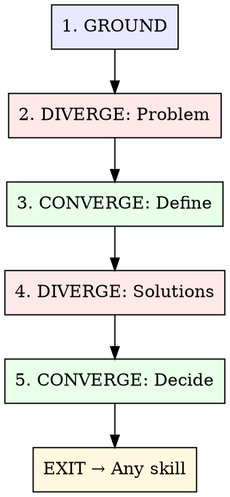

# Collaborative Brainstorming

Structured ideation using the Double Diamond model, grounded in persistent memory. Mined from 100+ real brainstorming sessions across production projects.

**Core insight:** AI excels at divergent phases (volume, cross-domain connections). Humans excel at convergent phases (judgment, selection). Separating the two, and using Sibyl to avoid re-exploring solved problems, is the shape that consistently produces useful brainstorms.

**How to read this skill:** the phases below describe the natural rhythm of a good brainstorm, not a procedure to march through. Skip phases that don't apply. Revisit earlier phases when new info changes the frame. Use judgment about when to compress, when to skip to action, and when divergent exploration is actually warranted.

## The Shape


```dot
digraph brainstorm {
    rankdir=TB;
    node [shape=box];

    "1. GROUND" [style=filled, fillcolor="#e8e8ff"];
    "2. DIVERGE: Problem" [style=filled, fillcolor="#ffe8e8"];
    "3. CONVERGE: Define" [style=filled, fillcolor="#e8ffe8"];
    "4. DIVERGE: Solutions" [style=filled, fillcolor="#ffe8e8"];
    "5. CONVERGE: Decide" [style=filled, fillcolor="#e8ffe8"];
    "EXIT → Any skill" [style=filled, fillcolor="#fff8e0"];

    "1. GROUND" -> "2. DIVERGE: Problem";
    "2. DIVERGE: Problem" -> "3. CONVERGE: Define";
    "3. CONVERGE: Define" -> "4. DIVERGE: Solutions";
    "4. DIVERGE: Solutions" -> "5. CONVERGE: Decide";
    "5. CONVERGE: Decide" -> "EXIT → Any skill";
}
```

---

## Phase 1: GROUND (Memory-First)

Lean on existing knowledge before generating new ideas. The cost of a Sibyl search is low; the cost of re-discovering a pattern we already learned is high.

### Common moves

- **Search Sibyl** for related patterns, decisions, and known constraints. Useful queries: `sibyl search "<topic keywords>"`, `sibyl search "<related architecture>"`, plus a quick scan of existing tasks/epics on the topic.
- **Surface constraints** that aren't up for debate: tech stack locks, budget, timeline, conventions you'd be foolish to violate.
- **Present prior art** before ideating: "Sibyl has 3 relevant entries: [pattern X], [decision Z], [gotcha W]. Want to factor these in?"

If Sibyl already has a directly applicable answer, surface it first. The brainstorm is then about whether to apply it as-is, adapt it, or genuinely diverge, not re-deriving it from scratch.

---

## Phase 2: DIVERGE: Explore the Problem Space

**Goal:** Generate breadth. Understand what we're actually solving before reaching for solutions.

### Common moves

- **Lean toward one load-bearing question at a time.** Stacking five questions buries the signal; building understanding incrementally surfaces what actually matters. The exception is when the user fires multiple parallel asks; then answer them in parallel rather than artificially serializing.
- **Reframe the problem** from multiple angles: user view ("as a [user], I need..."), system view ("the system currently..."), constraint view ("we're bounded by...").
- **Spawn parallel Explore agents** when the problem space is genuinely large: research how similar projects solve this, map the existing codebase surface, search for SOTA approaches.

The discipline here is staying in problem space when the pull toward solutions is strong. If the problem is already crisp, skip ahead. This phase exists to prevent solving the wrong thing, not to perform exploration.

### Anti-patterns

- Jumping to solutions before the problem frame is clear
- Stacking questions when the answers depend on each other
- Dismissing vague input ("make it faster" is a valid starting point; help sharpen it instead of rejecting it)

---

## Phase 3: CONVERGE: Define the Core Problem

**Goal:** Narrow from exploration to a crisp problem statement before exploring solutions for it.

Synthesize the exploration into a 1-2 sentence problem statement, confirm it lands ("is this what we're solving?"), and call out scope boundaries. The output usually looks like:

> **Problem:** [crisp statement]
> **In scope:** [what we'll address]
> **Out of scope:** [what we won't]
> **Key constraint:** [the most important limiting factor]

If the problem was already crisp coming in, this phase is a 30-second confirmation, not a deliverable.

---

## Phase 4: DIVERGE: Explore Solutions

**Goal:** Generate multiple viable approaches with explicit tradeoffs.

### Common moves

- **Present 2-3 approaches** with tradeoffs side-by-side. Two is the floor (otherwise it's a recommendation, not a brainstorm); past four, decision fatigue kicks in.

  | Approach  | Pros | Cons | Complexity   | Risk |
  | --------- | ---- | ---- | ------------ | ---- |
  | A: [name] | ...  | ...  | Low/Med/High | ...  |
  | B: [name] | ...  | ...  | Low/Med/High | ...  |
  | C: [name] | ...  | ...  | Low/Med/High | ...  |

- **Include one unconventional option** when the obvious paths look similar. Fixation on the first decent idea is the failure mode this phase is designed to prevent.
- **Carry one subtractive option.** The judo move at the approach altitude: alongside the options that build something, include the one that builds less or nothing. Reuse an existing system, solve it with config, or delete the need entirely. The cheapest complexity is what you never write, and it rarely makes the list unless you force it on.
- **Ground in existing patterns:** "this follows what we did in [project X]" or "this diverges from our convention because [reason]".
- **Name the verification method** for each approach so the choice connects to a concrete check (test, benchmark, visual confirmation).

### Exploration vs exploitation

Balance like MCTS. Don't fixate on the first decent idea:

- If all approaches look similar → push for a wild card option
- If approaches are wildly different → that's healthy divergence
- If the user gravitates early → present the contrarian case before converging

### Anti-patterns

- Seven "maybe" options instead of 2-3 real choices with tradeoffs
- Options presented without explicit costs (every option has one)
- Options that quietly violate constraints surfaced in Phase 1
- Defaulting to the most complex solution; start simple, add complexity only when justified
- Every option builds something; none asks what we could remove or reuse instead

---

## Phase 5: CONVERGE: Decide and Record

**Goal:** Lock in the approach, record the decision, exit to action.

The user picks. Present your recommendation with conviction but don't bulldoze; the whole point of divergent exploration is preserving genuine choice. Then record the decision in Sibyl so future sessions don't re-litigate it:

```
sibyl add "Brainstorm: [topic]" "Chose [approach] because [reason]. Rejected [other approaches] due to [tradeoffs]. Key constraint: [X]."
```

Hand off to whatever's next:

   | Next Step                  | When                                  |
   | -------------------------- | ------------------------------------- |
   | `/hyperskills:plan`        | Complex feature needing decomposition |
   | `/hyperskills:research`    | Need deeper investigation first       |
   | `/hyperskills:orchestrate` | Ready to dispatch agents              |
   | Direct implementation      | Simple enough to just build           |
   | Write a spec               | Needs formal documentation            |

### Output

> **Decision:** [what we're doing]
> **Approach:** [which option, brief description]
> **Why:** [1-2 sentences on the reasoning]
> **Next:** [the immediate next action]

---

## Quick Mode

For small decisions that don't need the full diamond: search Sibyl, present two options with tradeoffs, decide, record. Skip problem exploration entirely when the problem is already well-understood and the user just needs help choosing between known options. Most "brainstorms" are actually this.

---

## Multi-Agent Brainstorming

For complex architectural decisions, deploy a **Council pattern:**

```
Agent 1 (Advocate): Makes the strongest case FOR approach A
Agent 2 (Advocate): Makes the strongest case FOR approach B
Agent 3 (Critic): Finds flaws in BOTH approaches
```

Synthesize their outputs, then present the unified analysis to the user.

**When to use:** Architecture decisions affecting 3+ systems, technology selection, major refactors. Don't use for simple feature design.

---

## Anti-Patterns

| Anti-Pattern                              | Fix                                              |
| ----------------------------------------- | ------------------------------------------------ |
| Jumping to solutions before defining pain | Spend one pass on the problem frame first        |
| Asking a stack of questions at once       | Ask one load-bearing question, then adapt        |
| Presenting seven "maybe" options          | Offer 2-3 real choices with tradeoffs            |
| Ignoring prior decisions in Sibyl         | Search memory first and surface relevant context |
| Brainstorming when the user said build it | Switch to implementation and keep momentum       |

---

## What This Skill is NOT

- **Not a gate.** You don't need permission to skip phases. If the user says "just build it," build it.
- **Not a waterfall.** Phases can revisit. New information in Phase 4 can send you back to Phase 2.
- **Not a document generator.** The output is a decision, not a design doc (unless the user wants one).
- **Not required for everything.** Bug fixes, typo corrections, and clear-spec features don't need brainstorming.

## YAGNI Check

Before concluding, ask: **"Is there anything in this plan we don't actually need yet?"** Strip it. Build the minimum that validates the approach.
