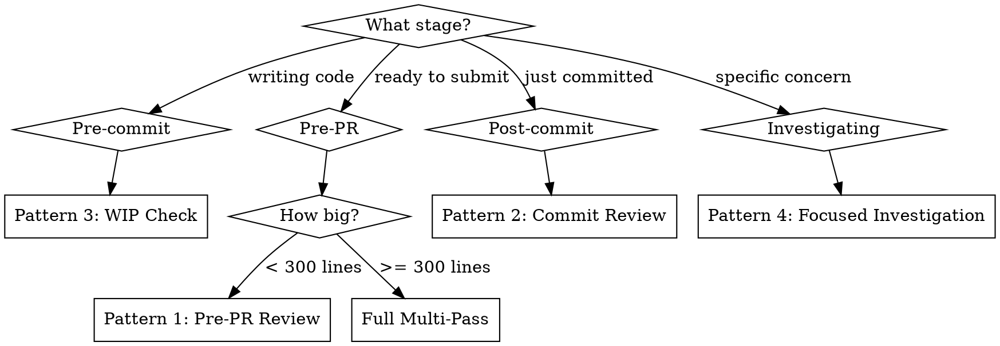

# Cross-Model Code Review with Codex

Cross-model validation using Codex CLI's MCP tools. Claude writes code, Codex reviews it — different architecture, different training distribution, no self-approval bias.

**Core insight:** Single-model self-review is systematically biased. Cross-model review catches different bug classes because the reviewer has fundamentally different blind spots than the author.

## The Two Codex Tools

The Codex CLI MCP server exposes two tools relevant for reviews:

| Tool | Best For | Key Constraint |
|------|----------|----------------|
| Codex **review** | Structured diff review with prioritized findings | `prompt` cannot combine with `uncommitted: true` |
| Codex **codex** | Freeform deep-dive on specific concerns | Requires explicit diff context in prompt |

**Always pass these parameters:**
- `model: "gpt-5.3-codex"` — most capable coding model
- `reasoningEffort: "xhigh"` — maximum depth (on `codex` tool)
- `sandbox: "read-only"` — reviewer must never modify the working tree (on `codex` tool)

## Review Patterns

### Pattern 1: Pre-PR Full Review (Default)

The standard review before opening a PR. Use for any non-trivial change.

```
Step 1 — Structured review (catches correctness + general issues):
  Codex review(
    base: "main",
    model: "gpt-5.3-codex",
    title: "Pre-PR Review"
  )

Step 2 — Security deep-dive (if code touches auth, input handling, or APIs):
  Codex codex(
    prompt: <security template from references/prompts.md>,
    model: "gpt-5.3-codex",
    reasoningEffort: "xhigh",
    sandbox: "read-only"
  )

Step 3 — Fix findings, then re-review:
  Codex review(
    base: "main",
    model: "gpt-5.3-codex",
    title: "Re-review after fixes"
  )
```

### Pattern 2: Commit-Level Review

Quick check after each meaningful commit. Good for iterative development.

```
Codex review(
  commit: "<SHA>",
  model: "gpt-5.3-codex",
  title: "Commit review"
)
```

### Pattern 3: WIP Check

Review uncommitted work mid-development. Catches issues before they're baked in.

```
Codex review(
  uncommitted: true,
  model: "gpt-5.3-codex",
  title: "WIP check"
)
```

Note: `uncommitted: true` cannot combine with a custom `prompt`.

### Pattern 4: Focused Investigation

Surgical deep-dive on a specific concern (error handling, concurrency, data flow).

```
Codex codex(
  prompt: "Analyze [specific concern] in the changes between main and HEAD.
           For each issue found: cite file and line, explain the risk,
           suggest a concrete fix. Confidence threshold: only flag issues
           you are >=70% confident about.",
  model: "gpt-5.3-codex",
  reasoningEffort: "xhigh",
  sandbox: "read-only"
)
```

### Pattern 5: Ralph Loop (Implement-Review-Fix)

Iterative quality enforcement — implement, review, fix, repeat. Max 3 iterations.

```
Iteration 1:
  Claude → implement feature
  Codex → review(base: "main") → findings
  Claude → fix critical/high findings

Iteration 2:
  Codex → review(base: "main") → verify fixes + catch remaining
  Claude → fix remaining issues

Iteration 3 (final):
  Codex → review(base: "main") → clean bill of health
  (or accept known trade-offs and document them)

STOP after 3 iterations. Diminishing returns beyond this.
```

## Multi-Pass Strategy

For thorough reviews, run multiple focused passes instead of one vague pass. Each pass gets a specific persona and concern domain.

| Pass | Focus | Tool | Reasoning |
|------|-------|------|-----------|
| **Correctness** | Bugs, logic, edge cases, race conditions | `review` | `xhigh` |
| **Security** | OWASP Top 10, injection, auth, secrets | `codex` | `xhigh` |
| **Architecture** | Coupling, abstractions, API consistency | `codex` | `xhigh` |
| **Performance** | O(n^2), N+1 queries, memory leaks | `codex` | `xhigh` |

Run passes sequentially. Fix critical findings between passes to avoid noise compounding.

When to use multi-pass vs single-pass:

| Change Size | Strategy |
|-------------|----------|
| < 50 lines, single concern | Single `review` call |
| 50-300 lines, feature work | `review` + security `codex` pass |
| 300+ lines or architecture change | Full 4-pass |
| Security-sensitive (auth, payments, crypto) | Always include security pass |

## Decision Tree: Which Pattern?



## Prompt Engineering Rules

1. **Assign a persona** — "senior security engineer" beats "review for security"
2. **Specify what to skip** — "Skip formatting, naming style, minor docs gaps" prevents bikeshedding
3. **Require confidence scores** — Only act on findings with confidence >= 0.7
4. **Demand file:line citations** — Vague findings without location are not actionable
5. **Ask for concrete fixes** — "Suggest a specific fix" not just "this is a problem"
6. **One domain per pass** — Security-only, architecture-only. Mixing dilutes depth.

Ready-to-use prompt templates are in `references/prompts.md`.

## Anti-Patterns

| Anti-Pattern | Why It Fails | Fix |
|-------------|-------------|-----|
| "Review this code" | Too vague — produces surface-level bikeshedding | Use specific domain prompts with persona |
| Single pass for everything | Context dilution — every dimension gets shallow treatment | Multi-pass with one concern per pass |
| Self-review (Claude reviews Claude's code) | Systematic bias — models approve their own patterns | Cross-model: Claude writes, Codex reviews |
| No confidence threshold | Noise floods signal — 0.3 confidence findings waste time | Only act on >= 0.7 confidence |
| Style comments in review | LLMs default to bikeshedding without explicit skip directives | "Skip: formatting, naming, minor docs" |
| > 3 review iterations | Diminishing returns, increasing noise, overbaking | Stop at 3. Accept trade-offs. |
| Review without project context | Generic advice disconnected from codebase conventions | Codex reads CLAUDE.md/AGENTS.md automatically |

## What This Skill is NOT

- **Not a replacement for human review.** Cross-model review catches bugs but can't evaluate product direction or user experience.
- **Not a linter.** Don't use Codex review for formatting or style — that's what linters are for.
- **Not infallible.** 5-15% false positive rate is normal. Triage findings, don't blindly fix everything.
- **Not for self-approval.** The whole point is cross-model validation. Don't use Claude to review Claude's code.

## References

For ready-to-use prompt templates, see `references/prompts.md`.
