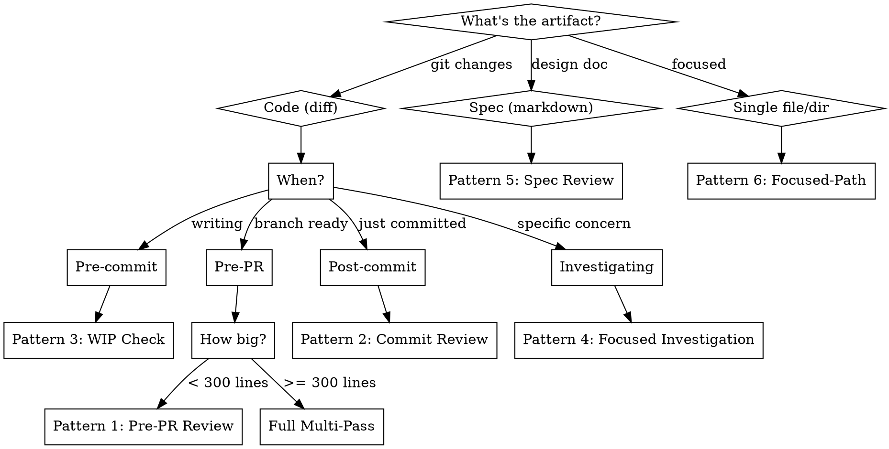

# Cross-Model Code Review with Codex CLI

Cross-model validation using the `codex` binary directly. Claude writes code, Codex reviews it — different architecture, different training distribution, no self-approval bias.

**Core insight:** Single-model self-review is systematically biased. Cross-model review catches different bug classes because the reviewer has fundamentally different blind spots than the author.

**Prerequisite:** The `codex` CLI must be installed and authenticated. Verify with `codex --version`. User defaults are configured in `~/.codex/config.toml` — respect them.

**Direction:** Claude → Codex only. For the bidirectional skill (also handles Codex → Claude with the `claude -p` gotchas around `yield_time_ms` and variadic flags), use `/hyperskills:cross-model-review` instead.

---

## ⚠️ Non-Negotiable Rule: Always pass a scope flag to `codex review`

A bare `codex review` (no scope) is the #1 cause of failures: it hangs or produces 100KB+ blob output. **Always specify exactly one scope flag:**

| Want to review            | Command                       |
| ------------------------- | ----------------------------- |
| Branch since main         | `codex review --base main`    |
| Single commit             | `codex review --commit <SHA>` |
| Working tree (unstaged)   | `codex review --uncommitted`  |

For anything outside this trio (spec docs, single files, custom personas, focused passes), use `codex exec "PROMPT"` with explicit scope in the prompt — never bare `codex review`.

If output exceeds ~100KB, the diff is too large for one pass. Split per commit, or use `codex exec` with a narrower prompt ("Review error handling only").

---

## Two Ways to Invoke Codex

| Mode           | Command                                                     | Best For                                                    |
| -------------- | ----------------------------------------------------------- | ----------------------------------------------------------- |
| `codex review` | Structured diff review with prioritized findings            | Pre-PR reviews, commit reviews, WIP checks                  |
| `codex exec`   | Freeform non-interactive deep-dive with full prompt control | Security audits, architecture, focused investigation, specs |

### Scope flags (`codex review` only)

| Flag              | Purpose                          |
| ----------------- | -------------------------------- |
| `--base <BRANCH>` | Diff against base branch         |
| `--commit <SHA>`  | Review a specific commit         |
| `--uncommitted`   | Review working tree changes      |

### Sandbox & ergonomics flags (both modes)

| Flag                                          | When                                              |
| --------------------------------------------- | ------------------------------------------------- |
| `--sandbox read-only`                         | Default for review work — no writes               |
| `--sandbox workspace-write`                   | Review + apply suggested fixes                    |
| `--full-auto`                                 | Alias for `--ask-for-approval never --sandbox workspace-write` |
| `--dangerously-bypass-approvals-and-sandbox`  | Last resort; explicit user request only           |
| `-C <DIR>` / `--cd <DIR>`                     | Run in another worktree without `cd`              |
| `--skip-git-repo-check`                       | Running from a non-repo directory                 |
| `--add-dir <DIR>`                             | Extend read access to another path                |
| `--ephemeral`                                 | One-shot session, no persistence                  |
| `--json` / `--output-last-message <FILE>`     | Capture structured output to a file               |
| `-c model_reasoning_effort="xhigh"`           | Spec/RFC review only (see Effort Policy)          |

### Effort override policy

| Reviewing            | Effort flag                              |
| -------------------- | ---------------------------------------- |
| Code (commit / diff / PR / WIP) | **None** — defer to `~/.codex/config.toml` |
| Spec / RFC / design doc         | `-c model_reasoning_effort="xhigh"`        |

Specs are higher-stakes than diffs — a subtle architectural mistake compounds across the eventual implementation. Code diffs are smaller scope and the user's configured effort is fine.

**Never** specify `--model`, `-m`, or `-c model=` to override the model itself. User config is authoritative.

---

## Review Patterns

### Pattern 1: Pre-PR Full Review (default)

The standard review before opening a PR. Use for any non-trivial change.

```
Step 1 — Structured review (catches correctness + general issues):
  codex review --base main

Step 2 — Security deep-dive (if code touches auth, input handling, or APIs):
  codex exec "<security prompt from references/prompts.md>"

Step 3 — Fix findings, then re-review:
  codex review --base main
```

### Pattern 2: Commit-Level Review

Quick check after each meaningful commit.

```bash
codex review --commit <SHA>
```

### Pattern 3: WIP Check

Review uncommitted work mid-development. Catches issues before they're baked in.

```bash
codex review --uncommitted
```

### Pattern 4: Focused Investigation

Surgical deep-dive on a specific concern (error handling, concurrency, data flow).

```bash
codex exec --sandbox read-only \
  "You are a senior <DOMAIN> engineer. Analyze <CONCERN> in the changes
   between main and HEAD. For each issue: cite file and line, explain the
   risk, suggest a concrete fix. Confidence threshold: 0.7."
```

### Pattern 5: Spec / RFC Review

Reviewing prose (markdown design docs) before code is written.

```bash
codex exec -c model_reasoning_effort="xhigh" --sandbox read-only \
  "You are a senior staff engineer doing a candid pre-implementation review of
   <PATH>. The author wants sharp, unsentimental analysis. For each finding:
   severity (BLOCKER / HIGH / MEDIUM / LOW), confidence (>= 0.7 only), location
   (file path + section heading), the issue, a concrete fix.
   End with a one-paragraph go/no-go verdict."
```

### Pattern 6: Single-File / Focused-Path Review

Review one file or directory rather than a full diff.

```bash
codex exec --sandbox read-only \
  "Review only <PATH> for <CONCERN>. Skip style and ergonomics.
   Return PASS if no real issues; otherwise concise FAIL findings with
   file:line evidence."
```

### Pattern 7: Ralph Loop (Implement → Review → Fix)

Iterative quality enforcement. Max 3 iterations.

```
Iteration 1:
  Claude → implement feature
  codex review --base main → findings
  Claude → fix critical/high findings

Iteration 2:
  codex review --base main → verify fixes + catch remaining
  Claude → fix remaining issues

Iteration 3 (final):
  codex review --base main → clean or accept trade-offs

STOP after 3 iterations. Diminishing returns beyond this.
```

---

## Multi-Pass Strategy

For thorough reviews, run multiple focused passes instead of one vague pass. Each pass gets a specific persona and concern domain.

| Pass             | Focus                                       | Mode                                  |
| ---------------- | ------------------------------------------- | ------------------------------------- |
| **Correctness**  | Bugs, logic, edge cases, race conditions    | `codex review`                        |
| **Security**     | OWASP Top 10:2025, injection, auth, secrets | `codex exec` with security prompt     |
| **Architecture** | Coupling, abstractions, API consistency     | `codex exec` with architecture prompt |
| **Performance** | O(n²), N+1 queries, memory leaks            | `codex exec` with performance prompt  |

Run passes sequentially. Fix critical findings between passes to avoid noise compounding.

| Change size                                 | Strategy                       |
| ------------------------------------------- | ------------------------------ |
| < 50 lines, single concern                  | Single `codex review`          |
| 50-300 lines, feature work                  | `codex review` + security pass |
| 300+ lines or architecture change           | Full 4-pass                    |
| Security-sensitive (auth, payments, crypto) | Always include security pass   |

---

## Decision Tree: Which Pattern?


```dot
digraph review_decision {
    rankdir=TB;
    node [shape=diamond];

    "What's the artifact?" -> "Code (diff)" [label="git changes"];
    "What's the artifact?" -> "Spec (markdown)" [label="design doc"];
    "What's the artifact?" -> "Single file/dir" [label="focused"];

    node [shape=box];
    "Code (diff)" -> "When?" [shape=diamond];
    "When?" -> "Pre-commit" [label="writing"];
    "When?" -> "Pre-PR" [label="branch ready"];
    "When?" -> "Post-commit" [label="just committed"];
    "When?" -> "Investigating" [label="specific concern"];

    "Pre-commit" -> "Pattern 3: WIP Check";
    "Pre-PR" -> "How big?" [shape=diamond];
    "Post-commit" -> "Pattern 2: Commit Review";
    "Investigating" -> "Pattern 4: Focused Investigation";

    "How big?" -> "Pattern 1: Pre-PR Review" [label="< 300 lines"];
    "How big?" -> "Full Multi-Pass" [label=">= 300 lines"];

    "Spec (markdown)" -> "Pattern 5: Spec Review";
    "Single file/dir" -> "Pattern 6: Focused-Path";
}
```

---

## Prompt Engineering Rules

1. **Assign a persona** — "senior security engineer" beats "review for security"
2. **Specify what to skip** — "Skip formatting, naming style, minor docs gaps"
3. **Require confidence scores** — only act on findings ≥ 0.7
4. **Demand file:line citations** — vague findings without location aren't actionable
5. **Ask for concrete fixes** — "Suggest a specific fix" not "this is a problem"
6. **One domain per pass** — security-only, architecture-only
7. **Demand a verdict** — "Verdict: patch is correct / incorrect" or "go / no-go"

Ready-to-use prompt templates are in `references/prompts.md`.

---

## Anti-Patterns

| Anti-Pattern | Why It Fails | Fix |
| ------------ | ------------ | --- |
| Bare `codex review` (no scope flag) | Hangs or produces 100KB+ blob output | Always pass `--base <ref>`, `--commit <SHA>`, or `--uncommitted` |
| `codex review` output > 100KB | Diff too large for one pass | Split per commit, or use `codex exec` with narrower prompt |
| `timeout 30 codex review` | Reviews legitimately take 30s–5min | No timeout, or `timeout 300` minimum |
| "Review this code" (no specifics) | Vague — produces bikeshedding | Specific domain prompts with persona |
| Single pass for everything | Context dilution — shallow on every dimension | Multi-pass with one concern per pass |
| Self-review (Claude reviews Claude's code) | Systematic bias — models approve their own patterns | Cross-model: Claude writes, Codex reviews |
| No confidence threshold | Noise floods signal — 0.3 confidence wastes time | Only act on ≥ 0.7 confidence |
| Style comments in review | LLMs default to bikeshedding | "Skip: formatting, naming, minor docs" |
| > 3 review iterations | Diminishing returns, increasing noise, overbaking | Stop at 3. Accept trade-offs. |
| Review without project context | Generic advice disconnected from codebase | Run from repo root |
| MCP wrapper around `codex` | Unnecessary indirection over a CLI binary | Call `codex` directly via Bash |
| Hardcoding `--model` / `-m` / `-c model=` | Overrides user config; stale model names | Defer to `~/.codex/config.toml` |
| Effort override on routine code review | Wastes tokens, ignores user defaults | `-c model_reasoning_effort="xhigh"` is for spec review only |
| `--full-auto` for pure review | Grants write access the review doesn't need | `--sandbox read-only` for review; `--full-auto` only when applying fixes |

---

## What This Skill is NOT

- **Not a replacement for human review.** Cross-model review catches bugs but can't evaluate product direction or UX.
- **Not a linter.** Don't use Codex review for formatting or style.
- **Not infallible.** 5–15% false positive rate is normal. Triage findings.
- **Not for self-approval.** The whole point is cross-model validation. Don't use Claude to review Claude's code.

## References

For ready-to-use prompt templates, see `references/prompts.md`.
