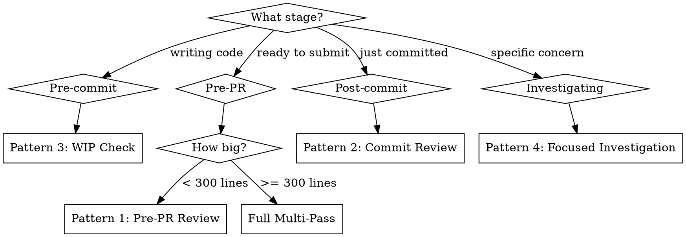

# Cross-Model Code Review with Codex CLI

Cross-model validation using the `codex` binary directly. Claude writes code, Codex reviews it — different architecture, different training distribution, no self-approval bias.

**Core insight:** Single-model self-review is systematically biased. Cross-model review catches different bug classes because the reviewer has fundamentally different blind spots than the author.

**Prerequisite:** The `codex` CLI must be installed and authenticated. Verify with `codex --help`. Configure defaults in `~/.codex/config.toml`:

```toml
model = "gpt-5.4"
review_model = "gpt-5.4"
# Note: review_model overrides model for codex review specifically
model_reasoning_effort = "high"
```

## Two Ways to Invoke Codex

| Mode           | Command                                                     | Best For                                                    |
| -------------- | ----------------------------------------------------------- | ----------------------------------------------------------- |
| `codex review` | Structured diff review with prioritized findings            | Pre-PR reviews, commit reviews, WIP checks                  |
| `codex exec`   | Freeform non-interactive deep-dive with full prompt control | Security audits, architecture review, focused investigation |

**Key flags:**

| Flag                                | Applies To    | Purpose                                              |
| ----------------------------------- | ------------- | ---------------------------------------------------- |
| `-c model="gpt-5.4"`                | both          | Model selection (review has no `-m` flag)            |
| `-m`, `--model`                     | `exec` only   | Model selection shorthand                            |
| `-c model_reasoning_effort="xhigh"` | both          | Reasoning depth: `low` / `medium` / `high` / `xhigh` |
| `--base <BRANCH>`                   | `review` only | Diff against base branch                             |
| `--commit <SHA>`                    | `review` only | Review a specific commit                             |
| `--uncommitted`                     | `review` only | Review working tree changes                          |

## Review Patterns

### Pattern 1: Pre-PR Full Review (Default)

The standard review before opening a PR. Use for any non-trivial change.

```
Step 1 — Structured review (catches correctness + general issues):
  Run via Bash:
    codex review --base main -c model="gpt-5.4"

Step 2 — Security deep-dive (if code touches auth, input handling, or APIs):
  Run via Bash:
    codex exec -m gpt-5.4 \
      -c model_reasoning_effort="xhigh" \
      "<security prompt from references/prompts.md>"

Step 3 — Fix findings, then re-review:
  Run via Bash:
    codex review --base main -c model="gpt-5.4"
```

### Pattern 2: Commit-Level Review

Quick check after each meaningful commit.

```bash
codex review --commit <SHA> -c model="gpt-5.4"
```

### Pattern 3: WIP Check

Review uncommitted work mid-development. Catches issues before they're baked in.

```bash
codex review --uncommitted -c model="gpt-5.4"
```

### Pattern 4: Focused Investigation

Surgical deep-dive on a specific concern (error handling, concurrency, data flow).

```bash
codex exec -m gpt-5.4 \
  -c model_reasoning_effort="xhigh" \
  "Analyze [specific concern] in the changes between main and HEAD.
   For each issue found: cite file and line, explain the risk,
   suggest a concrete fix. Confidence threshold: only flag issues
   you are >=70% confident about."
```

### Pattern 5: Ralph Loop (Implement-Review-Fix)

Iterative quality enforcement — implement, review, fix, repeat. Max 3 iterations.

```
Iteration 1:
  Claude -> implement feature
  Bash: codex review --base main -c model="gpt-5.4" -> findings
  Claude -> fix critical/high findings

Iteration 2:
  Bash: codex review --base main -c model="gpt-5.4" -> verify fixes + catch remaining
  Claude -> fix remaining issues

Iteration 3 (final):
  Bash: codex review --base main -c model="gpt-5.4" -> clean bill of health
  (or accept known trade-offs and document them)

STOP after 3 iterations. Diminishing returns beyond this.
```

## Multi-Pass Strategy

For thorough reviews, run multiple focused passes instead of one vague pass. Each pass gets a specific persona and concern domain.

| Pass             | Focus                                    | Mode                                  | Reasoning |
| ---------------- | ---------------------------------------- | ------------------------------------- | --------- |
| **Correctness**  | Bugs, logic, edge cases, race conditions | `codex review`                        | default   |
| **Security**     | OWASP Top 10, injection, auth, secrets   | `codex exec` with security prompt     | `xhigh`   |
| **Architecture** | Coupling, abstractions, API consistency  | `codex exec` with architecture prompt | `xhigh`   |
| **Performance**  | O(n^2), N+1 queries, memory leaks        | `codex exec` with performance prompt  | `high`    |

Run passes sequentially. Fix critical findings between passes to avoid noise compounding.

When to use multi-pass vs single-pass:

| Change Size                                 | Strategy                       |
| ------------------------------------------- | ------------------------------ |
| < 50 lines, single concern                  | Single `codex review`          |
| 50-300 lines, feature work                  | `codex review` + security pass |
| 300+ lines or architecture change           | Full 4-pass                    |
| Security-sensitive (auth, payments, crypto) | Always include security pass   |

## Decision Tree: Which Pattern?


```dot
digraph review_decision {
    rankdir=TB;
    node [shape=diamond];

    "What stage?" -> "Pre-commit" [label="writing code"];
    "What stage?" -> "Pre-PR" [label="ready to submit"];
    "What stage?" -> "Post-commit" [label="just committed"];
    "What stage?" -> "Investigating" [label="specific concern"];

    node [shape=box];
    "Pre-commit" -> "Pattern 3: WIP Check";
    "Pre-PR" -> "How big?";
    "Post-commit" -> "Pattern 2: Commit Review";
    "Investigating" -> "Pattern 4: Focused Investigation";

    "How big?" [shape=diamond];
    "How big?" -> "Pattern 1: Pre-PR Review" [label="< 300 lines"];
    "How big?" -> "Full Multi-Pass" [label=">= 300 lines"];
}
```

## Prompt Engineering Rules

1. **Assign a persona** — "senior security engineer" beats "review for security"
2. **Specify what to skip** — "Skip formatting, naming style, minor docs gaps" prevents bikeshedding
3. **Require confidence scores** — Only act on findings with confidence >= 0.7
4. **Demand file:line citations** — Vague findings without location are not actionable
5. **Ask for concrete fixes** — "Suggest a specific fix" not just "this is a problem"
6. **One domain per pass** — Security-only, architecture-only. Mixing dilutes depth.

Ready-to-use prompt templates are in `references/prompts.md`.

## Anti-Patterns

| Anti-Pattern                                         | Why It Fails                                                                    | Fix                                                                                                        |
| ---------------------------------------------------- | ------------------------------------------------------------------------------- | ---------------------------------------------------------------------------------------------------------- |
| "Review this code"                                   | Too vague — produces surface-level bikeshedding                                 | Use specific domain prompts with persona                                                                   |
| Single pass for everything                           | Context dilution — every dimension gets shallow treatment                       | Multi-pass with one concern per pass                                                                       |
| Self-review (Claude reviews Claude's code)           | Systematic bias — models approve their own patterns                             | Cross-model: Claude writes, Codex reviews                                                                  |
| No confidence threshold                              | Noise floods signal — 0.3 confidence findings waste time                        | Only act on >= 0.7 confidence                                                                              |
| Style comments in review                             | LLMs default to bikeshedding without explicit skip directives                   | "Skip: formatting, naming, minor docs"                                                                     |
| > 3 review iterations                                | Diminishing returns, increasing noise, overbaking                               | Stop at 3. Accept trade-offs.                                                                              |
| Review without project context                       | Generic advice disconnected from codebase conventions                           | Codex reads CLAUDE.md/AGENTS.md automatically                                                              |
| Using an MCP wrapper                                 | Unnecessary indirection over a CLI binary                                       | Call `codex` directly via Bash                                                                             |
| Specifying legacy/deprecated models (o1, o3, gpt-4o) | These models are ancient history and may not be available on the user's account | Use the defaults from `~/.codex/config.toml` or the model shown in `codex --help`. Never guess model names |
| Overcomplicating the invocation                      | Adding unnecessary flags, custom reasoning efforts, or exotic configs           | Use `codex review` with simple flags (`--uncommitted`, `--base main`). The defaults are good               |

## What This Skill is NOT

- **Not a replacement for human review.** Cross-model review catches bugs but can't evaluate product direction or user experience.
- **Not a linter.** Don't use Codex review for formatting or style — that's what linters are for.
- **Not infallible.** 5-15% false positive rate is normal. Triage findings, don't blindly fix everything.
- **Not for self-approval.** The whole point is cross-model validation. Don't use Claude to review Claude's code.

## References

For ready-to-use prompt templates, see `references/prompts.md`.
