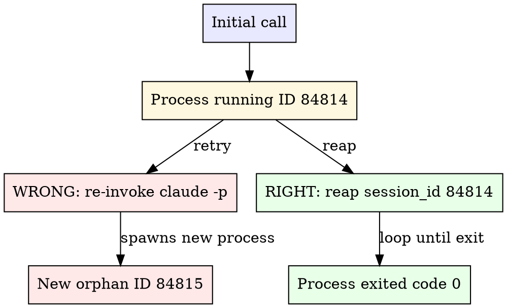

# Cross-Model Code Review

Cross-model validation: the authoring model writes code, a different model reviews it. Different architectures, different training distributions, no self-approval bias.

**Core insight:** Single-model self-review is systematically biased. The same blind spots that let bugs through during writing let them through during review. Cross-model review catches different bug classes because the reviewer has fundamentally different failure modes.

**How to read this skill:** patterns and decision trees below are guidelines. Pick what fits, blend when needed. The rules marked ⚠️ are different: they're real CLI behaviors (`yield_time_ms`, the `--` separator, scope flags), not procedural ceremony. A Jun 2026 audit across 4k+ Claude/Codex JSONL conversations found `claude -p` failures clustering around these mechanics, plus zsh wrapper mistakes. Treat them as facts about the tool, not opinions about workflow.

## Direction & Pre-Flight

Identify the host first. The host runs the _other_ model's CLI as a subprocess.

| Current host      | You invoke                      | Direction                     |
| ----------------- | ------------------------------- | ----------------------------- |
| Claude Code       | `codex` CLI                     | Claude writes → Codex reviews |
| Codex             | `claude` CLI                    | Codex writes → Claude reviews |
| Pi (pi-nova pack) | `/xreview` (wraps `codex exec`) | Pi writes → Codex reviews     |

Confirm the reviewer is reachable before the real call:

| Host   | Verify command                                                                                                                       | Notes                             |
| ------ | ------------------------------------------------------------------------------------------------------------------------------------ | --------------------------------- |
| Claude | `codex --version`                                                                                                                    | One-shot, no special flags        |
| Codex  | `printf 'say ok\n' \| env -u ANTHROPIC_API_KEY claude -p --output-format text --no-session-persistence` with `yield_time_ms: 300000` | Sanity ping only, see Rules 1 & 4 |
| Pi     | `codex --version`                                                                                                                    | Same binary as Claude host        |

**On Pi:** prefer `/xreview` when the xreview extension is installed — it shells out to `codex exec --sandbox read-only` with stdin closed and injects Verdict, Findings, and Fix Queue back into the session. Scope explicitly: `/xreview` reviews the working tree, `/xreview main` reviews since a base ref; put any focused concern in the prompt before running it. Manual bash fallback follows the Claude-host rules below. Treat PASS as evidence only for the reviewed scope.

**User defaults are authoritative.** Both CLIs read configured defaults (`~/.codex/config.toml`, `~/.claude/settings.json`). Never specify `--model`, `-m`, or `-c model=`. The only sanctioned override is reasoning effort, and only for spec review (see Effort Override Policy below).

---

## ⚠️ Codex → Claude: Four Non-Negotiable Rules

Rules 1–3 cause the overwhelming majority of cross-model review failures. They're not workflow preferences; they're how the `claude -p` shell tool behaves under Codex. Rule 4 doesn't break the review; it silently bills it to the wrong account. Get all four right on the first call.

### Rule 1: `yield_time_ms: 300000` on EVERY call

Codex's shell tool yields output back to the model after `yield_time_ms` elapses (default `1000` = 1 second). A real `claude -p` review takes 30 seconds to 5+ minutes. The default yields empty output + `Process running with session ID NNNN` before Claude has even started, and the model misreads this as failure.

**The rule:** every `claude -p` call uses `yield_time_ms: 300000` (5 minutes). Initial call, every reaping call, every sanity ping beyond a one-line `say ok`. No exceptions.

```json
{ "cmd": "claude -p --allowedTools \"Read,Glob,Grep,Bash(git *)\" -- \"PROMPT\"", "yield_time_ms": 300000 }
```

**Common cognitive trap:** "My prompt is short, I only need 30s." Wrong. Claude session setup, network, and model compute dominate; prompt length barely factors in. Always 300000.

**Consistency rule:** once you're at 300000, stay at 300000. Reverting to 1000 between calls in the same session creates a fresh wave of orphans on top of any still running.

### Rule 2: `Process running with session ID NNNN` is NOT an error: REAP, never retry

When Codex returns `Process running with session ID NNNN`, the process is alive and computing in the background. The yield fired before completion. **This is normal output, not failure.**



**Wrong** (each retry spawns a fresh process; original keeps running):

```json
{"cmd": "claude -p --allowedTools '...' -- 'PROMPT'", "yield_time_ms": 300000}
→ "Process running with session ID 84814"
{"cmd": "claude -p --allowedTools '...' -- 'PROMPT'", "yield_time_ms": 300000}
→ "Process running with session ID 84815"   // 84814 still alive, orphaned
{"cmd": "claude -p --allowedTools '...' -- 'PROMPT'", "yield_time_ms": 300000}
→ "Process running with session ID 84816"   // 84814 + 84815 both still alive
... 8 more retries ... 11+ orphans, ~7 minutes wall time
```

**Right** (reap the existing session by ID until exit):

```json
{"cmd": "claude -p --allowedTools '...' -- 'PROMPT'", "yield_time_ms": 300000}
→ "Process running with session ID 84814"
{"session_id": 84814, "yield_time_ms": 300000}        // reap, do NOT re-invoke claude -p
→ "Process running with session ID 84814"             // still computing
{"session_id": 84814, "yield_time_ms": 300000}        // keep reaping
→ "Process exited with code 0"                        // done, parse the output
```

**Reaping rules:**

- Do NOT re-invoke `claude -p` (creates a new process)
- Do NOT change flags, prompts, or tools (reaping is a different operation entirely)
- DO call `{"session_id": NNNN, "yield_time_ms": 300000}` repeatedly
- Stop only when `Process exited with code X` appears

### Rule 3: Variadic flags require the `--` separator

The `claude` CLI has flags that take `<value...>` and greedily consume every following argument until the next flag. If your prompt follows one of these without a `--` separator, the prompt gets swallowed as a flag value, the prompt arg goes missing, and Claude errors with `Input must be provided either through stdin or as a prompt argument when using --print` or hangs waiting on stdin.

**Variadic flags:** `--allowedTools` / `--allowed-tools`, `--disallowedTools` / `--disallowed-tools`, `--tools`, `--add-dir`, `--betas`, `--file`, `--mcp-config`, `--plugin-dir`.

**Required form** (default to this, works regardless of flag order):

```bash
claude -p --allowedTools "Read,Glob,Grep,Bash(git *)" -- "PROMPT"
```

**Two fallback shapes** (use only if `--` won't work in your context):

| Shape               | Example                                                        |
| ------------------- | -------------------------------------------------------------- |
| Prompt before flags | `claude -p "PROMPT" --allowedTools "Read,Bash(git *)"`         |
| Stdin pipe          | `echo "PROMPT" \| claude -p --allowedTools "Read,Bash(git *)"` |

The `codex` CLI does not have this issue, its flags are non-variadic.

### Rule 4: Strip `ANTHROPIC_API_KEY` so the review bills to your subscription

Codex — and most shells that touch the Anthropic API — export `ANTHROPIC_API_KEY` into the environment. Child `claude -p` calls inherit it, and Claude Code's auth precedence ranks the API key **above** your Pro/Max subscription OAuth. Interactive `claude` prompts once before using a stray key and remembers your choice; `-p` (non-interactive) mode uses the key **silently, on every call**. The review still works — it just bills per-token against the API instead of drawing from your plan. Nothing surfaces it until the invoice does, which is why interactive sessions can read "Max" in `/status` while the headless review path quietly meters to API.

**The rule:** prefix every spawning `claude -p` call with `env -u ANTHROPIC_API_KEY`. That strips the variable for just that call, so Claude falls through to the subscription credentials stored by `/login`.

```json
{
  "cmd": "env -u ANTHROPIC_API_KEY claude -p --allowedTools \"Read,Glob,Grep,Bash(git *)\" -- \"PROMPT\"",
  "yield_time_ms": 300000
}
```

The prefix goes on the **spawning** call only — reaping calls (Rule 2) are bare `session_id` polls with no command, so there is nothing to strip.

**Precedence trap:** `CLAUDE_CODE_OAUTH_TOKEN` ranks _below_ `ANTHROPIC_API_KEY`, so exporting an OAuth token does **not** rescue you while the key is present — stripping is mandatory either way. The fallback only lands on the plan if a prior interactive `/login` (Pro/Max) wrote `~/.claude/.credentials.json`; without those creds, `claude -p` has nothing to fall through to.

### Codex → Claude Gold Path

Use this launch shape unless the review scope forces a different one. It bakes in the four rules, captures output to a file, and avoids the zsh `status` variable trap found in failed sessions.

```bash
prompt=$(mktemp -t claude-review-prompt.XXXXXX.md)
out=$(mktemp -t claude-review-output.XXXXXX.txt)
cat > "$prompt" <<'PROMPT'
You are an independent senior code reviewer.

Review the current branch for correctness, security, and maintainability.
Cite file:line for each finding, include confidence, and skip style nits.
Verdict: PASS or FAIL.
PROMPT
printf 'prompt_file=%s\nreview_output=%s\n' "$prompt" "$out"
if env -u ANTHROPIC_API_KEY claude -p --output-format text \
  --allowedTools "Read,Glob,Grep,Bash(git *),Bash(rg *)" \
  -- "$(cat "$prompt")" > "$out" 2>&1; then
  rc=0
else
  rc=$?
fi
printf 'claude_exit=%s\nreview_output=%s\n' "$rc" "$out"
exit "$rc"
```

Run that shell command through Codex with `yield_time_ms: 300000` and a normal output budget such as `max_output_tokens: 20000`.

**Why this shape survives real failures:**

| Element                     | Why it matters                                                 |
| --------------------------- | -------------------------------------------------------------- |
| `prompt` + `out` temp files | Preserves the prompt and full review output across turns       |
| `env -u ANTHROPIC_API_KEY`  | Prevents silent API-key billing                                |
| `-- "PROMPT"`               | Stops variadic tool flags from swallowing the prompt           |
| `rc`, not `status`          | `status` is read-only in zsh; assigning it kills the wrapper   |
| `> "$out" 2>&1`             | Keeps long reviews out of the agent context and readable later |
| `yield_time_ms: 300000`     | Lets the first call complete or yield a reapable session       |

If this yields `Process running with session ID NNNN`, reap that session exactly as Rule 2 says. The initial output already printed `review_output=...`, so read that file after the process exits.

---

## ⚠️ Claude → Codex: One Non-Negotiable Rule

### Always pass a scope flag to `codex review`

A bare `codex review` (no scope) is the #1 cause of Claude → Codex failures: it hangs or produces 100KB+ blob output. **Always specify exactly one scope flag:**

| Want to review          | Command                       |
| ----------------------- | ----------------------------- |
| Branch since main       | `codex review --base main`    |
| Single commit           | `codex review --commit <SHA>` |
| Working tree (unstaged) | `codex review --uncommitted`  |

For anything outside this trio (spec docs, single files, custom scopes, personas), use `codex exec "PROMPT"` with explicit scope in the prompt, never bare `codex review`.

If `codex review` output exceeds ~100KB, the diff is too large for one pass. Split: `codex review --commit <SHA1>`, `codex review --commit <SHA2>`, or use `codex exec` with a narrowed prompt ("Review error handling only").

---

## ⚠️ Both Directions: Capture Output to a File

**Never** pipe a review to `| tail -N` or `| head -N`. Three reasons it fails:

1. **The pipe buffers until EOF.** `tail` (and `head`) read the entire upstream stream before producing output. The agent gets _nothing_ until the review process exits or times out, no progress signal, no early verdict, no way to tell if the call is alive. With `claude -p`, this compounds the `yield_time_ms` problem: the wrapping shell call holds output until claude exits, then `tail` finally runs.
2. **Reviews don't put the verdict at the end.** Findings are typically ordered by severity (BLOCKER first), with the summary/verdict near the top. `tail -300` discards exactly the part you need.
3. **A file lets a human watch progress live.** `tail -f /tmp/review.txt` in another terminal shows the review streaming in real time, completely independent of the agent's call. The pipe pattern hides everything until exit.

**Right pattern:** pick a non-colliding filename, redirect to it, then read it back.

```bash
# Use mktemp so parallel/repeat reviews don't clobber each other.
# Bake the scope into the slug so the file is self-describing when you tail -f it.
out=$(mktemp -t codex-review-pre-pr.XXXXXX) && echo "$out"

# Claude → Codex
codex review --base main > "$out" 2>&1
codex exec --sandbox read-only "PROMPT" > "$out" 2>&1

# Codex → Claude (yield_time_ms: 300000 + env -u ANTHROPIC_API_KEY still required — Rules 1 & 4)
env -u ANTHROPIC_API_KEY claude -p --allowedTools "Read,Glob,Grep,Bash(git *)" -- "PROMPT" > "$out" 2>&1
git diff main...HEAD | env -u ANTHROPIC_API_KEY claude -p "PROMPT" > "$out" 2>&1
```

If `mktemp` isn't handy, use a PID + timestamp slug: `out=/tmp/codex-review-$$-$(date +%s).txt`.

Echo the path before the redirect so the agent (and a human running `tail -f`) knows where to look. After the command exits, `Read` (or `cat`) the file. It persists across turns, re-read instead of re-running.

---

## Codex → Claude Failure Triage

When a `claude -p` review fails, classify the failure before changing tactics. Most failures are wrapper mechanics, not model quality.

| Symptom                                                 | Meaning                                   | Recovery                                                                           |
| ------------------------------------------------------- | ----------------------------------------- | ---------------------------------------------------------------------------------- |
| `Process running with session ID NNNN`                  | The review is alive; Codex yielded early  | Reap `session_id` with `yield_time_ms: 300000`; never re-run the command           |
| `Input must be provided either through stdin...`        | A variadic flag swallowed the prompt      | Re-run once with `--` before the prompt, or use the gold-path template             |
| `zsh: read-only variable: status`                       | The shell wrapper assigned `status=$?`    | Rename the variable to `rc` or `exit_code`; the Claude invocation may have worked  |
| Exit `124`                                              | A shell `timeout` killed the review       | Remove `timeout`; if an external guard is mandatory, use a much longer one         |
| Exit `130`, exit `143`, or `aborted by user`            | The process was interrupted or terminated | Read the output file first; do not infer a review verdict from the exit code alone |
| `write_stdin failed: stdin is closed`                   | The host lost the reaping handle          | Read the output file if printed; otherwise re-run once with the gold-path template |
| `Execution error` with little output                    | Claude runner failed after launch         | Inspect the output file, then retry once with a narrower prompt or diff packet     |
| `Unable to connect to API`, spend limit, or auth errors | External auth/billing/network state       | Stop retrying; surface the exact error and ask for auth or quota repair            |

**Timeout policy:** default to no shell `timeout` around `claude -p`. Codex already has the reap loop, and real reviews in the audited logs exceeded 180-240 seconds often enough that short timeouts created false failures.

---

## Review Modes Matrix

Match the row to what you're actually reviewing. The current skill historically documented 5 patterns; real usage covers many more.

The Codex → Claude cells below show scope shape only. For actual execution, wrap the chosen scope in the gold-path launcher above so `env -u ANTHROPIC_API_KEY`, file capture, zsh-safe `rc`, and `yield_time_ms: 300000` all stay intact.

| Mode                        | Scope                                                | Claude → Codex                                                                 | Codex → Claude                                                          |
| --------------------------- | ---------------------------------------------------- | ------------------------------------------------------------------------------ | ----------------------------------------------------------------------- |
| **Pre-PR full**             | `main...HEAD` (all commits on branch)                | `codex review --base main`                                                     | `git diff main...HEAD \| claude -p "PROMPT"`                            |
| **Single commit**           | One SHA                                              | `codex review --commit <SHA>`                                                  | `git show <SHA> \| claude -p "PROMPT"`                                  |
| **Commit range**            | `<base>..HEAD` (multi-commit slice, not all of main) | `codex review --base <base>`                                                   | `git diff <base>..HEAD \| claude -p "PROMPT"`                           |
| **Branch-vs-branch**        | feat-a vs feat-b (stacked PRs)                       | `codex review --base feat-a`                                                   | `git diff feat-a...HEAD \| claude -p "PROMPT"`                          |
| **Staged only**             | About-to-commit                                      | `git diff --staged \| codex exec "PROMPT"`                                     | `git diff --staged \| claude -p "PROMPT"`                               |
| **Unstaged WIP**            | Working tree                                         | `codex review --uncommitted`                                                   | `git diff \| claude -p "PROMPT"`                                        |
| **Mixed state**             | Staged + unstaged + untracked                        | `git status; codex exec "Review all current uncommitted work"`                 | `git status; git diff HEAD \| claude -p "PROMPT"`                       |
| **Single file / path**      | One file or directory                                | `codex exec --sandbox read-only "Review only <path> for ..."`                  | `git diff <path> \| claude -p "PROMPT"` (or tool-access for cross-file) |
| **Spec / RFC / design doc** | Markdown prose                                       | `codex exec -c model_reasoning_effort="xhigh" "Review docs/design/RFC.md ..."` | `cat docs/design/RFC.md \| claude -p "PROMPT"` (max effort, see policy) |
| **Focused investigation**   | Custom (security, perf)                              | `codex exec "You are a senior <DOMAIN> engineer. Analyze <CONCERN> ..."`       | `claude -p --allowedTools "Read,Glob,Grep,Bash(git *)" -- "PROMPT"`     |
| **Ralph loop**              | Implement → review → fix                             | Repeat any of the above × 3 max                                                | Repeat any of the above × 3 max                                         |

**Billing:** every `claude -p` in the Codex → Claude column assumes the `env -u ANTHROPIC_API_KEY` prefix from Rule 4 — the cells omit it for width. Drop the prefix and the review silently meters to the API instead of your subscription.

**Common scope mistakes:**

- Using `--base main` when you only want one commit (review noise from unrelated commits) → use `--commit <SHA>`
- Using `git diff` when you meant `git diff --staged` → reviewer sees WIP and produces noisy findings on incomplete code
- Using piped diff for architecture review → diff lacks surrounding context; use `--allowedTools` tool-access mode instead

---

## Sandbox & Permission Flags

Both CLIs scope what the reviewer can read, write, and execute. Default to the most restrictive that does the job.

### Codex sandbox modes

`codex exec` and `codex review` accept `--sandbox <mode>`:

| Mode                                         | Read | Write    | Network | Use for                                              |
| -------------------------------------------- | ---- | -------- | ------- | ---------------------------------------------------- |
| `read-only`                                  | ✓    | ✗        | ✗       | Pure review (default for review work)                |
| `workspace-write`                            | ✓    | cwd only | ✗       | Review + apply suggested fixes                       |
| `danger-full-access`                         | ✓    | ✓        | ✓       | Last resort; explicit user request only              |
| `--full-auto` (alias)                        | n/a  | n/a      | n/a     | `--ask-for-approval never --sandbox workspace-write` |
| `--dangerously-bypass-approvals-and-sandbox` | n/a  | n/a      | n/a     | Last resort; full bypass                             |

### Codex working-directory and ergonomics flags

| Flag                                | When                                              |
| ----------------------------------- | ------------------------------------------------- |
| `-C <DIR>` / `--cd <DIR>`           | Run in another worktree without `cd`              |
| `--skip-git-repo-check`             | Running from a non-repo directory                 |
| `--add-dir <DIR>`                   | Extend read access to another path                |
| `--ephemeral`                       | One-shot session, no persistence                  |
| `--ignore-user-config`              | Skip `~/.codex/config.toml` (unusual)             |
| `--json` / `--output-last-message`  | Capture structured output to a file               |
| `-c model_reasoning_effort="xhigh"` | Spec/RFC review only (see Effort Override Policy) |

### Claude permission flags (`claude -p`)

| Flag                                          | When                                            |
| --------------------------------------------- | ----------------------------------------------- |
| `--allowedTools "Read,Glob,Grep,Bash(git *)"` | Standard read-only review toolset (recommended) |
| `--add-dir <PATH>`                            | Read access outside cwd                         |
| `--no-session-persistence`                    | Sanity pings; one-shot calls                    |
| `--output-format text` / `json`               | Capture for parsing                             |
| `--dangerously-skip-permissions`              | Last resort; explicit user request only         |

The default toolset for Codex → Claude is `--allowedTools "Read,Glob,Grep,Bash(git *)"`. Add `Bash(rg:*)` if the reviewer needs grep across files. Resist write tools unless the review explicitly applies fixes.

---

## Effort Override Policy

Code review defers to user config. Spec review overrides higher.

| What you're reviewing           | Codex effort                                 | Claude effort                  |
| ------------------------------- | -------------------------------------------- | ------------------------------ |
| Code (commit / diff / PR / WIP) | **No flag**, defer to `~/.codex/config.toml` | **No flag**, defer to settings |
| Spec / RFC / design doc         | `-c model_reasoning_effort="xhigh"`          | `max`                          |

**Why split:** specs are higher-stakes than diffs, a subtle architectural mistake compounds across the eventual implementation. Code diffs are smaller scope and the user's configured effort is fine.

---

## Piped Diff vs Tool Access (Codex → Claude)

For Codex-hosted sessions, choose based on depth:

| Approach        | Command shape                                                       | When                                                                                                         |
| --------------- | ------------------------------------------------------------------- | ------------------------------------------------------------------------------------------------------------ |
| **Piped diff**  | `git diff ... \| claude -p "PROMPT"`                                | Quick review; reviewer sees only the diff. Faster, cheaper.                                                  |
| **Tool access** | `claude -p --allowedTools "Read,Glob,Grep,Bash(git *)" -- "PROMPT"` | Architecture/security/cross-file deep-dive. Reviewer can trace data flow across files the diff doesn't show. |

Tool access costs more tokens but catches bugs that need surrounding context (signatures defined elsewhere, downstream consumers, similar patterns). Both shapes take the `env -u ANTHROPIC_API_KEY` prefix (Rule 4) so the cost lands on your subscription, not the API.

---

## Multi-Pass Strategy

Thorough reviews benefit from multiple focused passes rather than one vague pass. Single passes dilute attention and produce shallow findings on each dimension. Each pass gets a specific persona and concern domain.

| Pass             | Focus                                       | Approach                                                             |
| ---------------- | ------------------------------------------- | -------------------------------------------------------------------- |
| **Correctness**  | Bugs, logic, edge cases, race conditions    | Structured review (`codex review`) or piped diff with general prompt |
| **Security**     | OWASP Top 10:2025, injection, auth, secrets | Focused investigation with security persona                          |
| **Architecture** | Coupling, abstractions, API consistency     | Tool-access mode for full file context                               |
| **Performance**  | O(n²), N+1 queries, memory leaks            | Focused investigation with performance persona                       |

| Change size                                 | Strategy                     |
| ------------------------------------------- | ---------------------------- |
| < 50 lines, single concern                  | Single review pass           |
| 50-300 lines, feature work                  | Review + security pass       |
| 300+ lines or architecture change           | Full 4-pass                  |
| Security-sensitive (auth, payments, crypto) | Always include security pass |

Run passes sequentially. Fix critical findings between passes to avoid noise compounding. Three review iterations is the practical ceiling; past that, returns diminish and you start re-litigating findings rather than fixing real bugs.

---

## Prompt Engineering Heuristics

These apply to both directions; prompts are model-agnostic and reliably improve review signal:

1. **Assign a persona.** "Senior security engineer" beats "review for security"
2. **Specify what to skip.** "Skip formatting, naming style, minor docs gaps" prevents bikeshedding
3. **Require confidence scores** and act only on findings ≥ 0.7
4. **Demand file:line citations.** Vague findings without location aren't actionable
5. **Ask for concrete fixes.** "Suggest a specific fix"
6. **One domain per pass.** Security-only, architecture-only
7. **Demand a verdict.** "Verdict: patch is correct / incorrect" or "go / no-go"

Ready-to-use prompt templates for security, architecture, performance, error handling, and concurrency are in `references/prompts.md`.

---

## Anti-Patterns

| Anti-Pattern                                                            | Why It Fails                                                                                                                           | Fix                                                                                                                           |
| ----------------------------------------------------------------------- | -------------------------------------------------------------------------------------------------------------------------------------- | ----------------------------------------------------------------------------------------------------------------------------- |
| Self-review (model reviews its own code)                                | Systematic bias, same blind spots                                                                                                      | Cross-model: author and reviewer are different models                                                                         |
| "Review this code" (no specifics)                                       | Vague → bikeshedding                                                                                                                   | Domain prompt + persona + structured output                                                                                   |
| Single pass for everything                                              | Context dilution                                                                                                                       | Multi-pass, one concern per pass                                                                                              |
| No confidence threshold                                                 | Noise floods signal                                                                                                                    | Only act on ≥ 0.7                                                                                                             |
| > 3 review iterations                                                   | Diminishing returns                                                                                                                    | Stop at 3, accept trade-offs                                                                                                  |
| Hardcoding `--model` / `-m` / `-c model=`                               | Overrides user config; stale model names                                                                                               | Defer to user config; only `model_reasoning_effort` for spec review                                                           |
| `claude -p --allowedTools "..." "PROMPT"` (no `--`)                     | Variadic flag eats prompt → "Input must be provided" or hang                                                                           | Always `--` separator: `claude -p --allowedTools "..." -- "PROMPT"`                                                           |
| `yield_time_ms: 1000` (or any value < 300000) on `claude -p`            | Yields empty output before claude responds; model treats as failure and retries                                                        | `yield_time_ms: 300000` on EVERY call, no exceptions                                                                          |
| Reverting `yield_time_ms` mid-session (300000 → 1000 between calls)     | New orphans pile on top of existing ones                                                                                               | Pick 300000 once, keep it for every call                                                                                      |
| Re-invoking `claude -p` after `Process running with session ID NNNN`    | Spawns a parallel claude; original still working                                                                                       | Reap with `{"session_id": NNNN, "yield_time_ms": 300000}` until exit code                                                     |
| `claude -p` from Codex with `ANTHROPIC_API_KEY` in the env              | Key outranks subscription OAuth; `-p` uses it silently → review bills per-token to the API, not your plan                              | Prefix the spawning call: `env -u ANTHROPIC_API_KEY claude -p ...`                                                            |
| Bare `codex review` (no scope flag)                                     | Hangs or produces 100KB+ blob output                                                                                                   | Always pass `--base <ref>`, `--commit <SHA>`, or `--uncommitted`                                                              |
| `codex review` output > 100KB                                           | Diff too large for one pass                                                                                                            | Split per commit, or use `codex exec` with narrower prompt                                                                    |
| `timeout 30 codex review` or `timeout 180 claude -p`                    | Reviews legitimately take 30s–5min+; short shell timeouts produced false exit-124 failures                                             | No shell timeout by default; if required externally, make it much longer than the Codex reap window                           |
| `codex exec "PROMPT" \| tail -300` or `claude -p "PROMPT" \| tail -300` | Pipe buffers until EOF (no progress signal); discards summary/verdict (usually near top); slurps full review into agent context window | Redirect to a file: `... > /tmp/review.txt 2>&1`. Then `head`, `rg severity`, `sed`-by-range. Human can `tail -f` separately. |
| Printing `review_output=/tmp/...` but not redirecting Claude there      | The file path exists but the review output stays in the tool stream or disappears on interrupt                                         | Always run `claude ... > "$out" 2>&1` after echoing the path                                                                  |
| Assigning `status=$?` in Codex shell snippets                           | zsh reserves `status` as a read-only variable; the wrapper fails after the review                                                      | Use `rc=$?` or `exit_code=$?`                                                                                                 |
| `<<'EOF'` heredoc when prompt references env vars                       | Single-quoted heredoc blocks expansion; vars stay literal                                                                              | Use `<<EOF` (unquoted) when interpolation is needed                                                                           |
| Trying `claude ultrareview` first                                       | Many orgs block ("Remote sessions are disabled by your organization's policy")                                                         | Local `claude -p` first; ultrareview is opt-in                                                                                |
| Style/formatting comments in review                                     | LLMs default to bikeshedding                                                                                                           | Always include "Skip: formatting, naming, minor docs"                                                                         |
| Piped diff for architecture review                                      | Diff lacks surrounding context                                                                                                         | Use tool-access mode (`--allowedTools`)                                                                                       |
| MCP wrapper around `codex` / `claude`                                   | Unnecessary indirection over a CLI binary                                                                                              | Call the reviewer CLI directly via Bash                                                                                       |
| Reviewing without repo context                                          | Generic advice disconnected from codebase                                                                                              | Run from repo root so project memory + source files are visible                                                               |
| Effort override on routine code review                                  | Wastes tokens, ignores user defaults                                                                                                   | Spec review only; code review = no effort flag                                                                                |

---

## What This Skill is NOT

- Not a replacement for human review, can't evaluate product direction or UX
- Not a linter, use linters for formatting and style
- Not infallible, 5–15% false positive rate is normal; triage findings
- Not for self-approval, the entire point is cross-model validation

## References

For ready-to-use prompt templates (security, architecture, performance, error handling, concurrency), see `references/prompts.md`.
