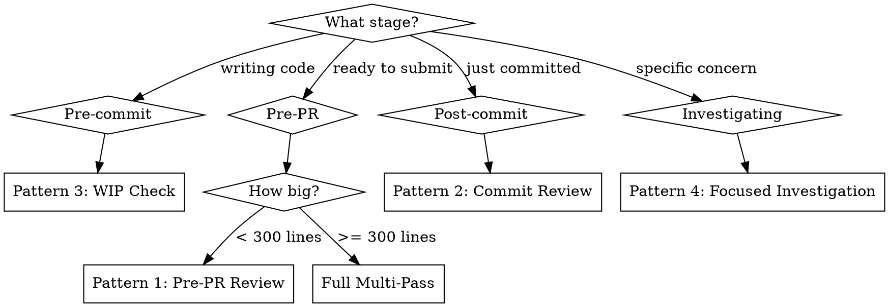

# Cross-Model Code Review

Cross-model validation: the authoring model writes code, a different model reviews it. Different architectures, different training distributions, no self-approval bias.

**Core insight:** Single-model self-review is systematically biased. The same blind spots that let bugs through during writing let them through during review. Cross-model review catches different bug classes because the reviewer has fundamentally different failure modes.

## Host Detection & Direction

Identify the current host, then invoke the other model's CLI.

| Current Host | Reviewer CLI | Direction                     |
| ------------ | ------------ | ----------------------------- |
| Claude Code  | `codex`      | Claude writes → Codex reviews |
| Codex        | `claude`     | Codex writes → Claude reviews |

Verify the reviewer CLI is installed and authenticated before starting:

```bash
codex --help       # For Claude-hosted sessions
claude --version   # For Codex-hosted sessions
```

**User defaults are authoritative.** Both CLIs read configured defaults (`~/.codex/config.toml`, `~/.claude/settings.json`). Never specify `--model`, `-m`, `--effort`, or `-c model=` in invocations unless the user explicitly asks to override.

## ⚠️ Critical: Claude CLI Variadic Flag Gotcha

The `claude` CLI has variadic flags that take `<value...>` and greedily consume every following argument until the next flag. If a prompt follows one of these, it gets swallowed as a value, the prompt arg goes missing, and Claude either errors with `Input must be provided either through stdin or as a prompt argument when using --print` or hangs waiting on stdin.

**Variadic flags to watch for:** `--allowedTools` / `--allowed-tools`, `--disallowedTools` / `--disallowed-tools`, `--tools`, `--add-dir`, `--betas`, `--file`, `--mcp-config`, `--plugin-dir`.

**Three working shapes — use one of these whenever a variadic flag is involved:**

| Shape                  | Example                                                              |
| ---------------------- | -------------------------------------------------------------------- |
| `--` separator         | `claude -p --allowedTools "Read,Bash(git *)" -- "PROMPT"`            |
| Prompt before flag     | `claude -p "PROMPT" --allowedTools "Read,Bash(git *)"`               |
| Stdin pipe, no prompt arg | `echo "PROMPT" \| claude -p --allowedTools "Read,Bash(git *)"`     |

`--` is the most defensive — it works regardless of flag ordering and is the form to standardize on.

The `codex` CLI does not have this gotcha; its flags are non-variadic and any of `codex exec "PROMPT"` / `codex exec --flag value "PROMPT"` work fine.

## Invocation Cheat Sheet

| Capability             | Claude → Codex                                | Codex → Claude                                                      |
| ---------------------- | --------------------------------------------- | ------------------------------------------------------------------- |
| Structured diff review | `codex review --base main`                    | Use piped diff or tool access (no equivalent)                       |
| Commit review          | `codex review --commit <SHA>`                 | `git show <SHA> \| claude -p "PROMPT"`                              |
| Uncommitted WIP        | `codex review --uncommitted`                  | `git diff \| claude -p "PROMPT"`                                    |
| Freeform prompt        | `codex exec "PROMPT"`                         | `claude -p "PROMPT"`                                                |
| Pipe diff in           | `git diff main...HEAD \| codex exec "PROMPT"` | `git diff main...HEAD \| claude -p "PROMPT"`                        |
| Read-only exploration  | `codex exec -s read-only "PROMPT"`            | `claude -p --allowedTools "Read,Glob,Grep,Bash(git *)" -- "PROMPT"` |
| JSON output            | `codex exec --json "PROMPT"`                  | `claude -p --output-format json -- "PROMPT"`                        |

Codex has a dedicated `review` subcommand with structured output; Claude reviews go through print mode (`-p`) with a prompt. Note the `--` separator before the prompt in every Codex → Claude invocation that uses a variadic flag — this is required, not optional.

## Review Patterns

Each pattern shows both directions. Pick the one matching your host.

### Pattern 1: Pre-PR Full Review

Standard review before opening a PR.

**Claude → Codex:**

```bash
codex review --base main
```

**Codex → Claude (fast, piped diff):**

```bash
git diff main...HEAD | claude -p \
  "Review this diff. Prioritize correctness, security, and performance.
   For each finding: cite file and line, explain the risk, suggest a fix.
   Rate confidence 0.0-1.0. Skip formatting and naming style.
   Verdict: patch is correct / patch is incorrect."
```

**Codex → Claude (deep, full context):**

```bash
claude -p --allowedTools "Read,Glob,Grep,Bash(git *)" -- \
  "Review the changes between main and HEAD in this repository.
   Prioritize correctness, security, and performance.
   For each finding: cite file and line, explain the risk, suggest a fix.
   Rate confidence 0.0-1.0. Skip formatting and naming style."
```

The `--` separator is required — `--allowedTools` is variadic and will swallow the prompt without it. See the gotcha section above.

### Pattern 2: Commit-Level Review

Quick check after a meaningful commit.

**Claude → Codex:**

```bash
codex review --commit <SHA>
```

**Codex → Claude:**

```bash
git show <SHA> | claude -p \
  "Review this commit. Flag bugs, security issues, and logic errors.
   Cite file:line for each finding. Confidence threshold: 0.7."
```

### Pattern 3: WIP Check

Review uncommitted work mid-development.

**Claude → Codex:**

```bash
codex review --uncommitted
```

**Codex → Claude:**

```bash
git diff | claude -p \
  "Review these uncommitted changes. Flag anything that looks wrong.
   Cite file:line for each finding. Skip incomplete code paths."
```

### Pattern 4: Focused Investigation

Surgical deep-dive on a specific concern (security, performance, concurrency).

**Claude → Codex:**

```bash
codex exec \
  "You are a senior [DOMAIN] engineer. Analyze [CONCERN] in the changes
   between main and HEAD. For each issue: cite file and line, explain the
   risk, suggest a concrete fix. Confidence threshold: 0.7."
```

**Codex → Claude:**

```bash
claude -p --allowedTools "Read,Glob,Grep,Bash(git *)" -- \
  "You are a senior [DOMAIN] engineer. Analyze [CONCERN] in the changes
   between main and HEAD. For each issue: cite file and line, explain the
   risk, suggest a concrete fix. Confidence threshold: 0.7."
```

Replace `[DOMAIN]` with the review focus and `[CONCERN]` with the specific worry.

### Pattern 5: Ralph Loop (Implement-Review-Fix)

Iterative quality enforcement. Max 3 iterations.

```
Iteration 1:
  Host -> implement feature
  Reviewer CLI -> findings
  Host -> fix critical/high findings

Iteration 2:
  Reviewer CLI -> verify fixes + catch remaining
  Host -> fix remaining issues

Iteration 3 (final):
  Reviewer CLI -> clean or accept trade-offs

STOP after 3 iterations. Diminishing returns beyond this.
```

Invoke the reviewer with Pattern 1 commands each iteration.

## Piped Diff vs Tool Access (Codex → Claude)

For Codex-hosted sessions reviewing with Claude, choose based on depth needed:

| Approach        | Command Shape                                                       | When to Use                                                                 |
| --------------- | ------------------------------------------------------------------- | --------------------------------------------------------------------------- |
| **Piped diff**  | `git diff ... \| claude -p "PROMPT"`                                | Quick reviews; reviewer sees only the diff                                  |
| **Tool access** | `claude -p --allowedTools "Read,Glob,Grep,Bash(git *)" -- "PROMPT"` | Architecture/security deep-dives; reviewer can trace data flow across files |

Piped diff is faster and cheaper. Tool access costs more tokens but catches bugs that require surrounding context (function signatures defined elsewhere, downstream consumers, similar patterns in the codebase).

## Multi-Pass Strategy

For thorough reviews, run multiple focused passes. Each pass gets a specific persona and concern domain.

| Pass             | Focus                                       | Approach                                                             |
| ---------------- | ------------------------------------------- | -------------------------------------------------------------------- |
| **Correctness**  | Bugs, logic, edge cases, race conditions    | Structured review (`codex review`) or piped diff with general prompt |
| **Security**     | OWASP Top 10:2025, injection, auth, secrets | Focused investigation with security persona                          |
| **Architecture** | Coupling, abstractions, API consistency     | Tool-access mode for full file context                               |
| **Performance**  | O(n^2), N+1 queries, memory leaks           | Focused investigation with performance persona                       |

When to go multi-pass:

| Change Size                                 | Strategy                     |
| ------------------------------------------- | ---------------------------- |
| < 50 lines, single concern                  | Single review pass           |
| 50-300 lines, feature work                  | Review + security pass       |
| 300+ lines or architecture change           | Full 4-pass                  |
| Security-sensitive (auth, payments, crypto) | Always include security pass |

Run passes sequentially. Fix critical findings between passes to avoid noise compounding.

## Decision Tree: Which Pattern?



## Prompt Engineering Rules

These apply to both directions — the prompts are model-agnostic.

1. **Assign a persona** — "senior security engineer" beats "review for security"
2. **Specify what to skip** — "Skip formatting, naming style, minor docs gaps"
3. **Require confidence scores** — Only act on findings >= 0.7
4. **Demand file:line citations** — Vague findings aren't actionable
5. **Ask for concrete fixes** — "Suggest a specific fix"
6. **One domain per pass** — Security-only, architecture-only

Ready-to-use prompt templates for security, architecture, performance, error handling, and concurrency are in `references/prompts.md`.

## Anti-Patterns

| Anti-Pattern                             | Why It Fails                              | Fix                                                               |
| ---------------------------------------- | ----------------------------------------- | ----------------------------------------------------------------- |
| Self-review (model reviews its own code) | Systematic bias — same blind spots        | Cross-model: author and reviewer are different models             |
| "Review this code" (no specifics)        | Too vague, produces bikeshedding          | Domain-specific prompts with persona                              |
| Single pass for everything               | Context dilution                          | Multi-pass, one concern per pass                                  |
| No confidence threshold                  | Noise floods signal                       | Only act on >= 0.7                                                |
| > 3 review iterations                    | Diminishing returns                       | Stop at 3, accept trade-offs                                      |
| Hardcoding model names in commands       | Overrides user config, goes stale fast    | Omit model/effort flags; use configured defaults                  |
| `claude -p --allowedTools "..." "PROMPT"` (no `--`) | Variadic flag eats the prompt; CLI errors or hangs on stdin | Use `claude -p --allowedTools "..." -- "PROMPT"` (or pipe via stdin) |
| Style comments in review                 | LLMs default to bikeshedding              | "Skip: formatting, naming, minor docs"                            |
| Piped diff for architecture review       | Diff lacks surrounding context            | Use tool-access mode for architecture passes                      |
| Using an MCP wrapper                     | Unnecessary indirection over a CLI binary | Call the reviewer CLI directly via Bash                           |
| Review without project context           | Generic advice disconnected from codebase | Run from repo root so project memory and source files are visible |

## What This Skill is NOT

- Not a replacement for human review — can't evaluate product direction or UX
- Not a linter — use linters for formatting and style
- Not infallible — 5-15% false positive rate is normal; triage findings
- Not for self-approval — the entire point is cross-model validation

## References

For ready-to-use prompt templates (security, architecture, performance, error handling, concurrency), see `references/prompts.md`.
