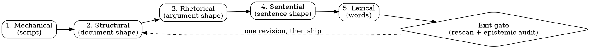

# Deslop

AI tells sit at three levels: characters, words, and shape. The first two are cheap to fix and carry the least signal. Corpus work points the same way: across 61,608 stories, narrative-structure features alone separated model text from human text at 93.2% macro-F1 ([StoryScope](https://arxiv.org/abs/2604.03136)). Swap the vocabulary and the thing that identifies the text is still there.

So the passes below start with character checks because a script does those for free, then work down through document shape, argument shape, and sentence shape, and reach vocabulary last. The order is the contribution. Neither source catalog prescribes one, and a flat list of patterns invites a reader to fix twenty cheap word hits and call it done.

The second thing that decides every rule is the surface. A pass tuned for a blog post will strip the semantic emoji a PR body requires, flatten the calibrated uncertainty that makes a postmortem honest, and spend tokens polishing a brief no human will read. Read the surface row before editing anything.

This file gets its own rhetorical, sentential, and epistemic passes. Its tables, dense phrasing, and house jargon are correct for an agent reader and would be wrong in a README, which is what the agent-facing row below means.

## Surface first

One canonical matrix. When a surface names an authority skill, that skill decides structure and this one supplies prose patterns.

| Surface                                   | Register target                       | Structure authority          | What changes here                                                                   |
| ----------------------------------------- | ------------------------------------- | ---------------------------- | ----------------------------------------------------------------------------------- |
| PR body, PR comment reply                 | Reviewer-first, receipts              | `super-good-pr`              | Semantic emoji headers and bold section leads stay. Prose patterns apply             |
| PR review report                          | Principal-engineer prose              | `hyper-pr-review`            | Severity markers stay. Prose patterns apply                                          |
| Commit body                               | Plain text, factual                   | `implement`, `git`           | No markdown at all, wrap at 76. Trailers and URLs exempt                            |
| Spec, plan, design doc                    | Precise, decision-carrying            | `plan`                       | Full pass. Slop here propagates into everything built from it                        |
| Research report                           | Findings with provenance              | `research`                   | Full pass. Stitched agent summaries arrive pre-slopped                               |
| README, docs, guides                      | Plain, concrete, second person        | this skill                   | Full pass. Code, CLI output, config samples untouched                                |
| Changelog, release notes, migration guide | Version-scoped                        | this skill                   | Full pass, but narrating the change is correct here rather than a tell                |
| Slack, email                              | Warm, complete sentences              | this skill                   | Full pass. Required signature footers stay                                           |
| Interactive chat with the user             | The house register                    | the project contract         | Skip. They watched the work happen and can ask a follow-up                          |
| Blog, essay, opinion, personal            | The author's voice                    | the author                   | Full pass, and stance belongs here. Flat neutrality is its own tell                  |
| Encyclopedic, reference, neutral docs     | Neutral and plain                     | the publication              | Full pass, no injected stance. Neutral is the correct human register                  |
| Scientific, legal, medical, forecasting    | Calibrated uncertainty                | the discipline               | Hedges are honest. Cut only hedges that qualify nothing                              |
| Marketing copy the user asked for          | Persuasive                            | the brief                    | Puffery is the genre. Name it once, then respect the brief                            |
| Fiction, creative                         | The piece's voice                     | the author                   | Invented detail is the work. The no-fabrication rule does not apply                   |
| Code comments, docstrings                 | Describe the thing as it is           | the codebase                 | Narrating a past change is a tell here, unlike a changelog                            |
| Agent brief, skill file, prompt, memory    | Dense, jargon welcome                 | this skill                   | Structure exempt (tables, density, jargon). Rhetorical, sentential, and epistemic passes still apply |

Per-surface detail and worked artifact-level rewrites are in `references/surface-profiles.md`.

## Two roles, and why they are separate

Detection and rewriting are different jobs, and one agent doing both grades its own work. Self-gating raises acceptance while correctness falls, so when the stakes justify it, split the roles: the detector reports findings and is not permitted to rewrite, and the rewriter consumes those findings without re-deriving them. On a subagent host, enforce it with tool permissions rather than instructions, denying the detector `Write` and `Edit`.

For a short artifact one agent can hold both roles, provided the detection report is written down before any edit starts. Writing the findings first is what stops the pass from becoming a vibe.

## Where the folklore is wrong

Several rules that circulate as deslop advice point in the wrong direction. Instruction-tuned models **under**-use these relative to humans, so removing them moves prose toward the machine register. Full citations and numbers in `references/evidence.md`.

| Common rule                       | What the corpus shows                                                        | Do this instead                                              |
| --------------------------------- | ---------------------------------------------------------------------------- | ------------------------------------------------------------ |
| "Cut passive voice"               | Models use agentless passive at roughly half the human rate                    | Fix only passive that hides an actor the reader needs         |
| "Strip hedges"                    | Models hedge at 50 to 67% of the human rate                                   | Cut hedges that qualify nothing, keep calibrated ones         |
| "Avoid contractions, first person" | Both run well below human rates                                              | Add them back wherever the register allows                     |
| "Ban robust, leverage, crucial"   | All three skew **human** in HC3 log-odds                                     | Drop them from the banned list and judge in context           |
| "Em dashes prove AI"              | Published human essays out-dash frontier models                              | Treat the ban as a house rule plus a density check            |
| "Cut every 'in order to'"         | Isolated wordy constructions are a human signal in the Wikipedia corpus       | Cut clusters, not instances                                    |

The same research supplies a tell nobody lists: models over-use phrasal coordination ("X, Y, and Z") at up to twice the human rate while under-using clausal coordination ("and then the build broke"). That imbalance is what makes a tricolon feel machine-made, and rebuilding one list into a sequence of clauses fixes more than deleting a third item.

Lexical markers also rot. Words get called out publicly, writers avoid them, and models keep moving. Treat any wordlist here as dated (Aug 2026) and weight structure higher, because structural tells have survived every generation so far.

## The five passes



**1. Mechanical.** Run the scanner. It masks every protected region (frontmatter, fenced code in all forms, indented code, inline code spans, blockquotes, link targets) before any check, so it never reports a hit inside code or inside a quoted example.

```bash
perl skills/deslop/scripts/slopscan.pl --surface house FILE...
# --surface house (default, our repos) | published | agent | sample
# exit 0 clean · 10 candidates only · 20 hard failures
```

Hard failures get fixed. Candidates get judged, because the heading check flags legitimate proper nouns and a bold lead that ends in a period and then adds new information is fine. The rhythm lines are diagnostics and never a gate: short technical prose legitimately scores low, and the thresholds circulating for these metrics are unvalidated. Vocabulary is inventory at this stage, applied in pass five.

**2. Structural.** Judge the document with the text out of focus, looking only at its shape: header inflation, bullets where the ideas connect, uniform section and paragraph sizes, reasoning packed into table cells, a summary that restates what was just read.

**3. Rhetorical.** Read for the argument. Inflated significance, puffery, vague attribution, signposting, generic closes, and the reasoning-era tells (premise stacking, announced counts, the tie-back close, fractal summaries, invented concept labels).

**4. Sentential.** Sentence shape: negative parallelism, tailing negation fragments, participial tails, false ranges, clause stacks that force a reread, manufactured punchlines, staccato runs, and the phrasal-coordination imbalance above.

**5. Lexical.** Plain words, filler clusters, copula avoidance, adverbs propping up weak verbs, abstract metaphor nouns, house jargon leaking outward. Colons introduce lists and explanations; as a dramatic mid-sentence hinge a colon does the same work as the em dash it replaced.

**Epistemic axis, checked at the gate.** Truth-level tells cut across all five: cutoff disclaimers, speculative gap-filling, sycophancy, chatbot residue, process theatre, unfalsifiable claims, and fabricated specificity.

Every entry, with before-and-after pairs, is in `references/pattern-catalog.md`. Do not restate the catalog here.

## How many signals convict

A single marker proves nothing, and acting on one is how a deslop pass starts damaging good writing.

| Independent signals                   | Report                                                            |
| ------------------------------------- | ----------------------------------------------------------------- |
| One                                   | Nothing. No finding, no hedged mention                            |
| Two                                   | The structural finding on its own evidence, without citing markers |
| Three or more, plus structural evidence | A finding that states how many signals it rests on                 |

Markers that are all manifestations of one sentence count as one signal.

## Evidence per finding

Each finding carries an artifact or it does not get reported.

| Test         | Question                                                        | Artifact required                            |
| ------------ | --------------------------------------------------------------- | -------------------------------------------- |
| Deletion     | Cut the span. What was lost?                                    | The cut span and the named loss. "Nothing" convicts |
| Inversion    | Negate the claim and write the negation out                      | If nobody would assert it, the original said nothing |
| Stranger     | Could someone who never read the source have written this?       | The specific fact only a reader would know    |
| Attribution  | Does "studies show" resolve to a source supporting this claim?   | The resolved citation, or the finding         |
| Load bearing | Delete the wrapper. What broke?                                 | The failing command, or nothing              |

Report a "not flagged, and why" note whenever softer markers were present and deliberately passed over. It is the one restraint control that shows its work.

## Swap traps

Removing a tell tends to relocate it.

| You removed           | The trap                                                  | Do this instead                                                          |
| --------------------- | --------------------------------------------------------- | ------------------------------------------------------------------------ |
| An em dash            | Parenthesis spray, colon as connector, or a `--` substitute | End the sentence. Use a comma for a tight aside                           |
| Rule of three         | Rule of four, or three items with new rhythm              | Count the real items, then rebuild the list as clauses                    |
| Bold-lead bullets     | A heading per former bullet                               | Prose, or a bold lead ending in a period followed by new information      |
| An AI vocabulary word | A same-register synonym ("crucial" to "vital")            | The plain word, or cut the adjective                                      |
| Passive voice         | A fake actor ("the system", "the framework")              | The real actor, or leave the passive alone                                |
| Hedging               | A flat overclaim                                          | The calibrated claim plus its basis                                       |
| A generic conclusion  | A different generic conclusion ("In short", "Ultimately")  | Stop at the last concrete fact                                            |
| Sycophancy            | Clipped coldness                                          | A neutral, direct answer                                                  |
| Staccato drama        | One long clause-stacked sentence                          | Mixed rhythm across the paragraph                                        |
| Decorative emoji      | Caps or bold as replacement decoration                    | Nothing. The sentence carries itself                                      |
| "Delve into"          | "Dive into", "explore"                                    | The verb for what happened: read, measured, tested, benchmarked           |

## Voice: match, never invent

Voice comes from a source. In priority order: a writing sample the user provides, the author's existing prose in the same repo or thread, the register the project contract specifies, then the surface default.

A user-provided sample outranks every rule here, including the dash ban. If the sample uses em dashes, keep them at the sample's frequency.

Where the surface allows stance, let the writing carry opinions, mixed feelings, uneven rhythm, asides, and first person when it fits. Stance is voice and it is yours to add. Facts are not: no name, number, date, quote, or citation enters the rewrite unless the source or the user supplied it. Trading a vague claim for an invented specific is the failure that matters most here, because the result reads better and is false.

## Preservation contract

Never edit: fenced or inline code, CLI output, frontmatter, link targets, quoted material, titles, proper names, required boilerplate, or a watched phrase that is being discussed rather than used. When a human hands you their own text for editing, edit it surgically and keep what they clearly chose.

Not tells on their own: clean grammar, formal vocabulary, a single transition word, curly quotes from an auto-curling editor, one em dash, one short emphatic sentence, mixed casual and formal register, unsourced claims, and precise technical vocabulary.

Signs of a human author, which mean edit less: hard-to-fabricate specifics, unresolved mixed feelings, era-bound references, real sentence-length variance, self-interrupting asides, first-person editorial choices the writer can defend, plain copulas, honest superlatives, and text predating late 2022.

## Two axes that cannot be traded

Score the pass on both, because optimizing one alone is how prose gets ruined.

**Slop** counts the confirmed tells that survived. **Lifelessness** measures the opposite failure: prose that reads as anti-AI cosplay, with legitimate longer sentences, precise technical vocabulary, and the author's own habits sanded off. A pass that improves one and wrecks the other has not worked.

The scanner trips a deterministic over-correction warning when mean sentence length drops below 10 words with a standard deviation under 4, or when more than 60% of sentences fall under 6 words. Either means the last pass went too far.

## The stop rule

One rewrite, one audit, one revision. Then ship, and say which checks still fail and why they were left.

When text still reads as generated after that, ask which of these it is before rewriting again: the wrong surface profile, source material with no information in it, a rewrite that relocated tells instead of removing them, or missing voice calibration. Each has a different fix, and only the second is unfixable by editing.

## Exit gate

1. The scanner reports zero hard failures for this surface, rerun after the rewrite.
2. Every name, number, date, and citation traces to the source.
3. No claim is unfalsifiable and no conversation residue survived.
4. Nothing inside the preservation contract was touched.
5. The opening does not announce and the close does not send off.
6. Any paragraph that would transplant unchanged into an unrelated project's docs is either specific now, or is boilerplate the reader needs.
7. It reads like the author, or like a person.
8. The over-correction warning is silent.

## Invocation modes

| Mode         | Trigger                                  | Deliver                                                        |
| ------------ | ---------------------------------------- | -------------------------------------------------------------- |
| **Embedded** | Another skill or task calls this mid-job | The final text only, no ceremony                               |
| **File**     | The user points at a file                | Rewrite prose in place, then report what changed in a few lines |
| **Pasted**   | The user pastes text in                  | The rewrite plus the tells found                               |
| **Gate**     | Pre-ship check on an artifact            | Pass or fail against the exit gate, with the fixes             |
| **Audit**    | "Does this read as AI?"                  | Findings with locations and no rewrite                         |

Default to embedded when another skill invoked this one.

## Anti-patterns

| Anti-pattern                                        | Fix                                                                     |
| --------------------------------------------------- | ----------------------------------------------------------------------- |
| Running the vocabulary pass and calling it done      | Structure and argument first. Words are pass five                       |
| One profile for every surface                        | Read the surface row. A PR body and an abstract share almost no rules   |
| Acting on a single marker                            | Convict on converging signals, per the table above                      |
| Reporting a finding with no artifact                 | Run one of the five evidence tests, or drop it                          |
| Deslopping a brief, prompt, or memory's structure    | Structure is exempt there. Prose passes still apply                      |
| Replacing a vague claim with an invented specific    | Ask for the fact, or write the plain version without it                 |
| Trusting your own scan for dashes and curly quotes   | Run the script. Reading for them misses them                            |
| Rewriting until it feels clean                       | One revision, then diagnose which of the four causes it is              |
| Stripping hedges where uncertainty is honest         | Scientific, legal, medical, and forecasting prose keeps its calibration |
| Injecting typos or filler to sound human             | That is detector cosplay. Write better instead                          |
| Flattening a human author's voice                    | Match the sample. It outranks every rule here                            |

## What this skill is NOT

- **Not a detector-evasion tool.** No injected typos, no artificial filler, no errors added to move a score. Never emit an authorship verdict, and never repeat a detector score as though it settled anything. Detectors misclassify human writing at high rates, with the damage falling hardest on second-language and neurodivergent writers.
- **Not a translator into one house voice.** It removes tells and matches the author, whose voice outranks its defaults.
- **Not a structure authority** for artifacts that own their shape. `super-good-pr` governs PR bodies and `hyper-pr-review` governs review reports.
- **Not a fact-checker.** It audits fabrications it introduced, not claims already in the source.
- **Not a substitute for having something to say.** Editing cannot add information to an empty draft.

## References

- `references/pattern-catalog.md` carries every tell, grouped by pass, with before-and-after pairs.
- `references/surface-profiles.md` carries per-surface rules with worked artifact-level rewrites.
- `references/evidence.md` records what the corpus research supports, with citations and verification tiers, plus the false-positive traps.
- `scripts/slopscan.pl` is the protection-aware mechanical scanner.
- `references/fixtures/` holds slop, protected, and clean fixtures for checking the scanner after an edit.

The pattern set synthesizes [Wikipedia's Signs of AI writing](https://en.wikipedia.org/wiki/Wikipedia:Signs_of_AI_writing) (WikiProject AI Cleanup), the [blader/humanizer](https://github.com/blader/humanizer) skill, Cursor's [pstack `unslop`](https://github.com/cursor/plugins/blob/main/pstack/skills/unslop/SKILL.md) skill, peer-reviewed corpus work cited in `references/evidence.md`, and house conventions from `super-good-pr` and `hyper-pr-review`.
