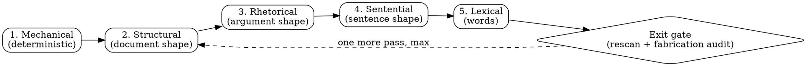

# Deslop

Slop is a shape, not a wordlist. Text with every banned word swapped out still reads as machine-written when the paragraph shape, the flat rhythm, and the decoration-where-evidence-belongs all survive. That is why lexical scrubbing feels productive and changes so little: it is the cheapest pass and the least effective one.

Two consequences drive everything below. Fix the shape before the words. And decide what surface you are writing for before you fix anything, because the rules that clean up a blog post will vandalize a PR body, a scientific abstract, or an agent brief.

Note on this file: skill files are an agent-facing surface, so the tables and bold lead-ins here are correct for the reader they have. The doc profile below would flag both in a README. That is the surface model working, not a contradiction.

## Surface first

Read the target surface off the task, then apply that row. When a surface has its own authority skill, that skill wins on structure and this one contributes prose patterns only.

| Surface                                          | Register target                            | Structure                                                       | Overrides and exemptions                                                                |
| ------------------------------------------------ | ------------------------------------------ | --------------------------------------------------------------- | --------------------------------------------------------------------------------------- |
| PR body, PR comment reply                        | Reviewer-first, full sentences, receipts   | Semantic emoji headers and bold section leads are **required**   | `super-good-pr` owns structure. Take prose patterns only, leave the shape alone          |
| PR review report                                 | Principal-engineer prose                   | Severity markers (🚫 ⚠️ 💡) are load-bearing                     | `hyper-pr-review` owns structure                                                        |
| Commit body                                      | Plain text, imperative subject             | No markdown, no fences, wrap at 76                              | Attribution trailers and URLs exempt from wrap and from tell-scanning                   |
| README, docs, guides                             | Plain, concrete, second person             | Headings and code blocks are load-bearing                       | Never touch code blocks, CLI output, frontmatter, link targets, or config samples        |
| Changelog, release notes, migration guide         | Version-scoped                             | Lists are correct here                                          | Diff-anchored writing is **correct**, not a tell. These documents exist to narrate change |
| Slack, email, chat with a human                  | Warm, complete sentences, peer energy      | Minimal formatting                                              | House signature footer required where the contract says so                              |
| Blog, essay, opinion, personal writing            | The author's voice                          | Free                                                            | Voice and stance belong here. This is the only surface where you add opinion             |
| Encyclopedic, reference, neutral documentation    | Neutral and plain                          | Free                                                            | No first person, no injected stance. Neutral **is** the human register here              |
| Scientific, legal, medical, forecasting, postmortem | Calibrated uncertainty                     | Free                                                            | Hedges are honest. Strip only hedges that qualify nothing                                |
| Fiction, creative                                | The piece's voice                           | Free                                                            | Invented detail is the job. The no-fabrication rule does not apply                       |
| Code comments, docstrings                        | Describe the thing as it is                | Free                                                            | Diff-anchored comments ("this replaces the old loop") are a tell here, unlike changelogs |
| Agent briefs, skill files, Sibyl memories, prompts | Dense, jargon welcome                      | Tables and bold serve scanning                                  | **Skip this skill.** Prose polish for a machine reader burns tokens for nothing          |

The last row is a real boundary, not a caveat. House jargon between agents is efficient. Sweep it only from text a human reads.

## The five passes

Run them in this order. The order matters because starting with vocabulary tempts you to stop there, and word swaps on unfixed structure produce text that is still obviously generated.



### 1. Mechanical

Deterministic hits, no judgment needed. Run the commands, do not eyeball for these.

```bash
F=path/to/file.md

# hard fail: em and en dashes, curly quotes and apostrophes,
# double-hyphen dash, non-breaking space, ellipsis character
rg -n '[\x{2014}\x{2013}]' "$F"
rg -n '[\x{201c}\x{201d}\x{2018}\x{2019}]' "$F"
rg -n ' -- ' "$F"
rg -n '\x{00a0}' "$F"
rg -n '\x{2026}' "$F"

# candidate list, needs judgment: bold-lead bullets, title-case headings
rg -n '^\s*[-*+] \*\*[^*]+:\*\*' "$F"
rg -n '^#{1,6} .*[a-z] [A-Z][a-z]' "$F"

# AI vocabulary frequency, code fences stripped
awk '/^```/{f=!f; next} !f' "$F" | rg -oiw \
  -e delve -e crucial -e pivotal -e landscape -e tapestry -e testament \
  -e vibrant -e intricate -e showcase -e underscore -e additionally \
  -e enhance -e foster -e garner -e interplay -e leverage -e utilize \
  -e robust -e seamless -e holistic -e nuanced -e multifaceted \
  | sort | uniq -c | sort -rn

# negative parallelism and -ing pseudo-analysis
rg -ni "not (just|only|merely|simply)\b.{0,60}\b(it'?s|it is|but)" "$F"
rg -ni ', (highlighting|underscoring|emphasizing|ensuring|reflecting|symbolizing|showcasing|fostering|contributing|cultivating|encompassing|demonstrating|solidifying|cementing|paving) ' "$F"

# rhythm proxy: sentence-length histogram
awk '/^```/{f=!f; next} !f' "$F" \
  | awk 'BEGIN{RS="[.!?]"} {n=split($0,w,/[[:space:]]+/); c=0; for(i=1;i<=n;i++) if(w[i]!="") c++; if(c>1) print c}' \
  | sort -n | uniq -c
```

Hard-fail hits get fixed with no discussion. Candidate hits get judged, since the heading pattern flags legitimate proper nouns ("Using GitHub Actions") and a bold lead that ends in a period and adds new detail is fine. On the histogram, a healthy piece has real spread with genuinely short and genuinely long sentences. When most sentences cluster in a 12-to-25-word band with nothing under 8 and nothing over 35, the rhythm is machine-flat even if every word is clean.

### 2. Structural

Look at the document with the text unfocused, judging only its shape.

| Shape tell                                                  | Fix                                                                                  |
| ----------------------------------------------------------- | ------------------------------------------------------------------------------------ |
| A heading over every two paragraphs                         | Cut headings until each one covers a real section. Prose can carry a transition       |
| Bullets where the ideas connect                             | Connected reasoning is prose. Lists are for genuinely parallel, unordered items       |
| Every list item the same length, every section the same size | Let the important part be longer. Symmetry is the machine's signature                 |
| Reasoning packed into table cells                           | Tables hold enumerable facts. Arguments go in sentences                               |
| Bold-lead bullets that restate the label                    | Convert to prose, or make the lead name a thing the following sentence then advances   |
| A summary section that restates the document                | Cut it. The reader just read the document                                             |
| Boldface on every proper noun or key term                   | Bold at most what a skimmer must not miss                                             |

### 3. Rhetorical

Now read for the argument. These are the tells that survive a clean vocabulary and still give the game away.

Inflated significance ("marks a pivotal moment", "a testament to", "setting the stage for") gets cut down to what happened. Promotional puffery ("nestled", "vibrant", "breathtaking") becomes a neutral description. Vague attribution ("experts believe", "industry reports suggest") gets a named source or gets deleted, never a decorated guess. Signposting ("let's dive in", "here's what you need to know") gets replaced by the thing itself. A generic upbeat close ("the future looks bright") gets cut so the piece ends on its last concrete fact. Full catalog with before-and-after pairs in `references/pattern-catalog.md`.

Two tests worth running on every paragraph. First, the mechanism test: if a sentence names a feeling rather than a mechanism, a number, or an instruction, rewrite it to say what happens ("the database stays close at hand" becomes "queries run in-process, with no network hop"). Second, the generic-docs test: if a paragraph could appear verbatim in an unrelated project's documentation, it says nothing about this one, so cut it.

### 4. Sentential

Sentence-level shape: negative parallelism ("it's not just X, it's Y"), tailing negation fragments ("no guessing", "no wasted motion"), participle phrases bolted on to fake depth, false ranges ("from X to Y" where the endpoints share no scale), actor-hiding passive, clause stacks that force a reread, manufactured punchlines, and staccato runs of fragments engineering drama. One idea per sentence, and name the actor when the actor matters.

### 5. Lexical

Last, and least valuable. Swap the AI vocabulary for plain words, cut filler ("in order to", "it is important to note that"), collapse stacked hedges, replace elaborate copula avoidance ("serves as", "boasts") with "is" and "has", cut adverbs propping up weak verbs, and pick the concrete word over the abstract metaphor noun ("substrate" becomes "base", "vector" becomes "method"). Colons belong before a list or an explanation. As a dramatic mid-sentence hinge, a colon is an em dash wearing a hat.

### The epistemic axis

Truth-level tells cut across all five passes and get checked at the exit gate, because they damage trust rather than just readability: cutoff disclaimers, speculative gap-filling, sycophancy, chatbot residue, unfalsifiable claims ("production-ready", "built with security in mind"), and fabricated specificity. The catalog's section 6 carries them with fixes.

## Swap traps

Removing a tell usually relocates it. Each row is a pass that looks clean and reads worse.

| You removed          | The trap                                                | Do this instead                                                                   |
| -------------------- | ------------------------------------------------------- | --------------------------------------------------------------------------------- |
| An em dash           | Parenthesis spray, colon as mid-sentence connector      | End the sentence. Use a comma for a tight aside                                   |
| Rule of three        | Rule of four, or three items with new rhythm            | Count the real items and use that number, even when it is one                     |
| Bold-lead bullets    | The same list with a heading per item                   | Prose, or a bold lead that ends in a period and is followed by new information     |
| An AI vocabulary word | A same-register synonym ("crucial" to "vital")           | The plain word, or cut the adjective entirely                                     |
| Passive voice        | A fake actor ("the system", "the framework")            | The real actor, or keep the passive when the actor genuinely does not matter       |
| Hedging              | A flat overclaim                                        | The calibrated claim plus its actual basis                                        |
| A generic conclusion | A different generic conclusion ("In short", "Ultimately") | Stop at the last concrete fact                                                     |
| Sycophancy           | Clipped coldness                                        | A neutral, direct answer                                                          |
| Staccato drama       | One long clause-stacked sentence                        | Mixed rhythm across the paragraph                                                 |
| Decorative emoji     | Caps or bold as replacement decoration                  | Nothing. The sentence carries itself                                              |
| "Delve into"         | "Dive into", "explore"                                  | The verb that says what you did: read, measured, tested, benchmarked              |

## Voice: match, never invent

Voice comes from a source, never from your own taste. In priority order: a writing sample the user provides, the author's existing prose in the same repo or thread, the register the project contract specifies, then the surface default.

A user-provided sample outranks every style rule here, including the em dash ban. If the sample uses em dashes, keep them at the sample's frequency. Matching the author beats scrubbing the tell.

Where the surface allows stance (blog, essay, opinion, personal writing), sterile neutrality is its own tell, so let the writing have opinions, mixed feelings, uneven rhythm, and asides. Stance is voice and it is yours to add. Facts are not: no name, number, date, quote, or citation may appear in the rewrite unless the source or the user supplied it. Trading a vague claim for an invented specific is the worst failure this skill has, because it reads better and it is false.

## Preservation contract

Never edit: text inside code fences, inline code, CLI output, frontmatter, link targets, quoted material, titles, proper names, or any watched phrase being discussed rather than used.

Not tells on their own, and not grounds for rewriting:

- Clean grammar and consistent style. Polish is not evidence.
- Formal or unusual vocabulary. AI overuses a specific set of fancy words, not all of them.
- One transition word. A single "however" is not a confession.
- Curly quotes alone. macOS, Word, and most editors auto-curl by default.
- One em dash in otherwise human prose. Editors and journalists use them constantly.
- One short emphatic sentence. Humans land points that way.
- Mixed casual and formal register, which often signals a real person in a technical field.
- Unsourced claims. Most writing is unsourced.
- Precise technical vocabulary. "Idempotent", "quantile", and "eventual consistency" are the right words.

Look for clusters. A single tell means nothing; em dashes plus rule-of-three plus "vibrant tapestry" plus a "Conclusion" section is a confession.

Signs of a human author, which mean edit less: hard-to-fabricate specifics, unresolved mixed feelings, era-bound references, real sentence-length variance, and genuine self-interrupting asides.

## The stop rule

One rewrite plus one audit pass. Then stop.

If the text still reads as generated after two passes, the problem is not the prose. It is that the text has nothing to say, and no amount of editing adds information. Say so and ask for the missing facts.

Over-correction is a real failure with its own signature:

- Uniform short sentences are as machine-flat as uniform mid-length ones.
- Stripped technical vocabulary makes precise writing vague.
- Deleted honest hedges turn calibrated claims into overclaims.
- A sanded-down human author is worse off than before you started.
- Deletion is not always the fix. A vague attribution wants a real source, and a feeling-word wants a mechanism. Both are expansions.

## Exit gate

The pass is done when all of these hold:

1. The mechanical scan returns zero hard-fail hits for this surface, rerun after the rewrite rather than before it.
2. Every name, number, date, and citation traces back to the source.
3. No claim is unfalsifiable, and no conversation residue survived into the document.
4. The sentence-length histogram shows real spread.
5. The opening line does not announce, and the closing line does not send off.
6. No paragraph passes the generic-docs test.
7. It sounds like the author, or like a person, and not like nobody.
8. Nothing inside the preservation contract was touched.

## Invocation modes

| Mode         | Trigger                                    | Deliver                                                             |
| ------------ | ------------------------------------------ | ------------------------------------------------------------------- |
| **Embedded** | Another skill or task calls this mid-job   | The final text only. No draft, no audit bullets, no ceremony        |
| **File**     | The user points at a file                  | Rewrite in place, prose only, then report what changed in a few lines |
| **Pasted**   | The user pastes text in                    | The rewrite, plus the short list of tells you found                 |
| **Gate**     | Pre-ship check on an artifact              | Pass or fail per the exit gate, with the specific fixes             |
| **Audit**    | "Does this read as AI?"                    | The tells with locations and no rewrite                             |

Default to embedded when another skill invoked this one. Callers want prose, not process.

## Anti-patterns

| Anti-pattern                                            | Fix                                                                            |
| ------------------------------------------------------- | ------------------------------------------------------------------------------ |
| Running the vocabulary pass and calling it done          | Fix structure and argument shape first. Words are pass five of five            |
| Applying one profile to every surface                    | Read the surface row first. A PR body and a Wikipedia article share no rules   |
| Deslopping agent-facing text                             | Skip it. Prose polish for a machine reader is wasted tokens                    |
| Replacing a vague claim with an invented specific        | Ask for the fact, or write the plain version without it                        |
| Trusting your own scan for em dashes and curly quotes    | Run the commands. Eyeballing misses them consistently                          |
| Rewriting until it feels clean                           | Two passes, then diagnose the content instead                                  |
| Stripping hedges from writing where uncertainty is honest | Scientific, legal, medical, and forecasting prose keeps its calibration        |
| Injecting typos or filler to sound human                 | That is detector cosplay. Write well instead                                   |
| Editing quoted text, code, or proper names               | Honor the preservation contract                                                |
| Flattening a human author's voice                        | Match the sample. It outranks every rule here                                  |

## What this skill is NOT

- **Not a detector-evasion tool.** No injected typos, no artificial filler, no deliberate errors to move a score. If the context requires disclosure that text was AI-assisted, cleaning the prose does not change that obligation.
- **Not a translator into one house voice.** It removes tells and matches the author, and a human author's voice outranks its defaults.
- **Not a structure authority for artifacts that own their shape.** `super-good-pr` governs PR bodies, `hyper-pr-review` governs review reports. This skill contributes prose patterns to both and never restructures them.
- **Not for agent-facing text.** Briefs, skill files, prompts, and memories are exempt.
- **Not a fact-checker.** It audits fabrications it introduced, not claims already in the source.
- **Not a substitute for having something to say.** Slop is often a symptom of an empty draft, and editing cannot add information.

## References

The full tell catalog with before-and-after pairs lives in `references/pattern-catalog.md`, organized by the same five axes as the passes. Per-surface detail, including who overrides whom, lives in `references/surface-profiles.md`.

The pattern set synthesizes [Wikipedia's Signs of AI writing](https://en.wikipedia.org/wiki/Wikipedia:Signs_of_AI_writing) (maintained by WikiProject AI Cleanup), the [blader/humanizer](https://github.com/blader/humanizer) skill, and Cursor's [pstack `unslop`](https://github.com/cursor/plugins/blob/main/pstack/skills/unslop/SKILL.md) skill, plus editing craft and the house conventions this repo already encoded in `super-good-pr` and `hyper-pr-review`.
