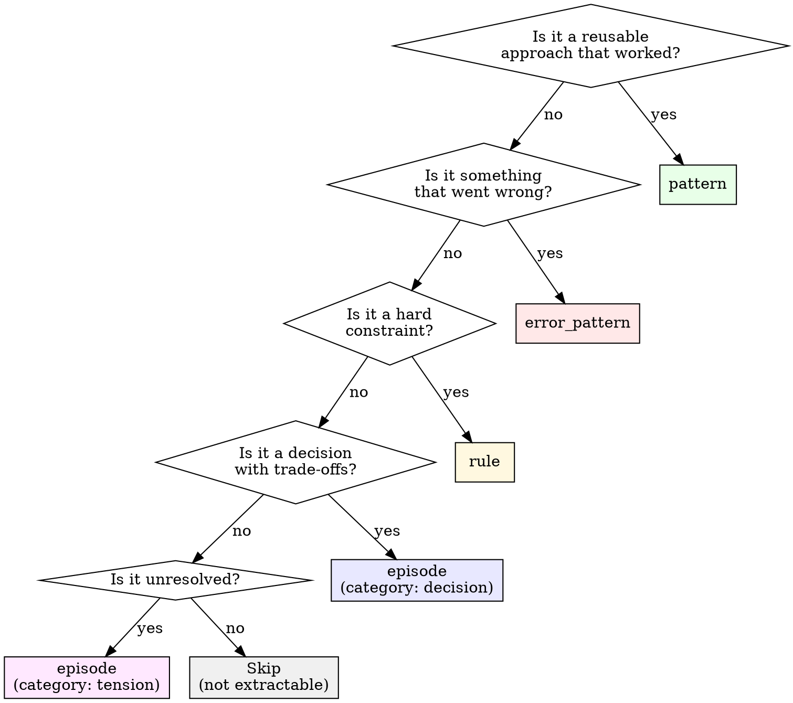

# Dream Extraction Guide

## What to Extract vs Skip

### High-Value Extractions

| Signal                             | Sibyl Type                     | Example                                                                               |
| ---------------------------------- | ------------------------------ | ------------------------------------------------------------------------------------- |
| User corrects assistant's approach | `error_pattern`                | "Don't use `uv pip` — use `uv add` for project dependencies"                          |
| Technical decision with trade-offs | `episode` (category: decision) | "Chose Temporal over BullMQ because workflow visibility matters more than simplicity" |
| Non-obvious debugging insight      | `pattern`                      | "FalkorDB WRONGTYPE errors mean the key schema changed — run FLUSHALL on dev"         |
| Reusable code pattern              | `pattern`                      | "Use `select!` with heartbeat future for long-running Temporal activities"            |
| Hard constraint discovered         | `rule`                         | "Never commit .env files — gradial uses SOPS for secrets"                             |
| Unresolved question deferred       | `episode` (category: tension)  | "Should Sibyl use Graphiti's built-in community detection or custom?"                 |
| New tool/library adoption          | `episode` (category: decision) | "Adopted better-auth for v2 — replacing next-auth due to multi-tenant needs"          |
| Performance finding                | `pattern`                      | "Batch Sibyl writes via REST API, not individual CLI calls — 10x faster"              |
| Configuration quirk                | `error_pattern`                | "moon workspace requires `.moon/toolchains.yml` even if empty"                        |

### Skip These (Low/No Value)

| Signal                                           | Why Skip                                                      |
| ------------------------------------------------ | ------------------------------------------------------------- |
| Simple Q&A ("what does X do?")                   | No transfer value — answer is in the docs                     |
| File reads / directory listings                  | Ephemeral navigation, not knowledge                           |
| Routine git operations                           | Git history captures this                                     |
| Typo corrections                                 | Not a pattern or learning                                     |
| Boilerplate generation                           | The code is the artifact, not the conversation                |
| "Make it work" debugging with no root cause      | No insight to capture if root cause unknown                   |
| Conversations that only resulted in reading code | Reading isn't learning unless something non-obvious was found |

---

## Quality Bar for Extractions

### Bad Extractions (Don't Write These)

```
"Fixed the auth bug"
→ No: What bug? What was the root cause? What's the transferable insight?

"Used React for the frontend"
→ No: This is a project fact derivable from package.json, not a learning.

"Updated the README"
→ No: The git commit says this. No knowledge to capture.
```

### Good Extractions

```
"JWT refresh tokens fail silently when Redis TTL expires before token expiry.
Root cause: token service catches WRONGTYPE error but swallows it.
Fix: Add explicit type check before SET, regenerate token on type mismatch.
Applies to: Any service using Redis for JWT storage with independent TTLs."
→ Yes: Root cause, fix, transferability.

"Temporal activity futures need periodic heartbeats, not just start/completion markers.
Pattern: Wrap the activity future in a select! loop emitting heartbeats every 30s.
Without this, Temporal marks the activity as failed after the heartbeat timeout."
→ Yes: Non-obvious behavior, concrete pattern, prevents future mistakes.

"Chose FalkorDB over Neo4j for Sibyl because: (1) Redis-compatible protocol for
existing infra, (2) built-in vector similarity search, (3) 10x faster for small
graphs (<1M nodes). Trade-off: less mature ecosystem, fewer community resources."
→ Yes: Decision with rationale, alternatives, trade-offs.
```

### The Transfer Test

Before writing an extraction, ask: **"Would this be useful in a different project or a different session?"**

- Yes → Write it
- Maybe → Write it with narrow scope tags
- No → Skip it

---

## Entity Type Selection Guide



---

## Deduplication Strategy

### Before Writing to Sibyl

1. **Exact match check:**

   ```bash
   sibyl search "[exact entity title]" --types [type] --limit 3
   ```

2. **Semantic similarity check:**

   ```bash
   sibyl search "[key concepts from the extraction]" --types [type] --limit 5
   ```

3. **Decision matrix:**

   | Search Result                  | Action                                                        |
   | ------------------------------ | ------------------------------------------------------------- |
   | No matches                     | Create new entity                                             |
   | Same topic, older info         | Update existing entity (note: Sibyl tracks temporal validity) |
   | Same topic, same info          | Skip — already captured                                       |
   | Same topic, contradictory info | Create new entity + tension entity linking both               |
   | Related but distinct           | Create new entity with RELATED_TO relationship                |

### Within a Single Dream Cycle

Multiple sessions may contain the same insight (e.g., same bug hit twice). Deduplicate within the extraction batch before writing to Sibyl:

1. Group extractions by topic/keyword
2. Merge duplicates — keep the richest description
3. Note multiple source sessions in the entity metadata

---

## Tagging Conventions

Consistent tags make future search and REM exploration effective.

### Required Tags

- `project:<name>` — Which project this relates to (e.g., `project:sibyl`, `project:v2`)
- Source conversation type — `source:claude` or `source:codex`

### Recommended Tags

- `domain:<area>` — Technical domain (e.g., `domain:auth`, `domain:graph`, `domain:deployment`)
- `stack:<tech>` — Technology involved (e.g., `stack:temporal`, `stack:react`, `stack:kubernetes`)
- `confidence:<level>` — How sure are we? `high`, `medium`, `low`

### Dream-Specific Tags

- `dream` — All entities created during dream cycles
- `dream-date:YYYY-MM-DD` — When the dream cycle ran
- `stale` — Flagged for review during REM phase
- `needs-review` — Low-confidence extraction requiring human validation
- `cross-project` — REM-discovered cross-project connections

---

## Examples: Full Extraction from a Conversation

### Input: Claude Code Session Excerpt

```
User: "the SessionEnd hook isn't firing when I close the terminal"
Assistant: [investigates, finds the issue]
Assistant: "The problem is that SessionEnd only fires on clean exits —
if the terminal is killed (SIGKILL), the hook never runs. You need to
also handle SIGTERM in your hook registration..."
User: "ah that explains why the data was missing. let's add SIGTERM handling"
```

### Extractions

**1. Error Pattern:**

```bash
sibyl add "SessionEnd hook doesn't fire on terminal kill" \
  "Claude Code SessionEnd hook only fires on clean exits (user types exit, Ctrl+D, /clear). Terminal kill (SIGKILL, closing window) bypasses the hook entirely. SIGTERM may or may not fire depending on the terminal emulator. Workaround: Also register a SIGTERM handler in hook scripts, and use a heartbeat/watchdog pattern for critical post-session processing." \
  --type error_pattern --category hooks --tags "project:dreamer,source:claude,stack:claude-code"
```

**2. Pattern:**

```bash
sibyl add "Pattern: Heartbeat watchdog for session-end processing" \
  "Instead of relying solely on SessionEnd hook (which can miss unclean exits), use a dual approach: (1) SessionEnd hook for immediate processing, (2) Background watchdog that detects stale session PIDs and runs cleanup. Check ~/.claude/sessions/<pid>.json for active sessions." \
  --type pattern --category hooks --tags "project:dreamer,source:claude,stack:claude-code"
```
