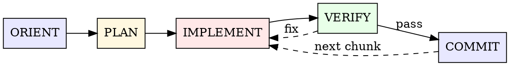

# Implementation

Verification-driven coding with tight feedback loops. Distilled from 21,321 tracked operations across 64+ projects, 612 debugging sessions, and ~600 transcribed working sessions from the Apr–Jul 2026 corpus. These are the patterns that consistently ship working code.

**Core insight:** Verify in tight loops, roughly every 2-3 edits — 73% of fixes go unverified across the dataset, the single biggest quality gap. And proof lives where the artifact is *consumed*, not where it was produced: green producer gates are necessary, never sufficient.

**How to read this skill:** the loop and the heuristics below are calibrated for non-trivial implementation work. Trivial fixes (config, typo, single-line) shouldn't drag through five phases. Use judgment, scale planning to scope, and skip what doesn't apply. The Code Discipline section is principles that bias toward caution; for one-line changes, just make the change.

## The Loop

Implementation work composes from five things that must all be true by the time a chunk ships. Not a fixed order; the graph below shows the natural dependencies and the loop-backs that are routine in practice.



- **Oriented.** Existing code is read before anything gets touched. `Grep → Read → Read` is the dominant opening across the dataset. Sessions that read 10+ files before the first edit require fewer fix iterations downstream. Blind changes are the most expensive way to start. Before creating any new structure — module, config surface, CLI group, error type — locate the nearest in-repo exemplar and clone its shape; the repo usually solved this kind of thing once already.

- **Planned.** Decomposition exists at the right scale. Trivial fixes don't need a plan; features benefit from a task list; epics earn a research swarm. The decision is "what's proportional," not "always plan."

- **Implemented.** Work happens in batches of roughly 2-3 edits, then verifies. Build in dependency order (types → logic → surfaces), held loosely: migrations get written AFTER the code that needs them, and frontend drives backend changes as often as the reverse. Edit existing files 9:1 over creating new ones; that's the observed ratio in successful sessions. Fix errors as they surface; accumulating them creates cascade-debugging.

- **Verified.** Typecheck is the primary inner-loop gate, fast and cheap; run it between batches. Tests fit naturally after feature-complete. Full suite before commit — and the proof ladder continues past green gates to the consumption boundary (see Verification Cadence).

- **Committed.** Atomic chunks, committed as you go. Stage specific files, commit, loop back to the next chunk. Many small commits per session is the pattern that consistently outperforms one mega-commit at the end. See **Commit Cadence** below for message anatomy.

**Trajectories that compose these:**

- **Typo fix**: Oriented (read the file) → Implemented → Verified (typecheck) → Committed. No Planned needed.
- **Standard feature**: Oriented → Planned → Implemented → Verified → Committed → loop back into Implemented for the next chunk.
- **Bug with cascade**: Oriented → Implemented → Verified (fails) → re-Implemented → Verified (passes) → Committed. The dashed VERIFY → IMPLEMENT edge above is this case.
- **Epic with phases**: Oriented → Planned (decomposition) → (Implemented → Verified → Committed) per phase → re-Oriented when the next phase changes the picture.

---

## Code Discipline

Principles that shape how you move through the loop, not steps to execute. Adapted from Karpathy's [observations](https://x.com/karpathy/status/2015883857489522876) on LLM coding pitfalls: models "make wrong assumptions on your behalf and just run along with them without checking ... really like to overcomplicate code and APIs, bloat abstractions ... implement a bloated construction over 1000 lines when 100 would do."

These principles bias toward caution because that's where models drift. For trivial fixes, the calculus inverts; apply judgment, not the full discipline.

### Think before coding

Don't assume. Don't hide confusion. Surface tradeoffs.

| Situation                               | Action                            |
| --------------------------------------- | --------------------------------- |
| Multiple interpretations of the request | Present them; don't pick silently |
| A simpler approach is plausible         | Say so; push back when warranted  |
| Something is unclear                    | Stop; name what's confusing; ask  |
| You hold a load-bearing assumption      | State it explicitly               |
| Inconsistency between request and code  | Surface it before proceeding      |

ORIENT (read the code) is the prerequisite. This principle is what to do with what you find: name the gaps, don't paper over them.

At security boundaries and other high-stakes forks, weak evidence for what the user's words denote is a stop-and-ask. For ambiguous directives elsewhere, announce which reading you took before executing: "treating 'this' as the GitOps path."

### Simplicity first

Minimum code that solves the problem. Nothing speculative.

| Don't                                          | Do                                           |
| ---------------------------------------------- | -------------------------------------------- |
| Add features beyond what was asked             | Solve exactly the stated problem             |
| Build abstractions for single-use code         | Inline first; abstract when reused           |
| Add "flexibility" or configurability not asked | Hardcode now; parameterize on demand         |
| Handle errors for impossible scenarios         | Trust internal invariants; validate at edges |
| Add a fallback, alias, or compat shim          | Check ship status first: pre-ship, delete the old shape and tighten to final — compat is a change that needs a pitch |
| Write 200 lines when 50 would do               | Rewrite tighter                              |

Two tests: would a senior engineer call this overcomplicated? And how long does this code live? Lifespan scales architecture — a two-week throwaway earns no pipeline. The bar is usefulness, not smallness.

### The judo move

Simplicity first is defensive: don't add bloat. The judo move is offensive: when bloat is already mounting, hunt the restructuring that makes it vanish. Same behavior, dramatically simpler shape, a design that feels inevitable in hindsight.

Mounting complexity is the cue, not the cost of doing business. When a change starts sprouting special cases, a function won't stop growing, or you reach for a cast to make the types agree, stop and look for the move before pushing through. Models drift toward elaborating complexity; the discipline is to reach for the eraser first.

| Smell                                                     | The judo move                                                          |
| --------------------------------------------------------- | ---------------------------------------------------------------------- |
| New `if` bolted onto an unrelated flow for one case       | Pull the case behind its own abstraction, or reframe so it can't arise |
| A wrapper that just forwards to another function          | Delete it; call through directly                                       |
| The same conditional copy-pasted across call sites        | Extract the decision into one home: a helper, a type, a model          |
| Feature logic living in a shared/util module              | Move it to the module that owns the concept, its canonical home        |
| `any`/`unknown`/casts smoothing over a shape you distrust | Make the type honest; let the contract carry the invariant             |
| Generic "magic" hiding a simple data-shape assumption     | Boring, explicit, direct code beats clever indirection                 |
| Independent async steps run in sequence                   | Run them in parallel; let related state land atomically                |

The test: are you **deleting** complexity or **relocating** it? Rearranging the same concepts into tidier piles isn't a judo move; removing a concept, a branch, a layer, or a mode is. If the diff only moved the mess, keep looking.

### Surgical changes

Touch only what you must. Clean up only your own mess.

| Rule                                                   | Why                                             |
| ------------------------------------------------------ | ----------------------------------------------- |
| Don't "improve" adjacent code, comments, or formatting | Pollutes the diff; outside your scope           |
| Don't refactor code that isn't broken                  | Scope creep expands blast radius                |
| Match existing style even if you'd do it differently   | Local consistency beats your preferences        |
| Notice unrelated dead code → mention, don't delete     | Other branches/agents may rely on it            |
| Remove imports/vars/funcs _your_ changes orphaned      | Clean up after yourself                         |
| Fix labels/counts/error text your change made untruthful | Fix the lie in the same commit; stale renders as stale, not fresh |
| Leave pre-existing dead code alone                     | Outside your remit unless explicitly asked      |
| Don't touch comments you don't understand              | Karpathy: "side effects ... orthogonal to task" |

The test: every changed line should trace directly to the user's request.

### Goal-driven execution

Define verifiable success. Loop until it passes.

| Vague task       | Verifiable goal                                     |
| ---------------- | --------------------------------------------------- |
| "Add validation" | Write tests for invalid inputs, then make them pass |
| "Fix the bug"    | Write a test that reproduces it, then make it pass  |
| "Refactor X"     | Ensure the same tests pass before and after         |
| "Make it work"   | Reject, name the actual signal that proves it works |

For multi-step work, state the plan with verification per step:

```
1. [Step] → verify: [check]
2. [Step] → verify: [check]
3. [Step] → verify: [check]
```

Strong success criteria let you loop independently. Weak criteria require constant clarification.

### Scope doubt

"Are we overengineering?" — from the user or your own gut — gets adjudication, not reassurance: an honest verdict, the carrying cost of the extra structure quantified, and over-built work parked unpushed with revival criteria rather than silently deleted.

Entering a review-fix round, triage blockers from follow-ups and declare a file budget before touching code — review loops ratchet scope monotonically (one observed loop: 8 rounds, 63 files; re-anchored to 6). "Documented why not" is a legitimate response to an absence finding.

---

## Scale Selection

Strategy changes dramatically based on scope. Pick the right weight class:

| Scale                      | Edits   | Strategy                                                 |
| -------------------------- | ------- | -------------------------------------------------------- |
| **Trivial** (config, typo) | 1-5     | Read -> Edit -> Verify -> Commit                         |
| **Small fix**              | 5-20    | Grep error -> Read -> Fix -> Test -> Commit              |
| **Feature**                | 50-200  | Plan -> Layer-by-layer impl -> Verify per layer          |
| **Subsystem**              | 300-500 | Task planning -> Wave dispatch -> Layer-by-layer         |
| **Epic**                   | 1000+   | Research swarm -> Spec -> Parallel agents -> Integration |

**Skip planning when:** Scope is clear, single-file change, fix describable in one sentence.

**Plan when:** Multiple files, unfamiliar code, uncertain approach.

---

## Verification Cadence

The single most impactful practice in the dataset. Tight loops here make the rest of the skill mostly unnecessary; loose loops make every other guideline harder to follow.

| Gate                   | Typically                  | Speed                    |
| ---------------------- | -------------------------- | ------------------------ |
| **Typecheck**          | Between edit batches       | Fast (inner-loop gate)   |
| **Lint (autofix)**     | After implementation batch | Fast                     |
| **Tests (specific)**   | After feature complete     | Medium                   |
| **Tests (full suite)** | Before commit              | Slow                     |
| **Build**              | Before PR/deploy           | Slowest                  |
| **Consumption check**  | Before calling it done     | Varies (the final proof) |

### The edit-verify-fix cycle

The pattern that consistently produces clean sessions: **~3 changes → verify → 1 fix**. Sweet spot, not a hard ratio. Sometimes one edit warrants its own verify, sometimes five edits group cleanly.

The pattern that produces debugging spirals: **2 changes → typecheck → 15 cascading fixes**. Prevent type cascades by grepping consumers before modifying shared types; once the cascade starts, separate fix domains (see Error Recovery).

**Combined gates save time:** `turbo lint:fix typecheck --filter=pkg` runs both in one shot. Scope verification to affected packages, never the full monorepo.

**Practical tips:**

- Run `lint:fix` BEFORE `lint` check to reduce iterations
- `cargo check` over `cargo build` (2-3x faster, same error detection)
- Truncate verbose output: `2>&1 | tail -20`
- Wrap tests with timeout: `timeout 120 uv run pytest`

### Proof lives at the consumption boundary

Typecheck through build prove the *producer*. "It works" is proven where the artifact is consumed:

| Artifact         | Consumption check                                                 |
| ---------------- | ----------------------------------------------------------------- |
| Rendered config  | Render the composed output; grep it for the motivating invariant  |
| Package/library  | Clean-clone install — no sibling checkout or cache to hide breaks |
| UI               | Drive the real surface (agent-browser), not just the test         |
| CLI              | Real invocation in a clean env, including the zero-arg case       |
| Deployed service | Walk the ladder: merged → synced → applied → running              |

Assert the motivating invariant in the consumed form, not "renders without error" — a wildcard can be accepted syntactically and still match nothing. When a symptom persists after a "fix," walk the promotion ladder before reopening the code: merged is not deployed, and the label is not the artifact. Review passes are not a substitute; a bogus foreign key survived multiple model reviews and died only on real apply.

### A green check must demonstrably do the work

Hollow greens are a named defect class: cached runs replayed as fresh, test filters matching zero tests, 7-second no-op CI jobs, env-gated suites silently skipping. A receipt carries a nonzero executed count, a plausible duration, a real exit code, uncached execution when the claim matters, and an invocation matching the gate that will judge the work (same flags, same env, the literal CI command). "Suspiciously fast" and "0 passed; N filtered out" are defects in the gate, not passes.

Two more signal rules:

- **Flake is a verdict, not a shrug.** It needs legs: the failure trace doesn't intersect the diff, the same failure shows on main or a sibling branch, a CI-shaped local run passes. Recurrence revokes the verdict, no matter who applied the label.
- **A guard you haven't watched fire is decoration.** New gate or detector: induce the exact failure it exists to catch and show it tripping — and staying quiet on normal — before shipping it.

### Felt surfaces need instruments

"Buttery, gorgeous, no jank" becomes named acceptance criteria before work starts. Perf and visual loops need an objective signal — a metric, telemetry, a repro harness — before iteration two; loops judged by the next screenshot become random walks. For interactive perf, size the unit of work to the interaction delta before touching scheduling or concurrency. When the surface is one you can't observe (TUI feel, hardware, another machine), the human is the sensor: hand them a pre-registered expected outcome and a discriminating tell.

---

## Decision Trees

### Subagents vs Direct Work

```
Self-contained with a clear deliverable?
  Yes -> Produces verbose output (tests, logs, research)?
    Yes -> Subagent (keeps context clean)
    No  -> Need frequent back-and-forth?
      Yes -> Direct
      No  -> Subagent
  No -> Direct (iterative refinement needs shared context)
```

### Refactoring Approach

```
Can changes be made incrementally?
  Yes -> Move first, THEN consolidate (separate commits)
        New code alongside old, remove old only after tests pass
  No  -> Analysis phase first (parallel review agents)
        Gap analysis: old vs new function-by-function
        Implement gaps as focused tasks
```

---

## Error Recovery

Most debugging resolves in 1-2 iterations when the red signal is classified before anything gets fixed. Misclassification is where thrash starts.

### Name the failure class first

| Red signal smells like        | Response                                                                                                          |
| ----------------------------- | ----------------------------------------------------------------------------------------------------------------- |
| Install/env, runner syntax    | Fix the environment; don't touch code                                                             |
| Stale artifact or cache       | Rebuild, cache-bust, confirm the running thing is your build                                       |
| Self-induced parallel race    | Rerun sequentially once; don't serialize forever                                                   |
| Pre-existing / inherited      | Prove it by absence (your signature missing, base red in the same place), then rebase — don't "fix" it in-branch |
| Probe contradicts known state | Audit the probe first: timeouts, regexes, auth freshness                                           |
| Actual code                   | Explicit hypothesis ("X because Y") → one targeted fix → verify                                    |

CI red: download the raw log to a file with its exit code, collapse the cascade to its root, and reproduce with the exact CI command — approximations have missed real bugs. Full protocol in `references/recovery.md`.

### Fix the class, bound the fix

A reported bug is a sample from a population. Before patching the symptom, check whether sibling call sites are just getting lucky; fix once at the choke point; after the fix, sweep the population for the same defect. Generalize the diagnosis, bound the fix — sibling fixes ship as their own scoped follow-ups, never an accidental cross-product refactor.

### Spiral prevention

- **Separate error domains.** Fix all type errors before chasing test failures; interleaving the two is how cascades compound.
- **3-strike heuristic.** Three failed attempts on the same error demands a genuinely new hypothesis one level deeper — not variation #4, and never an adjacent refactor mid-bug. Persistence spends its budget on depth, not breadth; and the done-bar belongs to the user, so stopping isn't yours to call alone.
- **Cascade depth > 3.** Pause, enumerate all remaining issues, then fix in dependency order rather than reactive whack-a-mole.
- **Second occurrence of the same issue.** That's a durable-capture trigger: a regression test, a pinned invariant, or a memory entry, plus a level switch to fix the class. Restart is the last resort, not the reflex.
- **Re-entry.** After compaction, handoff, or resumption, re-derive state from the repo and re-read pinned invariants before touching adjacent code. A fresh session is the fallback when re-grounding fails, not a scheduled event.

### Incident mode

Production on fire changes the grammar: freeze mutations and go read-only, park in-flight work so the fix diff stays pure, run two tracks (hotfix pinned to the deployed revision plus a clean main-based PR for the durable fix), and convert every scar into a guard, test, or runbook line before closing. Full shape in `references/recovery.md`.

---

## Commit Cadence

Commit each logical chunk as it lands and verifies. Many small commits per session is the norm, never accumulate hours of unrelated work into one mega-commit. The COMMIT step loops back to IMPLEMENT for the next chunk.

### When to commit

| Trigger                                         | Action          |
| ----------------------------------------------- | --------------- |
| Logical chunk done, verification passes         | Commit          |
| Move/rename complete, before behavioral changes | Commit (move)   |
| Behavioral change works after the move commit   | Commit (change) |
| Refactor extracted, callers still pass          | Commit          |
| About to switch to a different concern          | Commit current  |
| Verification fails or edit is speculative       | Don't commit    |

If a reviewer would want it as a separate diff, it's a separate commit.

### Shape checkpoint

Correctness gates can't see sprawl: a 397-file manifest factory shipped 549 green tests and two passing cross-model reviews, and died in seconds from the diffstat. At each commit boundary, glance at the shape, not just the gates:

```bash
git diff --name-only origin/main...HEAD | awk -F/ '{print $1"/"$2}' | sort | uniq -c | sort -nr
```

Classify by top-level path against the mission and ask: would the human veto this from the diffstat? A commit boundary is also a memory boundary — the natural moment to capture a gotcha before the next chunk buries it.

### Mirror local style

Before the first commit in any repo, run `git log -10 --oneline` and mirror the pattern. **Mirror format, not quality**, terse history doesn't lower your bar. Default to Conventional Commits when no pattern exists.

| Pattern              | Example                        |
| -------------------- | ------------------------------ |
| Conventional Commits | `feat(api): add token refresh` |
| Gitmoji              | `✨ Add token refresh`         |
| Ticket prefix        | `[ENG-1234] Add token refresh` |
| Module prefix        | `auth: add token refresh`      |
| Plain                | `Add token refresh`            |

Conventional Commit types: `feat` (capability), `fix` (bug), `refactor` (no behavior change), `perf`, `test`, `docs`, `style` (formatting only), `chore` (tooling/deps), `build`, `ci`. Scope is optional but encouraged when the change is localized.

### Message anatomy

**Subject:** imperative mood, ≤76 chars, no trailing period, no filenames. "Fix null deref in token refresh" beats "Fix bug." For Conventional Commits, no emoji in the subject, it breaks parsers.

**Body** (always include one): wrap at 76 chars, separated from subject by a blank line. Explain _why_, the diff shows _what_. State facts: banish "likely", "probably", "might", "seems", "appears to". If you don't know what a change does, read more before committing. Two sentences usually suffices; mention load-bearing context a future bisect would want.

### HEREDOC + Co-Author

Compose messages via HEREDOC (or `git commit -F <file>`) to preserve formatting — `-m` flags keep each paragraph on one unwrapped line and burn amend cycles. Add a `Co-Authored-By` trailer that names the model, "Claude" alone doesn't disambiguate across multi-agent sessions.

```bash
git commit -m "$(cat <<'EOF'
fix(auth): guard against null session in token refresh

Refresh racing with logout was dereferencing a freed session, surfacing
as a 500 with no log trail. Early return plus a single warn log makes
the failure mode visible without spamming on every refresh.

Co-Authored-By: Nova (Claude Opus 4.7) <noreply@anthropic.com>
EOF
)"
```

Backstop the wrap after committing (a check, not the mechanism):

```bash
git log -1 --format=%B | awk 'length($0) > 76 && $0 !~ /^(Co-Authored-By:|https?:\/\/)/ { print "over 76 chars: " $0; bad=1 } END { exit bad }'
```

### Multi-agent staging

Other agents may be working in parallel:

```bash
git status                # See the full picture first
git diff --staged         # Review what you're about to commit
git add <specific-files>  # Only files you personally touched
```

Never `git add -A` or `git add .` (catches other agents' WIP and secrets). Never `git restore` files you didn't modify. Never push `main`/`master` or tags — those need an explicit go-ahead. Pushing your own PR/feature branch in a shareable state is normal: re-fetch first, and after a history rewrite use `--force-with-lease` pinned to the just-fetched SHA. When in doubt whether a branch is yours, ask. Skip planning docs, scratch files, and `.local.md` from the repo.

---

## Anti-Patterns

| Anti-Pattern                                     | Fix                                             |
| ------------------------------------------------ | ----------------------------------------------- |
| 20+ edits without verification                   | Verify every 2-3 edits                          |
| Fix without verifying the fix                    | One fix, one verify, repeat                     |
| `fix -> fix -> fix` chains without checking      | Always verify between fixes                     |
| Editing without reading first                    | Read the file immediately before editing        |
| Writing tests from memory                        | Read actual function signatures first           |
| Changing shared types without grepping consumers | `Grep` all usages before modifying shared types |
| Mixing move and change in one commit             | Move first commit, change second commit         |
| Debugging spiral past 3 attempts                 | New hypothesis one level deeper, never wider    |
| Premature optimization                           | Correctness first, optimize after tests pass    |
| One mega-commit at end of session                | Commit each logical chunk as it lands           |
| Bare titles like `fix: bug` or `update stuff`    | Specific subject + body explaining why          |
| Skipping the body to "save time"                 | Always include a body, even two sentences       |
| Filenames or paths in the subject line           | Describe the behavior, not the file             |
| Uncertain language ("might fix", "should work")  | State facts; read more code if you don't know   |
| `git add -A` / `git add .`                       | Stage specific files only                       |
| Pushing `main`/`master` or tags autonomously     | Explicit go-ahead only; your own PR branch is fine |
| Acting on review findings without a file budget  | Triage blockers vs follow-ups; declare the budget first |
| Silently picking one interpretation              | Surface options; ask before committing to one   |
| "Improving" code adjacent to your change         | Stay surgical; touch only what's asked          |
| Touching comments you don't understand           | Leave them; not your scope                      |
| Bloated abstraction for single-use code          | Write the function; abstract when reused        |
| Pushing through mounting complexity              | Stop; hunt the judo move that deletes it        |
| Rearranging complexity instead of removing it    | Delete a concept, branch, or layer, not tidy it |
| Vague "make it work" goal                        | Define a verifiable check first                 |

---

## Cross-Model Review

For high-stakes changes, run `/hyperskills:cross-model-review` after implementation. A different reviewer model breaks self-review bias and catches real bugs: migration idempotency, PII in debug logging, empty-array edge cases, missing batch limits. It does not protect against shared-training staleness — version, SOTA, and ecosystem claims need live primary sources no matter how many models agreed. Use `/hyperskills:codex-review` only when you specifically want the Claude → Codex direction with `codex review` subcommand semantics.

---

## References

For quantitative benchmarks and implementation archetype templates, consult `references/benchmarks.md`. For the full CI-triage protocol, flake evidence standard, and incident-mode grammar, consult `references/recovery.md`.

---

## What This Skill is NOT

- **Not a gate.** Don't follow all five phases for a typo fix. Scale selection exists for a reason.
- **Not a replacement for reading code.** This skill tells you HOW to implement, not WHAT to implement.
- **Not a planning tool.** Use `/hyperskills:plan` for task decomposition.
- **Not an excuse to skip tests.** "Verify" means running actual checks, not eyeballing the diff.
