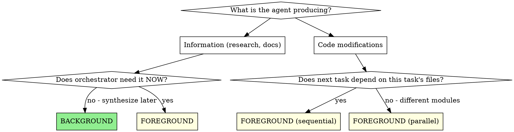

# Multi-Agent Orchestration

Meta-orchestration patterns mined from 597+ real agent dispatches across production codebases. This skill tells you WHICH strategy to use, HOW to structure prompts, and WHEN to use background vs foreground.

**Core principle:** Choose the right orchestration strategy for the work, partition agents by independence, inject context to enable parallelism, and adapt review overhead to trust level.

## Strategy Selection

```dot
digraph strategy_selection {
    rankdir=TB;
    "What type of work?" [shape=diamond];

    "Research / knowledge gathering" [shape=box];
    "Independent feature builds" [shape=box];
    "Sequential dependent tasks" [shape=box];
    "Same transformation across partitions" [shape=box];
    "Codebase audit / assessment" [shape=box];
    "Greenfield project kickoff" [shape=box];

    "Research Swarm" [shape=box style=filled fillcolor=lightyellow];
    "Epic Parallel Build" [shape=box style=filled fillcolor=lightyellow];
    "Sequential Pipeline" [shape=box style=filled fillcolor=lightyellow];
    "Parallel Sweep" [shape=box style=filled fillcolor=lightyellow];
    "Multi-Dimensional Audit" [shape=box style=filled fillcolor=lightyellow];
    "Full Lifecycle" [shape=box style=filled fillcolor=lightyellow];

    "What type of work?" -> "Research / knowledge gathering";
    "What type of work?" -> "Independent feature builds";
    "What type of work?" -> "Sequential dependent tasks";
    "What type of work?" -> "Same transformation across partitions";
    "What type of work?" -> "Codebase audit / assessment";
    "What type of work?" -> "Greenfield project kickoff";

    "Research / knowledge gathering" -> "Research Swarm";
    "Independent feature builds" -> "Epic Parallel Build";
    "Sequential dependent tasks" -> "Sequential Pipeline";
    "Same transformation across partitions" -> "Parallel Sweep";
    "Codebase audit / assessment" -> "Multi-Dimensional Audit";
    "Greenfield project kickoff" -> "Full Lifecycle";
}
```



| Strategy | When | Agents | Background | Key Pattern |
|----------|------|--------|------------|-------------|
| **Research Swarm** | Knowledge gathering, docs, SOTA research | 10-60+ | Yes (100%) | Fan-out, each writes own doc |
| **Epic Parallel Build** | Plan with independent epics/features | 20-60+ | Yes (90%+) | Wave dispatch by subsystem |
| **Sequential Pipeline** | Dependent tasks, shared files | 3-15 | No (0%) | Implement -> Review -> Fix chain |
| **Parallel Sweep** | Same fix/transform across modules | 4-10 | No (0%) | Partition by directory, fan-out |
| **Multi-Dimensional Audit** | Quality gates, deep assessment | 6-9 | No (0%) | Same code, different review lenses |
| **Full Lifecycle** | New project from scratch | All above | Mixed | Research -> Plan -> Build -> Review -> Harden |

---

## Strategy 1: Research Swarm

Mass-deploy background agents to build a knowledge corpus. Each agent researches one topic and writes one markdown document. Zero dependencies between agents.

### When to Use
- Kicking off a new project (need SOTA for all technologies)
- Building a skill/plugin (need comprehensive domain knowledge)
- Technology evaluation (compare multiple options in parallel)

### The Pattern

```
Phase 1: Deploy research army (ALL BACKGROUND)
    Wave 1 (10-20 agents): Core technology research
    Wave 2 (10-20 agents): Specialized topics, integrations
    Wave 3 (5-10 agents): Gap-filling based on early results

Phase 2: Monitor and supplement
    - Check completed docs as they arrive
    - Identify gaps, deploy targeted follow-up agents
    - Read completed research to inform remaining dispatches

Phase 3: Synthesize
    - Read all research docs (foreground)
    - Create architecture plans, design docs
    - Use Plan agent to synthesize findings
```

### Prompt Template: Research Agent

```markdown
Research [TECHNOLOGY] for [PROJECT]'s [USE CASE].

Create a comprehensive research doc at [OUTPUT_PATH]/[filename].md covering:
1. Latest [TECH] version and features (search "[TECH] 2026" or "[TECH] latest")
2. [Specific feature relevant to project]
3. [Another relevant feature]
4. [Integration patterns with other stack components]
5. [Performance characteristics]
6. [Known gotchas and limitations]
7. [Best practices for production use]
8. [Code examples for key patterns]

Include code examples where possible. Use WebSearch and WebFetch to get current docs.
```

**Key rules:**
- Every agent gets an explicit output file path (no ambiguity)
- Include search hints: "search [TECH] 2026" (agents need recency guidance)
- Numbered coverage list (8-12 items) scopes the research precisely
- ALL agents run in background -- no dependencies between research topics

### Dispatch Cadence
- 3-4 seconds between agent dispatches
- Group into thematic waves of 10-20 agents
- 15-25 minute gaps between waves for gap analysis

---

## Strategy 2: Epic Parallel Build

Deploy background agents to implement independent features/epics simultaneously. Each agent builds one feature in its own directory/module. No two agents touch the same files.

### When to Use
- Implementation plan with 10+ independent tasks
- Monorepo with isolated packages/modules
- Sprint backlog with non-overlapping features

### The Pattern

```
Phase 1: Scout (FOREGROUND)
    - Deploy one Explore agent to map the codebase
    - Identify dependency chains and independent workstreams
    - Group tasks by subsystem to prevent file conflicts

Phase 2: Deploy build army (ALL BACKGROUND)
    Wave 1: Infrastructure/foundation (Redis, DB, auth)
    Wave 2: Backend APIs (each in own module directory)
    Wave 3: Frontend pages (each in own route directory)
    Wave 4: Integrations (MCP servers, external services)
    Wave 5: DevOps (CI, Docker, deployment)
    Wave 6: Bug fixes from review findings

Phase 3: Monitor and coordinate
    - Check git status for completed commits
    - Handle git index.lock contention (expected with 30+ agents)
    - Deploy remaining tasks as agents complete
    - Track via Sibyl tasks or TodoWrite

Phase 4: Review and harden (FOREGROUND)
    - Run Codex/code-reviewer on completed work
    - Dispatch fix agents for critical findings
    - Integration testing
```

### Prompt Template: Feature Build Agent

```markdown
**Task: [DESCRIPTIVE TITLE]** (task_[ID])

Work in /path/to/project/[SPECIFIC_DIRECTORY]

## Context
[What already exists. Reference specific files, patterns, infrastructure.]
[e.g., "Redis is available at `app.state.redis`", "Follow pattern from `src/auth/`"]

## Your Job
1. Create `src/path/to/module/` with:
   - `file.py` -- [Description]
   - `routes.py` -- [Description]
   - `models.py` -- [Schema definitions]

2. Implementation requirements:
   [Detailed spec with code snippets, Pydantic models, API contracts]

3. Tests:
   - Create `tests/test_module.py`
   - Cover: [specific test scenarios]

4. Integration:
   - Wire into [main app entry point]
   - Register routes at [path]

## Git
Commit with message: "feat([module]): [description]"
Only stage files YOU created. Check `git status` before committing.
Do NOT stage files from other agents.
```

**Key rules:**
- Every agent gets its own directory scope -- NO OVERLAP
- Provide existing patterns to follow ("Follow pattern from X")
- Include infrastructure context ("Redis available at X")
- Explicit git hygiene instructions (critical with 30+ parallel agents)
- Task IDs for traceability

### Git Coordination for Parallel Agents

When running 10+ agents concurrently:

1. **Expect index.lock contention** -- agents will retry automatically
2. **Each agent commits only its own files** -- prompt must say this explicitly
3. **No agent should run `git add .`** -- only specific files
4. **Monitor with `git log --oneline -20`** periodically
5. **No agent should push** -- orchestrator handles push after integration

---

## Strategy 3: Sequential Pipeline

Execute dependent tasks one at a time with review gates. Each task builds on the previous task's output. Use `superpowers:subagent-driven-development` for the full pipeline.

### When to Use
- Tasks that modify shared files
- Integration boundary work (JNI bridges, auth chains)
- Review-then-fix cycles where each fix depends on review findings
- Complex features where implementation order matters

### The Pattern

```
For each task:
    1. Dispatch implementer (FOREGROUND)
    2. Dispatch spec reviewer (FOREGROUND)
    3. Dispatch code quality reviewer (FOREGROUND)
    4. Fix any issues found
    5. Move to next task

Trust Gradient (adapt over time):
    Early tasks:  Implement -> Spec Review -> Code Review (full ceremony)
    Middle tasks: Implement -> Spec Review (lighter)
    Late tasks:   Implement only (pattern proven, high confidence)
```

### Trust Gradient

As the session progresses and patterns prove reliable, progressively lighten review overhead:

| Phase | Review Overhead | When |
|-------|----------------|------|
| **Full ceremony** | Implement + Spec Review + Code Review | First 3-4 tasks |
| **Standard** | Implement + Spec Review | Tasks 5-8, or after patterns stabilize |
| **Light** | Implement + quick spot-check | Late tasks with established patterns |
| **Cost-optimized** | Use `model: "haiku"` for reviews | Formulaic review passes |

This is NOT cutting corners -- it's earned confidence. If a late task deviates from the pattern, escalate back to full ceremony.

---

## Strategy 4: Parallel Sweep

Apply the same transformation across partitioned areas of the codebase. Every agent does the same TYPE of work but on different FILES.

### When to Use
- Lint/format fixes across modules
- Type annotation additions across packages
- Test writing for multiple modules
- Documentation updates across components
- UI polish across pages

### The Pattern

```
Phase 1: Analyze the scope
    - Run the tool (ruff, ty, etc.) to get full issue list
    - Auto-fix what you can
    - Group remaining issues by module/directory

Phase 2: Fan-out fix agents (4-10 agents)
    - One agent per module/directory
    - Each gets: issue count by category, domain-specific guidance
    - All foreground (need to verify each completes)

Phase 3: Verify and repeat
    - Run the tool again to check remaining issues
    - If issues remain, dispatch another wave
    - Repeat until clean
```

### Prompt Template: Module Fix Agent

```markdown
Fix all [TOOL] issues in the [MODULE_NAME] directory ([PATH]).

Current issues ([COUNT] total):
- [RULE_CODE]: [description] ([count]) -- [domain-specific fix guidance]
- [RULE_CODE]: [description] ([count]) -- [domain-specific fix guidance]

Run `[TOOL_COMMAND] [PATH]` to see exact issues.

IMPORTANT for [DOMAIN] code:
[Domain-specific guidance, e.g., "GTK imports need GI.require_version() before gi.repository imports"]

After fixing, run `[TOOL_COMMAND] [PATH]` to verify zero issues remain.
```

**Key rules:**
- Provide issue counts by category (not just "fix everything")
- Include domain-specific guidance (agents need to know WHY patterns exist)
- Partition by directory to prevent overlap
- Run in waves: fix -> verify -> fix remaining -> verify

---

## Strategy 5: Multi-Dimensional Audit

Deploy multiple reviewers to examine the same code from different angles simultaneously. Each reviewer has a different focus lens.

### When to Use
- Major feature complete, need comprehensive review
- Pre-release quality gate
- Security audit
- Performance assessment

### The Pattern

```
Dispatch 6 parallel reviewers (ALL FOREGROUND):
    1. Code quality & safety reviewer
    2. Integration correctness reviewer
    3. Spec completeness reviewer
    4. Test coverage reviewer
    5. Performance analyst
    6. Security auditor

Wait for all to complete, then:
    - Synthesize findings into prioritized action list
    - Dispatch targeted fix agents for critical issues
    - Re-review only the dimensions that had findings
```

### Prompt Template: Dimension Reviewer

```markdown
[DIMENSION] review of [COMPONENT] implementation.

**Files to review:**
- [file1.ext]
- [file2.ext]
- [file3.ext]

**Analyze:**
1. [Specific question for this dimension]
2. [Specific question for this dimension]
3. [Specific question for this dimension]

**Report format:**
- Findings: numbered list with severity (Critical/Important/Minor)
- Assessment: Approved / Needs Changes
- Recommendations: prioritized action items
```

---

## Strategy 6: Full Lifecycle

For greenfield projects, combine all strategies in sequence:

```
Session 1: RESEARCH (Research Swarm)
    -> 30-60 background agents build knowledge corpus
    -> Architecture planning agents synthesize findings
    -> Output: docs/research/*.md + docs/plans/*.md

Session 2: BUILD (Epic Parallel Build)
    -> Scout agent maps what exists
    -> 30-60 background agents build features by epic
    -> Monitor, handle git contention, track completions
    -> Output: working codebase with commits

Session 3: ITERATE (Build-Review-Fix Pipeline)
    -> Code review agents assess work
    -> Fix agents address findings
    -> Deep audit agents (foreground) assess each subsystem
    -> Output: quality-assessed codebase

Session 4: HARDEN (Sequential Pipeline)
    -> Integration boundary reviews (foreground, sequential)
    -> Security fixes, race condition fixes
    -> Test infrastructure setup
    -> Output: production-ready codebase
```

Each session shifts orchestration strategy to match the work's nature. Parallel when possible, sequential when required.

---

## Background vs Foreground Decision



**Rules observed from 597+ dispatches:**
- Research agents with no immediate dependency -> BACKGROUND (100% of the time)
- Code-writing agents -> FOREGROUND (even if parallel)
- Review/validation gates -> FOREGROUND (blocks pipeline)
- Sequential dependencies -> FOREGROUND, one at a time

---

## Prompt Engineering Patterns

### Pattern A: Role + Mission + Structure (Research)

```markdown
You are researching [DOMAIN] to create comprehensive documentation for [PROJECT].

Your mission: Create an exhaustive reference document covering ALL [TOPIC] capabilities.

Cover these areas in depth:
1. **[Category]** -- specific items
2. **[Category]** -- specific items
...

Use WebSearch and WebFetch to find blog posts, GitHub repos, and official docs.
```

### Pattern B: Task + Context + Files + Spec (Feature Build)

```markdown
**Task: [TITLE]** (task_[ID])

Work in /absolute/path/to/[directory]

## Context
[What exists, what to read, what infrastructure is available]

## Your Job
1. Create `path/to/file` with [description]
2. [Detailed implementation spec]
3. [Test requirements]
4. [Integration requirements]

## Git
Commit with: "feat([scope]): [message]"
Only stage YOUR files.
```

### Pattern C: Review + Verify + Report (Audit)

```markdown
Comprehensive audit of [SCOPE] for [DIMENSION].

Look for:
1. [Specific thing #1]
2. [Specific thing #2]
...
10. [Specific thing #10]

[Scope boundaries -- which directories/files]

Report format:
- Findings: numbered with severity
- Assessment: Pass / Needs Work
- Action items: prioritized
```

### Pattern D: Issue + Location + Fix (Bug Fix)

```markdown
**Task:** Fix [ISSUE] -- [SEVERITY]

**Problem:** [Description with file:line references]
**Location:** [Exact file path]

**Fix Required:**
1. [Specific change]
2. [Specific change]

**Verify:**
1. Run [command] to confirm fix
2. Run tests: [test command]
```

---

## Context Injection: The Parallelism Enabler

Agents can work independently BECAUSE the orchestrator pre-loads them with all context they need. Without this, agents would need to explore first, serializing the work.

**Always inject:**
- Absolute file paths (never relative)
- Existing patterns to follow ("Follow pattern from `src/auth/jwt.py`")
- Available infrastructure ("Redis at `app.state.redis`")
- Design language/conventions ("SilkCircuit Neon palette")
- Tool usage hints ("Use WebSearch to find...")
- Git instructions ("Only stage YOUR files")

**For parallel agents, duplicate shared context:**
- Copy the same context block into each agent's prompt
- Explicit exclusion notes ("11-Sibyl is handled by another agent")
- Shared utilities described identically

---

## Monitoring Parallel Agents

When running 10+ background agents:

1. **Check periodically** -- `git log --oneline -20` for commits
2. **Read output files** -- `tail` the agent output files for progress
3. **Track completions** -- Use Sibyl tasks or TodoWrite
4. **Deploy gap-fillers** -- As early agents complete, identify missing work
5. **Handle contention** -- git index.lock is expected, agents retry automatically

### Status Report Template

```
## Agent Swarm Status

**[N] agents deployed** | **[M] completed** | **[P] in progress**

### Completed:
- [Agent description] -- [Key result]
- [Agent description] -- [Key result]

### In Progress:
- [Agent description] -- [Status]

### Gaps Identified:
- [Missing area] -- deploying follow-up agent
```

---

## Common Mistakes

**DON'T:** Dispatch agents that touch the same files -> merge conflicts
**DO:** Partition by directory/module -- one agent per scope

**DON'T:** Run all agents foreground when they're independent -> sequential bottleneck
**DO:** Use background for research, foreground for code that needs coordination

**DON'T:** Send 50 agents with vague "fix everything" prompts
**DO:** Give each agent a specific scope, issue list, and domain guidance

**DON'T:** Skip the scout phase for build sprints
**DO:** Always Explore first to map what exists and identify dependencies

**DON'T:** Keep full review ceremony for every task in a long session
**DO:** Apply the trust gradient -- earn lighter reviews through consistency

**DON'T:** Let agents run `git add .` or `git push`
**DO:** Explicit git hygiene in every build prompt

**DON'T:** Dispatch background agents for code that needs integration
**DO:** Background is for research only. Code agents run foreground.

---

## Integration with Other Skills

| Skill | Use With | When |
|-------|----------|------|
| `superpowers:subagent-driven-development` | Sequential Pipeline | Single-task implement-review cycles |
| `superpowers:dispatching-parallel-agents` | Parallel Sweep | Independent bug fixes |
| `superpowers:writing-plans` | Full Lifecycle | Create the plan before Phase 2 |
| `superpowers:executing-plans` | Sequential Pipeline | Batch execution in separate session |
| `superpowers:brainstorming` | Full Lifecycle | Before research phase |
| `superpowers:requesting-code-review` | All strategies | Quality gates between phases |
| `superpowers:verification-before-completion` | All strategies | Final validation |
