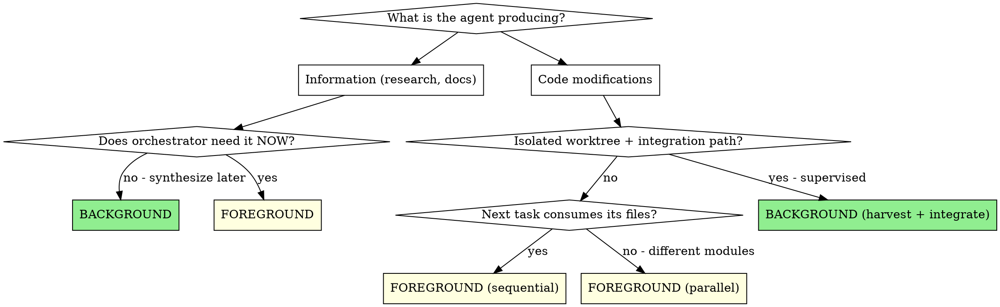

# Multi-Agent Orchestration

Meta-orchestration patterns mined from 597+ real agent dispatches across production codebases. The skill maps orchestration strategy to work shape, brief structure to agent type, and background/foreground to supervision and integration needs.

**Core principle:** Match the strategy to the work, partition agents by independence, inject enough context that parallelism is real, and let review overhead adapt as trust earns itself. The strategies below are reference patterns. Pick the one that fits, blend two when the work is mixed, invent your own when the patterns don't match.

## Dispatch Surface by Host

The strategies are host-agnostic; the fan-out verb differs:

| Host                      | Fan-out surface                                                   | Notes                                                      |
| ------------------------- | ----------------------------------------------------------------- | ---------------------------------------------------------- |
| Claude Code               | `Agent` tool — parallel calls in one block, background for swarms | Worktree isolation via the agent's isolation option        |
| Codex                     | `spawn_agent` with a role-appropriate `agent_type`                | Delegation gate precedence below                           |
| Pi (pi-nova pack)         | `dispatch` tool with `"mode": "parallel"`                         | Children inherit the safety gate via `PI_CODING_AGENT_DIR` |
| Any host, no fan-out verb | Task queue as bus — Sibyl tasks + worktree isolation              | A real dispatch mode, not a degraded one                   |

**Codex delegation gate precedence:** contract-mandated verification counts as warranted subagent work — or route it through external CLI review processes, which don't count as subagents. Exploratory swarms still need the user's ask. Standing user grants ("spawn subagents any time you want") persist across sessions; record them in memory.

**Task queue as bus:** when the host lacks a fan-out verb, orchestrate through the task graph plus worktree isolation. Write self-contained cold-pickup task descriptions (repo, refs, tags, done-means) at the same quality bar as a dispatch brief.

On Pi, builder children should use worktree isolation and return branch/patch info for review — never auto-merge child output. Use the reservation budget cap for large waves so scheduling stops before runaway spend. Copyable Pi dispatch shape in `references/dispatch-briefs.md`.

## Strategy Selection

| Strategy                    | When                                     | Agents    | Background | Key Pattern                                       |
| --------------------------- | ---------------------------------------- | --------- | ---------- | ------------------------------------------------- |
| **Research Swarm**          | Knowledge gathering, docs, SOTA research | 10-60+    | Yes (100%) | Fan-out, each writes own doc                      |
| **Epic Parallel Build**     | Plan with independent epics/features     | 20-60+    | Yes (90%+) | Wave dispatch by subsystem                        |
| **Sequential Pipeline**     | Dependent tasks, shared files            | 3-15      | No (0%)    | Implement -> Review -> Fix chain                  |
| **Parallel Sweep**          | Same fix/transform across modules        | 4-10      | No (0%)    | Partition by directory, fan-out                   |
| **Multi-Dimensional Audit** | Quality gates, deep assessment           | 6-9       | No (0%)    | Same code, different review lenses                |
| **Fleet/Stack Maintenance** | Many PRs/branches, shared review context | 1         | No (0%)    | Inventory first, serial fixer, evidence-based closures |
| **Full Lifecycle**          | New project from scratch                 | All above | Mixed      | Research -> Plan -> Build -> Review -> Harden     |

Serial is a dispatch mode, not a fallback: thirteen open PRs sharing review context got one inventory-first serial fixer, not a fan-out. Before any long unattended loop, ask whether progress accumulates between iterations — without auto-merge, an overnight loop makes parallel worktrees, not cumulative progress; one long worker beats many orphaned ones. Design loops for mid-run patching; they will need upgrades while running.

---

## Strategy 1: Research Swarm

Mass-deploy background agents to build a knowledge corpus. Each agent researches one topic and writes one markdown document. Zero dependencies between agents.

### When to Use

- Kicking off a new project (need SOTA for all technologies)
- Building a skill/plugin (need comprehensive domain knowledge)
- Technology evaluation (compare multiple options in parallel)

### The Pattern

```
Phase 1: Deploy research army (ALL BACKGROUND)
    Wave 1 (10-20 agents): Core technology research
    Wave 2 (10-20 agents): Specialized topics, integrations
    Wave 3 (5-10 agents): Gap-filling based on early results

Phase 2: Monitor and supplement
    - Check completed docs as they arrive
    - Identify gaps, deploy targeted follow-up agents
    - Read completed research to inform remaining dispatches

Phase 3: Synthesize
    - Read all research docs (foreground)
    - Create architecture plans, design docs
    - Use Plan agent to synthesize findings
```

**What good research-agent prompts share** (copyable template in `references/dispatch-briefs.md`):

- Explicit output file path (no ambiguity about where to write)
- Search hints with year ("search [TECH] 2026") so agents have recency guidance
- Numbered coverage list (8-12 items) that scopes the research precisely
- Background dispatch by default, since research topics have no inter-dependencies

---

## Strategy 2: Epic Parallel Build

Deploy background agents to implement independent features/epics simultaneously. Each agent builds one feature in its own directory/module. No two agents touch the same files.

### When to Use

- Implementation plan with 10+ independent tasks
- Monorepo with isolated packages/modules
- Sprint backlog with non-overlapping features

### The Pattern

```
Phase 1: Scout (FOREGROUND)
    - Deploy one Explore agent to map the codebase
    - Identify dependency chains and independent workstreams
    - Group tasks by subsystem to prevent file conflicts

Phase 2: Deploy build army (ALL BACKGROUND — legitimate because each
    builder has worktree isolation and the orchestrator integrates;
    see Background vs Foreground)
    Wave 1: Infrastructure/foundation (Redis, DB, auth)
    Wave 2: Backend APIs (each in own module directory)
    Wave 3: Frontend pages (each in own route directory)
    Wave 4: Integrations (MCP servers, external services)
    Wave 5: DevOps (CI, Docker, deployment)
    Wave 6: Bug fixes from review findings

Phase 3: Monitor and coordinate
    - Check git status for completed commits
    - Handle git lock contention (lock-owner forensics, below)
    - Deploy remaining tasks as agents complete
    - Track via Sibyl tasks or TodoWrite

Phase 4: Review and harden (FOREGROUND)
    - Run `/hyperskills:cross-model-review` on completed work
    - Dispatch fix agents for critical findings
    - Integration testing
```

**What good build-agent prompts share** (copyable worker brief in `references/dispatch-briefs.md`):

- Each agent gets its own directory scope; overlapping file ownership produces merge conflicts and lost work
- Existing patterns to follow ("Follow pattern from X"), which saves the agent from inventing one
- Infrastructure context ("Redis available at X"), which prevents the agent from re-discovering what already exists
- Explicit git hygiene; with 30+ parallel agents this is load-bearing, not optional
- Task IDs for traceability across the swarm

### Git coordination for parallel agents

When running 10+ agents concurrently, a few realities matter:

- **On `index.lock` contention, identify the owner before acting.** `lsof`/`ps` the holder: live owner → wait or hand off "verified but uncommitted"; no owner → stale lock, clean it and proceed. Report a blocker only after it reproduces; after a few blocked turns, escalate with evidence (pid + age) as a question
- **Each agent commits only its own files.** The prompt has to say this explicitly or agents will scoop up siblings' WIP
- **`git add .` and `git add -A` are out.** Specific paths only
- **Monitor with `git log --oneline -20`** periodically to spot stalled or off-pattern agents
- **Push is the orchestrator's call**, not the agent's, after integration

### Same-worktree fleets

Directory partitioning is the default. When several agents must share ONE working tree, the mechanics change:

- Each brief lists owned paths, forbidden paths, AND the interfaces sibling agents are producing that this one may rely on ("another agent is adding `GET /api/ready?probe=k8s`")
- Uniquely contended files get a single named owner
- Repo-wide pre-commit hooks create commit-_ordering_ constraints — hold workstream commits until the last agent lands, then commit each atomically
- Shared-environment health (disk, memory) preempts the pipeline; one worker's full disk can ENOSPC the others mid-build

---

## Strategy 3: Sequential Pipeline

Execute dependent tasks one at a time with review gates. Each task builds on the previous task's output.

### When to Use

- Tasks that modify shared files
- Integration boundary work (JNI bridges, auth chains)
- Review-then-fix cycles where each fix depends on review findings
- Complex features where implementation order matters

### The Pattern

```
For each task:
    1. Dispatch implementer (FOREGROUND)
    2. Dispatch spec reviewer (FOREGROUND)
    3. Dispatch code quality reviewer (FOREGROUND)
    4. Fix any issues found
    5. Move to next task

Trust Gradient (adapt over time):
    Early tasks:  Implement -> Spec Review -> Code Review (full ceremony)
    Middle tasks: Implement -> Spec Review (lighter)
    Late tasks:   Implement only (pattern proven, high confidence)
```

### Trust gradient

As patterns prove reliable, lighten review overhead instead of running full ceremony on every task. The cost of full review on the 12th identical CRUD endpoint is real and the signal-to-noise drops:

| Phase              | Review overhead                         | Typically                            |
| ------------------ | --------------------------------------- | ------------------------------------ |
| **Full ceremony**  | Implement + Spec Review + Code Review   | First 3-4 tasks                      |
| **Standard**       | Implement + Spec Review                 | Tasks 5-8, after patterns stabilize  |
| **Light**          | Implement + quick spot-check            | Late tasks with established patterns |
| **Cost-optimized** | Use the host's configured fast reviewer | Formulaic review passes              |

This is earned confidence, not cutting corners. The gradient resets when a task departs from the established pattern; escalate back to full ceremony for anything genuinely new.

The gradient covers correctness ceremony only. Three things never decay: shape checkpoints at wave boundaries (sprawl has shipped past green tests AND two passing cross-model reviews), mutation gates, and standing-correction recall — a vetoed pattern once re-appeared ~315 autonomous items later, so user vetoes re-enter every late-task brief verbatim. Risk escalates regardless of position in the run: security-critical or spec-level work goes back to rounds-until-PASS, iterating until it converges, not until a count is hit.

---

## Strategy 4: Parallel Sweep

Apply the same transformation across partitioned areas of the codebase. Every agent does the same TYPE of work but on different FILES.

### When to Use

- Lint/format fixes across modules
- Type annotation additions across packages
- Test writing for multiple modules
- Documentation updates across components
- UI polish across pages

### The Pattern

```
Phase 1: Analyze the scope
    - Run the tool (ruff, ty, etc.) to get full issue list
    - Auto-fix what you can
    - Group remaining issues by module/directory

Phase 2: Fan-out fix agents (4-10 agents)
    - One agent per module/directory
    - Each gets: issue count by category, domain-specific guidance
    - All foreground (need to verify each completes)

Phase 3: Verify and repeat
    - Run the tool again to check remaining issues
    - If issues remain, dispatch another wave
    - Repeat until clean
```

**What good sweep-agent prompts share** (copyable template in `references/dispatch-briefs.md`):

- Issue counts by category, not "fix everything", so agents have a target to verify against
- Domain-specific guidance so agents understand _why_ patterns exist (otherwise they cargo-cult or override)
- Directory partitioning to prevent overlap
- Wave shape: fix → verify → fix remaining → verify, until the issue count converges

---

## Strategy 5: Multi-Dimensional Audit

Deploy multiple reviewers to examine the same code from different angles simultaneously. Each reviewer has a different focus lens.

### When to Use

- Major feature complete, need comprehensive review
- Pre-release quality gate
- Security audit
- Performance assessment

### The Pattern

```
Dispatch 6 parallel reviewers (ALL FOREGROUND):
    1. Code quality & safety reviewer
    2. Integration correctness reviewer
    3. Spec completeness reviewer
    4. Test coverage reviewer
    5. Performance analyst
    6. Security auditor

Wait for all to complete, then:
    - Synthesize findings into prioritized action list
    - Dispatch targeted fix agents for critical issues
    - Re-review only the dimensions that had findings
```

Each reviewer gets named files, dimension-specific questions, and a fixed report format (findings with severity, an Approved/Needs Changes verdict, prioritized recommendations). Copyable verifier brief in `references/dispatch-briefs.md`.

### Lens-locked panels

Run the fact-checker first, then parallel judgment reviewers — each locked to ONE lens with explicit non-goals ("do NOT fact-check technical claims — another reviewer owns that") and a fixed return schema (3 strongest / top 5 problems / the one change). Independent same-brief reviewers on one diff produce complementary, non-overlapping true findings; N=1 coverage on a risky diff is demonstrably incomplete.

Give reviewers the lenses tests structurally can't reach: mixed-version rollout windows, config inheritance scope, guards one level below their threat model, rollback paths, what the fix _removed_.

### Read-only review brief (hardening)

A reviewer that can edit, checkout, or mutate state is a liability in a fan-out. Bound every read-only reviewer/auditor explicitly:

- **Sandbox the agent:** "Do NOT edit, checkout, switch branches, or mutate any state. Read only."
- **Read without checkout:** give the exact diff range plus `git show <ref>:<path>` / `git diff <base>..<head>` so the agent inspects the change without touching the working tree.
- **Prior findings to verify:** hand it the open findings so it confirms or refutes rather than re-deriving from scratch.
- **Prioritized risk lenses:** name the attack/failure categories that matter most (header smuggling, RLS bypass, apply-time CRD pruning, etc.) so coverage is deliberate, not generic.

**Synthesis -- adjudicate, don't vote-count.** When reviewers disagree, gather primary evidence (live read-only state, a render, the spec) and let it decide. Independent convergence -- two agents finding the same issue without coordination -- is a severity signal, not noise.

**Commit ownership for review/fix waves:** the orchestrator commits, agents report. Re-run the agent's tightest test and spot-check its load-bearing claims before trusting a self-reported PASS -- the implementer never self-assigns PASS.

### Verification lifecycle

A PASS is not a permanent state; it covers a SHA.

- **Any commit after the verifier's pass voids it.** Changed runtime code after a PASS? Get a fresh independent read before summarizing.
- **Freeze the tree while a verifier reads it.** Fill the wait only with work that is safe regardless of the verdict: reads, memory capture, other lanes.
- **Re-verify warm or fresh.** Warm re-verify (resume the same verifier with a delta brief: prior finding verbatim, fix SHA, enumerated proof cases) converges FAIL→fix rounds and catches regressions the fix itself introduced. A fresh verifier ("a prior PASS is never inherited") suits final certification. Both are practiced; as of Jul 2026 the evidence doesn't settle a single rule — pick per round purpose.
- **Interrupt contract.** A verifier can be interrupted mid-flight: status, stop at the current safe point, PASS/FAIL on what it has seen, no file edits. Amend scope by injecting a message rather than kill-and-respawn.
- **Reproduce a FAIL on the base** before accepting it as introduced by the change under review.

---

## Strategy 6: Full Lifecycle

For greenfield projects, combine all strategies in sequence:

```
Session 1: RESEARCH (Research Swarm)
    -> Background agents build the knowledge corpus; planning agents synthesize

Session 2: BUILD (Epic Parallel Build)
    -> Scout, then waves of builders; monitor, integrate, track completions

Session 3: ITERATE (Build-Review-Fix Pipeline)
    -> Review agents assess, fix agents address findings, audits per subsystem

Session 4: HARDEN (Sequential Pipeline)
    -> Integration boundaries, security, races — foreground, sequential

Session 5: CONSOLIDATE (Dream)
    -> Capture durable patterns and decisions into the knowledge graph
```

Each session shifts orchestration strategy to match the work's nature. Parallel when possible, sequential when required.

---

## Wave Mechanics

Wave design applies to any fan-out, research or build:

- **Collision analysis first.** Partition the wave by file overlap before writing briefs ("the next good wave has to avoid one giant ledger dogpile"). Lanes come from the dependency map, not task-list order.
- **Calibrate before committing the fleet.** A small first wave validates method quality; worker-discovered corrections get baked into wave-2 briefs.
- **The agent pool is managed state.** At the thread ceiling, harvest and close stale agents (final reports recover at close); close non-producers with an honest note.
- **Failed worker output is idea-ore, not a merge candidate.** A budget-blown worker with an oversized diff gets salvaged for its concept and reimplemented smaller — never merge the blob.

---

## Background vs Foreground Decision

The real axis is supervision plus integration, not agent type: attendance follows supervision need (someone must run the slow-vs-stuck ladder) and integration capability (does progress accumulate without you?).


```dot
digraph bg_fg {
    "What is the agent producing?" [shape=diamond];

    "Information (research, docs)" [shape=box];
    "Code modifications" [shape=box];

    "Does orchestrator need it NOW?" [shape=diamond];
    "BACKGROUND" [shape=box style=filled fillcolor=lightgreen];
    "FOREGROUND" [shape=box style=filled fillcolor=lightyellow];

    "Isolated worktree + integration path?" [shape=diamond];
    "Next task consumes its files?" [shape=diamond];
    "BACKGROUND (harvest + integrate)" [shape=box style=filled fillcolor=lightgreen];
    "FOREGROUND (sequential)" [shape=box style=filled fillcolor=lightyellow];
    "FOREGROUND (parallel)" [shape=box style=filled fillcolor=lightyellow];

    "What is the agent producing?" -> "Information (research, docs)";
    "What is the agent producing?" -> "Code modifications";

    "Information (research, docs)" -> "Does orchestrator need it NOW?";
    "Does orchestrator need it NOW?" -> "FOREGROUND" [label="yes"];
    "Does orchestrator need it NOW?" -> "BACKGROUND" [label="no - synthesize later"];

    "Code modifications" -> "Isolated worktree + integration path?";
    "Isolated worktree + integration path?" -> "BACKGROUND (harvest + integrate)" [label="yes - supervised"];
    "Isolated worktree + integration path?" -> "Next task consumes its files?" [label="no"];
    "Next task consumes its files?" -> "FOREGROUND (sequential)" [label="yes"];
    "Next task consumes its files?" -> "FOREGROUND (parallel)" [label="no - different modules"];
}
```

**Patterns observed across 597+ dispatches:**

- Research agents with no immediate dependency → background (essentially always)
- Code agents can run backgrounded when worktree isolation and an integration path (orchestrator review, cherry-pick, combined final gate) exist — that's what makes a build army work
- Code agents must not run backgrounded when the next task consumes their files, or when nothing merges their output — an unattended loop without auto-merge makes parallel worktrees, not cumulative progress
- Review/validation gates → foreground, since they block pipeline progress

---

## Brief Anatomy

The brief is where the orchestrator's context advantage transfers to the worker. Role, task, and report format are table stakes; these slots are the ones that earn their place:

| Slot                 | What it does                                                                               |
| -------------------- | ------------------------------------------------------------------------------------------ |
| Verbatim user ask    | Paraphrase inherits your misreadings; let the worker challenge your interpretation          |
| Scope fence          | Own these files only; you are not alone in the codebase                                     |
| Done-means block     | Checkable exit conditions plus a blocked-escape hatch; commit rights stated explicitly      |
| CURRENT TRUTH        | Dated fact sheet so workers diff against pinned reality, not training-data guesses         |
| Known traps          | Each with its failure mechanism, not just "be careful"                                      |
| Settled decisions    | What not to re-litigate                                                                     |
| Receipts already run | Exact commands and counts, so worker effort goes to residual risk                           |
| Epistemic rules      | Evidence format, confidence floor, `[unverified]` labels, finding caps, skip nits           |
| Capability grants    | Concrete verbs ("you can restart X", "read the db pod directly") — never "use your judgment" |
| Standing corrections | Every user veto from this session, verbatim — conversation context decays over long spans   |

Not every brief needs every slot: a research brief leans on CURRENT TRUTH and epistemic rules, a build brief on the scope fence and done-means block. Full copyable templates live in `references/dispatch-briefs.md`.

**Deviations from brief.** Worker reports carry a required "Deviations from brief" section with per-item justification. At harvest, read deviations first — briefs are hypotheses, and a justified deviation is a finding about your brief.

---

## Context Injection: The Parallelism Enabler

Parallel agents only work in parallel when the orchestrator front-loads context. Without it, every agent re-explores the codebase before doing useful work and the parallelism collapses into serialized discovery.

**Worth injecting into most prompts:**

- Absolute file paths, not relative (agents may run from unexpected cwds)
- Existing patterns to follow ("follow pattern from `src/auth/jwt.py`")
- Available infrastructure ("Redis at `app.state.redis`")
- Design language and conventions ("SilkCircuit Neon palette")
- Tool usage hints ("use WebSearch to find...")
- Git instructions ("only stage YOUR files")

**For parallel agents:**

- Duplicate the shared context block into each prompt. Context isn't free, but redundant context beats serialized exploration
- Add explicit exclusion notes ("agent 11-Sibyl handles X, don't touch it")
- Describe shared utilities identically across prompts to prevent drift

---

## Dispatch & Return Hygiene

The worker doesn't share your reality, and its output can poison yours.

- **Volatile context goes in the brief itself.** Worktree generation copies only tracked files — an untracked vision doc silently starves the worker. Distill live decisions and untracked docs into the prompt.
- **Grep returned artifacts' citations.** Before handing a delegated document onward, check that its cited symbols actually exist.
- **Quarantine confabulation.** A worker that returns output referencing decisions you never made gets discarded wholesale: verify it mutated nothing, keep only facts you can independently re-verify, redo the work directly.
- **Route agent-to-agent findings through the orchestrator.** Workers can't always reach each other; tell them to surface undeliverable messages instead of dropping them.

---

## Supervising the Fleet

Launching is the easy half. The craft is distinguishing slow from stuck, keeping watchers honest, and checking shape — not just correctness.

### Slow vs stuck

| Signal             | Move                                                                                                                                     |
| ------------------ | ---------------------------------------------------------------------------------------------------------------------------------------- |
| Long job goes quiet | Escalate poll windows geometrically, then switch to independent progress signals (pgrep, artifact growth, diff-stat trajectory) — never just more waiting on its own chatter |
| Suspected dead     | Killing needs evidence too — check for a write midstream before terminating                                                                |
| Slow but alive     | Patience is a value ("guesses don't deploy apps"); queue latency is not a failure signal                                                   |

### Watcher contract

Arm every watcher with a named exit condition, a remediation rung, an iteration ceiling, and stale-fire no-op — declared at arm time. Smoke-test the watcher before trusting hours of its output; a broken awk regex once made every poll read "not ready" indefinitely. Kill only your own PIDs. Tear down watchers as the first act of any pivot, narrate on state change only, and surface user input between polls — a watch-buried session once went ~50 minutes deaf to the user.

### Shape checkpoints

Correctness gates don't measure scope: a 397-file sprawl shipped with 549 green tests and two passing cross-model reviews, and the human killed it in seconds from the diffstat. At each wave boundary, run a shape check distinct from the verify gate:

```bash
git diff --name-only origin/${BASE:-main}...HEAD | awk -F/ '{print $1"/"$2}' | sort | uniq -c | sort -nr   # BASE = the PR's actual base ref
```

Classify the diff by top-level path against the mission and ask which pieces prove the MVP, not which pieces merely exist. When local gates are green and the pull is toward polishing validators, enumerate the remaining external-evidence tasks instead.

---

## Terminal States

An orchestrated run ends in one of two named states — never fake-done, never silent stop:

- **Done, with receipts:** gates actually run, output shown.
- **Blocked cleanly:** proof of current state (exact command → its output), a live-gate runbook (commands, evidence paths, pass criteria), and exactly one named human action ("type `! aws sso login` and I'll immediately run the plan, verify, and apply"). Pre-stage held irreversible actions so a one-word "go" executes instantly; optionally arm a watcher on the unblock artifact itself.

---

## Anti-Patterns

| Anti-Pattern                                     | Fix                                                                    |
| ------------------------------------------------ | ---------------------------------------------------------------------- |
| Dispatch agents that touch the same files        | Partition by directory/module; one owner per scope                     |
| Run independent research agents foreground       | Background research; synthesize after completion                       |
| Send 50 agents with "fix everything" prompts     | Give each agent a specific scope, issue list, and done signal          |
| Skip the scout phase for build sprints           | Explore first to map dependencies and file ownership                   |
| Keep full review ceremony for every late task    | Apply the trust gradient after patterns prove stable                   |
| Let agents run `git add .` or `git push`         | Explicit git hygiene in every build prompt                             |
| Background an agent whose output nothing merges  | Backgrounding code needs worktree isolation plus an integration path   |
| Treat `index.lock` as fatal — or clean it blind  | Lock-owner forensics: live owner → hand off; none → stale, clean and go |
| Ship the full fleet without a calibration wave   | Small first wave validates the method; corrections bake into wave 2    |
| Let correctness gates stand in for shape checks  | Shape checkpoint at every wave boundary; diffstat against the mission  |
| Merge a failed worker's oversized blob           | Salvage the idea, reimplement smaller                                  |
| Let read-only reviewers edit or checkout         | Sandbox the brief: read via `git show <ref>:<path>`, never mutate      |
| Vote-count contradicting reviewers               | Adjudicate against ground truth (live state, a render, the spec)       |

## References

Full copyable templates — research brief, sweep brief, worker brief, read-only verifier brief, warm re-verify delta brief, verifier interrupt, watcher spec — live in `references/dispatch-briefs.md`.

## Hyperskills Integration

| Skill                | Use With                | When                                       |
| -------------------- | ----------------------- | ------------------------------------------ |
| `brainstorm`         | Full Lifecycle          | Before research when the direction is open |
| `research`           | Research Swarm          | Knowledge gathering before decisions       |
| `plan`               | Epic Parallel Build     | Convert scope into dependency-safe waves   |
| `implement`          | All build strategies    | Execution loop and verification cadence    |
| `cross-model-review` | All strategies          | Independent quality gate; security lens in audits |
| `git`                | Epic Parallel Build     | Multi-agent staging, rebases, recovery     |
| `dream`              | Full Lifecycle          | Capture durable learnings after large runs |

## What This Skill is NOT

- Not permission to spawn agents when the host environment forbids it.
- Not a replacement for planning; orchestration executes a task graph.
- Not useful for tiny changes that one agent can finish faster directly.
- Not a way around file ownership; overlapping edits still need sequencing.
