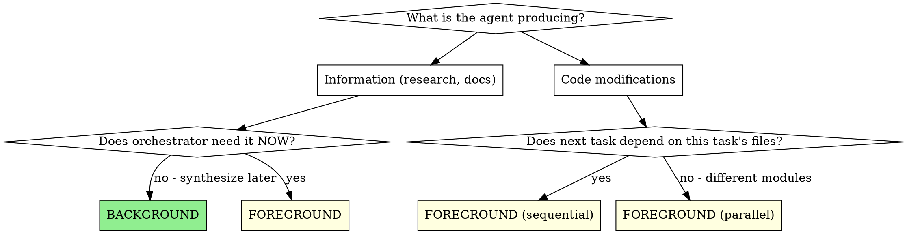

# Multi-Agent Orchestration

Meta-orchestration patterns mined from 597+ real agent dispatches across production codebases. The skill maps orchestration strategy to work shape, prompt structure to agent type, and background/foreground to dependency graph.

**Core principle:** Match the strategy to the work, partition agents by independence, inject enough context that parallelism is real, and let review overhead adapt as trust earns itself. The strategies below are reference patterns. Pick the one that fits, blend two when the work is mixed, invent your own when the patterns don't match.

## Dispatch Surface by Host

The strategies are host-agnostic; the fan-out verb differs:

| Host              | Fan-out surface                                                   | Notes                                                      |
| ----------------- | ----------------------------------------------------------------- | ---------------------------------------------------------- |
| Claude Code       | `Agent` tool — parallel calls in one block, background for swarms | Worktree isolation via the agent's isolation option        |
| Codex             | `spawn_agent` with a role-appropriate `agent_type`                | Use only when subagent work is actually warranted          |
| Pi (pi-nova pack) | `dispatch` tool with `"mode": "parallel"`                         | Children inherit the safety gate via `PI_CODING_AGENT_DIR` |

Pi dispatch task shape:

```json
{
  "mode": "parallel",
  "tasks": [
    {
      "agent": "worker",
      "task": "Implement <task> in <path>. Run <verification>. Return summary, files changed, and patch notes.",
      "tools": ["read", "grep", "find", "ls", "bash", "edit", "write"]
    }
  ]
}
```

On Pi, builder children should use worktree isolation and return branch/patch info for review — never auto-merge child output. Use the reservation budget cap for large waves so scheduling stops before runaway spend.

## Strategy Selection


```dot
digraph strategy_selection {
    rankdir=TB;
    "What type of work?" [shape=diamond];

    "Research / knowledge gathering" [shape=box];
    "Independent feature builds" [shape=box];
    "Sequential dependent tasks" [shape=box];
    "Same transformation across partitions" [shape=box];
    "Codebase audit / assessment" [shape=box];
    "Greenfield project kickoff" [shape=box];

    "Research Swarm" [shape=box style=filled fillcolor=lightyellow];
    "Epic Parallel Build" [shape=box style=filled fillcolor=lightyellow];
    "Sequential Pipeline" [shape=box style=filled fillcolor=lightyellow];
    "Parallel Sweep" [shape=box style=filled fillcolor=lightyellow];
    "Multi-Dimensional Audit" [shape=box style=filled fillcolor=lightyellow];
    "Full Lifecycle" [shape=box style=filled fillcolor=lightyellow];

    "What type of work?" -> "Research / knowledge gathering";
    "What type of work?" -> "Independent feature builds";
    "What type of work?" -> "Sequential dependent tasks";
    "What type of work?" -> "Same transformation across partitions";
    "What type of work?" -> "Codebase audit / assessment";
    "What type of work?" -> "Greenfield project kickoff";

    "Research / knowledge gathering" -> "Research Swarm";
    "Independent feature builds" -> "Epic Parallel Build";
    "Sequential dependent tasks" -> "Sequential Pipeline";
    "Same transformation across partitions" -> "Parallel Sweep";
    "Codebase audit / assessment" -> "Multi-Dimensional Audit";
    "Greenfield project kickoff" -> "Full Lifecycle";
}
```

| Strategy                    | When                                     | Agents    | Background | Key Pattern                                   |
| --------------------------- | ---------------------------------------- | --------- | ---------- | --------------------------------------------- |
| **Research Swarm**          | Knowledge gathering, docs, SOTA research | 10-60+    | Yes (100%) | Fan-out, each writes own doc                  |
| **Epic Parallel Build**     | Plan with independent epics/features     | 20-60+    | Yes (90%+) | Wave dispatch by subsystem                    |
| **Sequential Pipeline**     | Dependent tasks, shared files            | 3-15      | No (0%)    | Implement -> Review -> Fix chain              |
| **Parallel Sweep**          | Same fix/transform across modules        | 4-10      | No (0%)    | Partition by directory, fan-out               |
| **Multi-Dimensional Audit** | Quality gates, deep assessment           | 6-9       | No (0%)    | Same code, different review lenses            |
| **Full Lifecycle**          | New project from scratch                 | All above | Mixed      | Research -> Plan -> Build -> Review -> Harden |

---

## Strategy 1: Research Swarm

Mass-deploy background agents to build a knowledge corpus. Each agent researches one topic and writes one markdown document. Zero dependencies between agents.

### When to Use

- Kicking off a new project (need SOTA for all technologies)
- Building a skill/plugin (need comprehensive domain knowledge)
- Technology evaluation (compare multiple options in parallel)

### The Pattern

```
Phase 1: Deploy research army (ALL BACKGROUND)
    Wave 1 (10-20 agents): Core technology research
    Wave 2 (10-20 agents): Specialized topics, integrations
    Wave 3 (5-10 agents): Gap-filling based on early results

Phase 2: Monitor and supplement
    - Check completed docs as they arrive
    - Identify gaps, deploy targeted follow-up agents
    - Read completed research to inform remaining dispatches

Phase 3: Synthesize
    - Read all research docs (foreground)
    - Create architecture plans, design docs
    - Use Plan agent to synthesize findings
```

### Prompt Template: Research Agent

```markdown
Research [TECHNOLOGY] for [PROJECT]'s [USE CASE].

Create a comprehensive research doc at [OUTPUT_PATH]/[filename].md covering:

1. Latest [TECH] version and features (search "[TECH] 2026" or "[TECH] latest")
2. [Specific feature relevant to project]
3. [Another relevant feature]
4. [Integration patterns with other stack components]
5. [Performance characteristics]
6. [Known gotchas and limitations]
7. [Best practices for production use]
8. [Code examples for key patterns]

Include code examples where possible. Use WebSearch and WebFetch to get current docs.
```

**What good research-agent prompts share:**

- Explicit output file path (no ambiguity about where to write)
- Search hints with year ("search [TECH] 2026") so agents have recency guidance
- Numbered coverage list (8-12 items) that scopes the research precisely
- Background dispatch by default, since research topics have no inter-dependencies

### Dispatch cadence

- 3-4 seconds between agent dispatches usually avoids rate limits
- Thematic waves of 10-20 agents tend to be the manageable size
- 15-25 minute gaps between waves give space for gap analysis on early returns

---

## Strategy 2: Epic Parallel Build

Deploy background agents to implement independent features/epics simultaneously. Each agent builds one feature in its own directory/module. No two agents touch the same files.

### When to Use

- Implementation plan with 10+ independent tasks
- Monorepo with isolated packages/modules
- Sprint backlog with non-overlapping features

### The Pattern

```
Phase 1: Scout (FOREGROUND)
    - Deploy one Explore agent to map the codebase
    - Identify dependency chains and independent workstreams
    - Group tasks by subsystem to prevent file conflicts

Phase 2: Deploy build army (ALL BACKGROUND)
    Wave 1: Infrastructure/foundation (Redis, DB, auth)
    Wave 2: Backend APIs (each in own module directory)
    Wave 3: Frontend pages (each in own route directory)
    Wave 4: Integrations (MCP servers, external services)
    Wave 5: DevOps (CI, Docker, deployment)
    Wave 6: Bug fixes from review findings

Phase 3: Monitor and coordinate
    - Check git status for completed commits
    - Handle git index.lock contention (expected with 30+ agents)
    - Deploy remaining tasks as agents complete
    - Track via Sibyl tasks or TodoWrite

Phase 4: Review and harden (FOREGROUND)
    - Run `/hyperskills:cross-model-review` on completed work
    - Dispatch fix agents for critical findings
    - Integration testing
```

### Prompt Template: Feature Build Agent

```markdown
**Task: [DESCRIPTIVE TITLE]** (task\_[ID])

Work in /path/to/project/[SPECIFIC_DIRECTORY]

## Context

[What already exists. Reference specific files, patterns, infrastructure.]
[e.g., "Redis is available at `app.state.redis`", "Follow pattern from `src/auth/`"]

## Your Job

1. Create `src/path/to/module/` with:
   - `file.py` -- [Description]
   - `routes.py` -- [Description]
   - `models.py` -- [Schema definitions]

2. Implementation requirements:
   [Detailed spec with code snippets, Pydantic models, API contracts]

3. Tests:
   - Create `tests/test_module.py`
   - Cover: [specific test scenarios]

4. Integration:
   - Wire into [main app entry point]
   - Register routes at [path]

## Git

Commit with message: "feat([module]): [description]"
Only stage files YOU created. Check `git status` before committing.
Do NOT stage files from other agents.
```

**What good build-agent prompts share:**

- Each agent gets its own directory scope; overlapping file ownership produces merge conflicts and lost work
- Existing patterns to follow ("Follow pattern from X"), which saves the agent from inventing one
- Infrastructure context ("Redis available at X"), which prevents the agent from re-discovering what already exists
- Explicit git hygiene; with 30+ parallel agents this is load-bearing, not optional
- Task IDs for traceability across the swarm

### Git coordination for parallel agents

When running 10+ agents concurrently, a few realities matter:

- **`index.lock` contention is expected.** Agents retry automatically, don't try to prevent it
- **Each agent commits only its own files.** The prompt has to say this explicitly or agents will scoop up siblings' WIP
- **`git add .` and `git add -A` are out.** Specific paths only
- **Monitor with `git log --oneline -20`** periodically to spot stalled or off-pattern agents
- **Push is the orchestrator's call**, not the agent's, after integration

---

## Strategy 3: Sequential Pipeline

Execute dependent tasks one at a time with review gates. Each task builds on the previous task's output.

### When to Use

- Tasks that modify shared files
- Integration boundary work (JNI bridges, auth chains)
- Review-then-fix cycles where each fix depends on review findings
- Complex features where implementation order matters

### The Pattern

```
For each task:
    1. Dispatch implementer (FOREGROUND)
    2. Dispatch spec reviewer (FOREGROUND)
    3. Dispatch code quality reviewer (FOREGROUND)
    4. Fix any issues found
    5. Move to next task

Trust Gradient (adapt over time):
    Early tasks:  Implement -> Spec Review -> Code Review (full ceremony)
    Middle tasks: Implement -> Spec Review (lighter)
    Late tasks:   Implement only (pattern proven, high confidence)
```

### Trust gradient

As patterns prove reliable, lighten review overhead instead of running full ceremony on every task. The cost of full review on the 12th identical CRUD endpoint is real and the signal-to-noise drops:

| Phase              | Review overhead                         | Typically                            |
| ------------------ | --------------------------------------- | ------------------------------------ |
| **Full ceremony**  | Implement + Spec Review + Code Review   | First 3-4 tasks                      |
| **Standard**       | Implement + Spec Review                 | Tasks 5-8, after patterns stabilize  |
| **Light**          | Implement + quick spot-check            | Late tasks with established patterns |
| **Cost-optimized** | Use the host's configured fast reviewer | Formulaic review passes              |

This is earned confidence, not cutting corners. The gradient resets when a task departs from the established pattern; escalate back to full ceremony for anything genuinely new.

---

## Strategy 4: Parallel Sweep

Apply the same transformation across partitioned areas of the codebase. Every agent does the same TYPE of work but on different FILES.

### When to Use

- Lint/format fixes across modules
- Type annotation additions across packages
- Test writing for multiple modules
- Documentation updates across components
- UI polish across pages

### The Pattern

```
Phase 1: Analyze the scope
    - Run the tool (ruff, ty, etc.) to get full issue list
    - Auto-fix what you can
    - Group remaining issues by module/directory

Phase 2: Fan-out fix agents (4-10 agents)
    - One agent per module/directory
    - Each gets: issue count by category, domain-specific guidance
    - All foreground (need to verify each completes)

Phase 3: Verify and repeat
    - Run the tool again to check remaining issues
    - If issues remain, dispatch another wave
    - Repeat until clean
```

### Prompt Template: Module Fix Agent

```markdown
Fix all [TOOL] issues in the [MODULE_NAME] directory ([PATH]).

Current issues ([COUNT] total):

- [RULE_CODE]: [description] ([count]) -- [domain-specific fix guidance]
- [RULE_CODE]: [description] ([count]) -- [domain-specific fix guidance]

Run `[TOOL_COMMAND] [PATH]` to see exact issues.

IMPORTANT for [DOMAIN] code:
[Domain-specific guidance, e.g., "GTK imports need GI.require_version() before gi.repository imports"]

After fixing, run `[TOOL_COMMAND] [PATH]` to verify zero issues remain.
```

**What good sweep-agent prompts share:**

- Issue counts by category, not "fix everything", so agents have a target to verify against
- Domain-specific guidance so agents understand _why_ patterns exist (otherwise they cargo-cult or override)
- Directory partitioning to prevent overlap
- Wave shape: fix → verify → fix remaining → verify, until the issue count converges

---

## Strategy 5: Multi-Dimensional Audit

Deploy multiple reviewers to examine the same code from different angles simultaneously. Each reviewer has a different focus lens.

### When to Use

- Major feature complete, need comprehensive review
- Pre-release quality gate
- Security audit
- Performance assessment

### The Pattern

```
Dispatch 6 parallel reviewers (ALL FOREGROUND):
    1. Code quality & safety reviewer
    2. Integration correctness reviewer
    3. Spec completeness reviewer
    4. Test coverage reviewer
    5. Performance analyst
    6. Security auditor

Wait for all to complete, then:
    - Synthesize findings into prioritized action list
    - Dispatch targeted fix agents for critical issues
    - Re-review only the dimensions that had findings
```

### Prompt Template: Dimension Reviewer

```markdown
[DIMENSION] review of [COMPONENT] implementation.

**Files to review:**

- [file1.ext]
- [file2.ext]
- [file3.ext]

**Analyze:**

1. [Specific question for this dimension]
2. [Specific question for this dimension]
3. [Specific question for this dimension]

**Report format:**

- Findings: numbered list with severity (Critical/Important/Minor)
- Assessment: Approved / Needs Changes
- Recommendations: prioritized action items
```

### Read-only review brief (hardening)

A reviewer that can edit, checkout, or mutate state is a liability in a fan-out. Bound every read-only reviewer/auditor explicitly:

- **Sandbox the agent:** "Do NOT edit, checkout, switch branches, or mutate any state. Read only."
- **Read without checkout:** give the exact diff range plus `git show <ref>:<path>` / `git diff <base>..<head>` so the agent inspects the change without touching the working tree.
- **Prior findings to verify:** hand it the open findings so it confirms or refutes rather than re-deriving from scratch.
- **Prioritized risk lenses:** name the attack/failure categories that matter most (header smuggling, RLS bypass, apply-time CRD pruning, etc.) so coverage is deliberate, not generic.

**Synthesis -- adjudicate, don't vote-count.** When reviewers disagree, gather primary evidence (live read-only state, a render, the spec) and let it decide. Independent convergence -- two agents finding the same issue without coordination -- is a severity signal, not noise.

**Commit ownership for review/fix waves:** the orchestrator commits, agents report. Re-run the agent's tightest test and spot-check its load-bearing claims before trusting a self-reported PASS -- the implementer never self-assigns PASS.

---

## Strategy 6: Full Lifecycle

For greenfield projects, combine all strategies in sequence:

```
Session 1: RESEARCH (Research Swarm)
    -> 30-60 background agents build knowledge corpus
    -> Architecture planning agents synthesize findings
    -> Output: docs/research/*.md + docs/plans/*.md

Session 2: BUILD (Epic Parallel Build)
    -> Scout agent maps what exists
    -> 30-60 background agents build features by epic
    -> Monitor, handle git contention, track completions
    -> Output: working codebase with commits

Session 3: ITERATE (Build-Review-Fix Pipeline)
    -> Code review agents assess work
    -> Fix agents address findings
    -> Deep audit agents (foreground) assess each subsystem
    -> Output: quality-assessed codebase

Session 4: HARDEN (Sequential Pipeline)
    -> Integration boundary reviews (foreground, sequential)
    -> Security fixes, race condition fixes
    -> Test infrastructure setup
    -> Output: production-ready codebase

Session 5: CONSOLIDATE (Dream)
    -> Capture durable patterns, gotchas, and architecture decisions
    -> Link learnings back to project context in Sibyl
    -> Output: updated knowledge graph for future sessions
```

Each session shifts orchestration strategy to match the work's nature. Parallel when possible, sequential when required.

---

## Background vs Foreground Decision


```dot
digraph bg_fg {
    "What is the agent producing?" [shape=diamond];

    "Information (research, docs)" [shape=box];
    "Code modifications" [shape=box];

    "Does orchestrator need it NOW?" [shape=diamond];
    "BACKGROUND" [shape=box style=filled fillcolor=lightgreen];
    "FOREGROUND" [shape=box style=filled fillcolor=lightyellow];

    "Does next task depend on this task's files?" [shape=diamond];
    "FOREGROUND (sequential)" [shape=box style=filled fillcolor=lightyellow];
    "FOREGROUND (parallel)" [shape=box style=filled fillcolor=lightyellow];

    "What is the agent producing?" -> "Information (research, docs)";
    "What is the agent producing?" -> "Code modifications";

    "Information (research, docs)" -> "Does orchestrator need it NOW?";
    "Does orchestrator need it NOW?" -> "FOREGROUND" [label="yes"];
    "Does orchestrator need it NOW?" -> "BACKGROUND" [label="no - synthesize later"];

    "Code modifications" -> "Does next task depend on this task's files?";
    "Does next task depend on this task's files?" -> "FOREGROUND (sequential)" [label="yes"];
    "Does next task depend on this task's files?" -> "FOREGROUND (parallel)" [label="no - different modules"];
}
```

**Patterns observed across 597+ dispatches:**

- Research agents with no immediate dependency → background (essentially always)
- Code-writing agents → foreground, even when running in parallel
- Review/validation gates → foreground, since they block pipeline progress
- Sequential dependencies → foreground, one at a time

---

## Prompt Engineering Patterns

### Pattern A: Role + Mission + Structure (Research)

```markdown
You are researching [DOMAIN] to create comprehensive documentation for [PROJECT].

Your mission: Create an exhaustive reference document covering ALL [TOPIC] capabilities.

Cover these areas in depth:

1. **[Category]** -- specific items
2. **[Category]** -- specific items
   ...

Use WebSearch and WebFetch to find blog posts, GitHub repos, and official docs.
```

### Pattern B: Task + Context + Files + Spec (Feature Build)

```markdown
**Task: [TITLE]** (task\_[ID])

Work in /absolute/path/to/[directory]

## Context

[What exists, what to read, what infrastructure is available]

## Your Job

1. Create `path/to/file` with [description]
2. [Detailed implementation spec]
3. [Test requirements]
4. [Integration requirements]

## Git

Commit with: "feat([scope]): [message]"
Only stage YOUR files.
```

### Pattern C: Review + Verify + Report (Audit)

```markdown
Comprehensive audit of [SCOPE] for [DIMENSION].

Look for:

1. [Specific thing #1]
2. [Specific thing #2]
   ...
3. [Specific thing #10]

[Scope boundaries -- which directories/files]

Report format:

- Findings: numbered with severity
- Assessment: Pass / Needs Work
- Action items: prioritized
```

### Pattern D: Issue + Location + Fix (Bug Fix)

```markdown
**Task:** Fix [ISSUE] -- [SEVERITY]

**Problem:** [Description with file:line references]
**Location:** [Exact file path]

**Fix Required:**

1. [Specific change]
2. [Specific change]

**Verify:**

1. Run [command] to confirm fix
2. Run tests: [test command]
```

---

## Context Injection: The Parallelism Enabler

Parallel agents only work in parallel when the orchestrator front-loads context. Without it, every agent re-explores the codebase before doing useful work and the parallelism collapses into serialized discovery.

**Worth injecting into most prompts:**

- Absolute file paths, not relative (agents may run from unexpected cwds)
- Existing patterns to follow ("follow pattern from `src/auth/jwt.py`")
- Available infrastructure ("Redis at `app.state.redis`")
- Design language and conventions ("SilkCircuit Neon palette")
- Tool usage hints ("use WebSearch to find...")
- Git instructions ("only stage YOUR files")

**For parallel agents:**

- Duplicate the shared context block into each prompt. Context isn't free, but redundant context beats serialized exploration
- Add explicit exclusion notes ("agent 11-Sibyl handles X, don't touch it")
- Describe shared utilities identically across prompts to prevent drift

---

## Monitoring Parallel Agents

When running 10+ background agents:

1. **Check periodically** -- `git log --oneline -20` for commits
2. **Read output files** -- `tail` the agent output files for progress
3. **Track completions** -- Use Sibyl tasks or TodoWrite
4. **Deploy gap-fillers** -- As early agents complete, identify missing work
5. **Handle contention** -- git index.lock is expected, agents retry automatically

### Status Report Template

```
## Agent Swarm Status

**[N] agents deployed** | **[M] completed** | **[P] in progress**

### Completed:
- [Agent description] -- [Key result]
- [Agent description] -- [Key result]

### In Progress:
- [Agent description] -- [Status]

### Gaps Identified:
- [Missing area] -- deploying follow-up agent
```

---

## Anti-Patterns

| Anti-Pattern                                    | Fix                                                               |
| ----------------------------------------------- | ----------------------------------------------------------------- |
| Dispatch agents that touch the same files       | Partition by directory/module; one owner per scope                |
| Run independent research agents foreground      | Background research; synthesize after completion                  |
| Send 50 agents with "fix everything" prompts    | Give each agent a specific scope, issue list, and done signal     |
| Skip the scout phase for build sprints          | Explore first to map dependencies and file ownership              |
| Keep full review ceremony for every late task   | Apply the trust gradient after patterns prove stable              |
| Let agents run `git add .` or `git push`        | Explicit git hygiene in every build prompt                        |
| Dispatch background agents for integration code | Background is for research; coordinate code changes               |
| Let read-only reviewers edit or checkout        | Sandbox the brief: read via `git show <ref>:<path>`, never mutate |
| Vote-count contradicting reviewers              | Adjudicate against ground truth (live state, a render, the spec)  |

## Hyperskills Integration

| Skill                | Use With                | When                                       |
| -------------------- | ----------------------- | ------------------------------------------ |
| `brainstorm`         | Full Lifecycle          | Before research when the direction is open |
| `research`           | Research Swarm          | Knowledge gathering before decisions       |
| `plan`               | Epic Parallel Build     | Convert scope into dependency-safe waves   |
| `implement`          | All build strategies    | Execution loop and verification cadence    |
| `cross-model-review` | All strategies          | Independent quality gate after integration |
| `security`           | Multi-Dimensional Audit | Security review lens                       |
| `git`                | Epic Parallel Build     | Multi-agent staging, rebases, recovery     |
| `dream`              | Full Lifecycle          | Capture durable learnings after large runs |

## What This Skill is NOT

- Not permission to spawn agents when the host environment forbids it.
- Not a replacement for planning; orchestration executes a task graph.
- Not useful for tiny changes that one agent can finish faster directly.
- Not a way around file ownership; overlapping edits still need sequencing.
