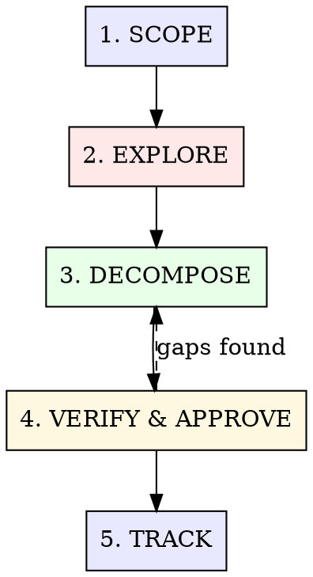

# Structured Planning

Verification-driven task decomposition with Sibyl-native tracking. Mined from 200+ real planning sessions — the plans that actually survived contact with code.

**Core insight:** Plans fail when steps can't be verified. Decompose until every step has a concrete check. Track in Sibyl so plans survive context windows.

## The Process



---

## Phase 1: SCOPE

**Bound the work before exploring it.**

### Actions

1. **Search Sibyl** for related tasks, decisions, prior plans:
   ```
   sibyl search "<feature keywords>"
   sibyl task list -s todo
   ```

2. **Define success criteria** — what does "done" look like?
   - Measurable outcomes (tests pass, endpoint returns X, UI renders Y)
   - NOT vague goals ("improve performance" → "p95 latency < 200ms")

3. **Identify constraints:**
   - Files/modules that CAN'T change
   - Dependencies that must be respected
   - Timeline or budget considerations

4. **Classify complexity:**

   | Scale | Description | Planning Depth |
   |-------|-------------|----------------|
   | **Quick fix** | < 3 files, clear solution | Skip to implementation |
   | **Feature** | 3-10 files, known patterns | Light plan (this skill) |
   | **Epic** | 10+ files, new patterns | Full plan + orchestration |
   | **Redesign** | Architecture change | Full plan + research first |

### Gate

If this is a **quick fix**, stop planning and go build. Planning a 5-minute fix is waste.

---

## Phase 2: EXPLORE

**Understand the codebase surface area before decomposing.**

### Actions

1. **Map the impact surface** — which files/modules will this touch?
   - Spawn an Explore agent if the scope is uncertain
   - Read the actual code, don't guess from file names

2. **Identify existing patterns:**
   - How does similar functionality work in this codebase?
   - What conventions exist? (naming, file structure, test patterns)

3. **Find the dependencies:**
   - What must exist before this can work?
   - What will break if we change X?

### Output

A mental model of the change surface:
> "This touches: [module A] (new endpoint), [module B] (type changes), [module C] (tests). Pattern follows [existing feature X]. Depends on [infrastructure Y] being available."

---

## Phase 3: DECOMPOSE

**Break work into verifiable steps. Every step must have a check.**

### The Verification Rule

**A step without a verification method is not a step — it's a hope.**

For each task, define:

| Field | Description |
|-------|-------------|
| **What** | Specific implementation action |
| **Files** | Exact files to create/modify |
| **Verify** | How to confirm it works |
| **Depends on** | Which tasks must complete first |

### Verification Methods

| Method | When to Use |
|--------|-------------|
| `typecheck` | Type changes, interface additions |
| `test` | Logic, edge cases, integrations |
| `lint` | Style, formatting, import order |
| `build` | Build system changes |
| `visual` | UI changes (screenshot or browser check) |
| `curl/httpie` | API endpoint changes |
| `manual` | Only when no automation exists |

### Decomposition Heuristics

- **2-5 minute tasks** are the sweet spot. If a task takes > 15 minutes, break it further.
- **One concern per task.** "Add endpoint AND write tests" is two tasks.
- **Order by dependency, not difficulty.** Foundation first.
- **Mark parallelizable tasks.** Tasks with no shared files can run simultaneously.

### Task Format

```markdown
## Task [N]: [Imperative title]

**Files:** `src/path/file.ts`, `tests/path/file.test.ts`
**Depends on:** Task [M]
**Parallel:** Yes/No (can run alongside Task [X])

### Implementation
[2-4 bullet points of what to do]

### Verify
- [ ] `pnpm typecheck` passes
- [ ] `pnpm test -- file.test.ts` passes
- [ ] [specific assertion about behavior]
```

### Parallelizability Markers

Mark tasks that can run simultaneously for orchestration:

```
Wave 1 (foundation):  Task 1, Task 2  [parallel]
Wave 2 (core):        Task 3, Task 4  [parallel, depends on Wave 1]
Wave 3 (integration): Task 5          [sequential, depends on Wave 2]
Wave 4 (polish):      Task 6, Task 7  [parallel, depends on Wave 3]
```

---

## Phase 4: VERIFY & APPROVE

**Review the plan before executing it.**

### Self-Check

Before presenting to the user, verify:

- [ ] Every task has a verification method
- [ ] Dependencies form a DAG (no cycles)
- [ ] No two parallel tasks modify the same files
- [ ] Total scope matches the original success criteria
- [ ] Nothing is over-engineered (YAGNI check)

### Present for Approval

Show the plan as a structured list with waves:

```markdown
## Plan: [Feature Name]

**Success criteria:** [measurable outcome]
**Estimated tasks:** [N] across [M] waves
**Parallelizable:** [X]% of tasks can run in parallel

### Wave 1: Foundation
- [ ] Task 1: [title] → verify: [method]
- [ ] Task 2: [title] → verify: [method]

### Wave 2: Core Implementation
- [ ] Task 3: [title] → verify: [method] (depends: 1)
- [ ] Task 4: [title] → verify: [method] (depends: 2)

### Wave 3: Integration
- [ ] Task 5: [title] → verify: [method] (depends: 3, 4)
```

### Gap Analysis

After presenting, explicitly check:
- "Is there anything missing from this plan?"
- "Should any of these tasks be combined or split further?"
- "Are the success criteria right?"

---

## Phase 5: TRACK

**Register the plan in Sibyl for persistence.**

### Actions

1. **Create a Sibyl task** for the feature:
   ```
   sibyl task create --title "[Feature]" -d "[success criteria]" --complexity epic
   ```

2. **Create sub-tasks** for each plan step:
   ```
   sibyl task create --title "Task 1: [title]" -e [epic-id] -d "[implementation + verify]"
   ```

3. **Record the plan decision:**
   ```
   sibyl add "Plan: [feature]" "[N] tasks across [M] waves. Key decisions: [architectural choices]. Dependencies: [critical path]."
   ```

### Adaptive Replanning

Plans change when they meet reality. When a task reveals unexpected complexity:

1. **Don't force through.** Pause and reassess.
2. **Update the plan** — add/remove/modify tasks.
3. **Update Sibyl** — keep the tracking current.
4. **Communicate** — "Task 3 revealed [X]. Adjusting plan: [changes]."

---

## Execution Handoff

Once the plan is approved, hand off to the right tool:

| Situation | Handoff |
|-----------|---------|
| 3-5 simple tasks, user present | Execute directly with verification gates |
| 5-15 tasks, mixed parallel | `/hyperskills:orchestrate` with wave strategy |
| Large epic, 15+ tasks | Orchestrate with Epic Parallel Build strategy |
| Needs more research first | `/hyperskills:research` before executing |

### Trust Gradient for Execution

| Phase | Review Level | When |
|-------|-------------|------|
| **Full ceremony** | Implement + spec review + code review | First 3-4 tasks |
| **Standard** | Implement + spec review | Tasks 5-8, patterns stabilized |
| **Light** | Implement + quick verify | Late tasks, established patterns |

This is earned confidence, not cutting corners.

---

## What This Skill is NOT

- **Not required for simple tasks.** If the solution is obvious, just build it.
- **Not a design doc generator.** Plans are action lists, not architecture documents.
- **Not a blocker.** If the user says "just start building," start building. You can plan in parallel.
- **Not rigid.** Plans adapt. The first plan is a hypothesis.
