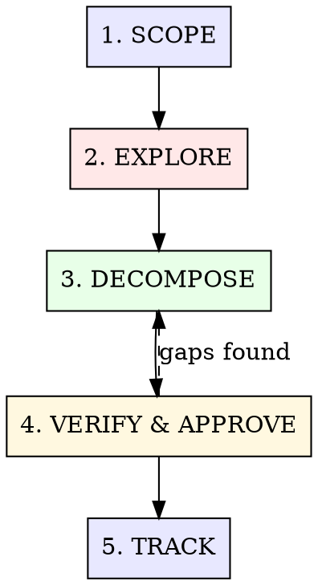

# Structured Planning

Verification-driven task decomposition with Sibyl-native tracking. Mined from 200+ real planning sessions: the plans that actually survived contact with code.

**Core insight:** Plans fail when steps can't be verified. Decomposition that lands in concrete checks survives contact with reality; abstract bullets don't. Tracking in Sibyl lets plans outlive the context window that produced them.

**How to read this skill:** the phases below describe the rhythm of a useful planning pass, not a procedure to march through. Skip planning entirely for small clear work, compress phases when the answers are obvious, and treat the first plan as a hypothesis. Replanning is the rule, not the exception.

## The Shape


```dot
digraph planning {
    rankdir=TB;
    node [shape=box];

    "1. SCOPE" [style=filled, fillcolor="#e8e8ff"];
    "2. EXPLORE" [style=filled, fillcolor="#ffe8e8"];
    "3. DECOMPOSE" [style=filled, fillcolor="#e8ffe8"];
    "4. VERIFY & APPROVE" [style=filled, fillcolor="#fff8e0"];
    "5. TRACK" [style=filled, fillcolor="#e8e8ff"];

    "1. SCOPE" -> "2. EXPLORE";
    "2. EXPLORE" -> "3. DECOMPOSE";
    "3. DECOMPOSE" -> "4. VERIFY & APPROVE";
    "4. VERIFY & APPROVE" -> "5. TRACK";
    "4. VERIFY & APPROVE" -> "3. DECOMPOSE" [label="gaps found", style=dashed];
}
```

---

## Phase 1: SCOPE

Bound the work before decomposing it. The goal is calibrating planning depth to actual scope, not generating a deliverable.

### Common moves

- **Search Sibyl** for related tasks, decisions, and prior plans: `sibyl search "<feature keywords>"`, `sibyl task list -s todo`. Cheap and often surfaces an already-decomposed predecessor.
- **Define success criteria** in measurable terms ("tests pass", "endpoint returns X", "p95 latency < 200ms") instead of vague goals like "improve performance".
- **Identify constraints**: files that shouldn't change, dependencies to respect, timeline or budget pressure.
- **Calibrate planning depth** to scope:

  | Scale         | Description                | Planning depth             |
  | ------------- | -------------------------- | -------------------------- |
  | **Quick fix** | < 3 files, clear solution  | Skip planning, go build    |
  | **Feature**   | 3-10 files, known patterns | Light plan (this skill)    |
  | **Epic**      | 10+ files, new patterns    | Full plan + orchestration  |
  | **Redesign**  | Architecture change        | Full plan + research first |

If the work is a quick fix, stop planning and go build. Planning a five-minute change is pure overhead.

---

## Phase 2: EXPLORE

Understand the codebase surface before decomposing it. Plans built from filenames alone fall apart at contact with the actual code.

### Common moves

- **Map the impact surface**: which files and modules will this touch? Read the actual code rather than guessing from names; spawn an Explore agent when scope is genuinely uncertain.
- **Identify existing patterns**: how does similar functionality already work? What conventions apply (naming, file structure, test patterns)?
- **Trace dependencies**: what must exist before this can work, and what breaks if we change X?

You're aiming for a mental model you can articulate: "this touches module A (new endpoint), module B (type changes), module C (tests); pattern follows existing feature X; depends on infrastructure Y being available." If you can't write that sentence, decomposition will rest on guesses.

---

## Phase 3: DECOMPOSE

Break the work into steps you can actually verify. The discipline that separates plans-that-survive from plans-that-fail is connecting each step to a concrete check.

### The verification heuristic

A step without a verification method is a hope, not a step. Push every task toward a concrete check before considering it decomposed. For each task, the useful fields are:

| Field          | Description                     |
| -------------- | ------------------------------- |
| **What**       | Specific implementation action  |
| **Files**      | Exact files to create/modify    |
| **Verify**     | How to confirm it works         |
| **Depends on** | Which tasks must complete first |

### Verification Methods

| Method        | When to Use                              |
| ------------- | ---------------------------------------- |
| `typecheck`   | Type changes, interface additions        |
| `test`        | Logic, edge cases, integrations          |
| `lint`        | Style, formatting, import order          |
| `build`       | Build system changes                     |
| `visual`      | UI changes (screenshot or browser check) |
| `curl/httpie` | API endpoint changes                     |
| `manual`      | Only when no automation exists           |

### Decomposition heuristics

- **2-5 minute tasks** tend to be the sweet spot. Tasks running longer than 15 minutes usually deserve to be split.
- **One concern per task.** "Add endpoint AND write tests" is two tasks; treat conjunctions in task titles as splitting hints.
- **Order by dependency, not difficulty.** Foundation first; later tasks build on earlier ones.
- **Mark parallelizable tasks.** Tasks with no shared files can run simultaneously, which matters once you hand off to orchestration.

### Task Format

```markdown
## Task [N]: [Imperative title]

**Files:** `src/path/file.ts`, `tests/path/file.test.ts`
**Depends on:** Task [M]
**Parallel:** Yes/No (can run alongside Task [X])

### Implementation

[2-4 bullet points of what to do]

### Verify

- [ ] `pnpm typecheck` passes
- [ ] `pnpm test -- file.test.ts` passes
- [ ] [specific assertion about behavior]
```

### Parallelizability Markers

Mark tasks that can run simultaneously for orchestration:

```
Wave 1 (foundation):  Task 1, Task 2  [parallel]
Wave 2 (core):        Task 3, Task 4  [parallel, depends on Wave 1]
Wave 3 (integration): Task 5          [sequential, depends on Wave 2]
Wave 4 (polish):      Task 6, Task 7  [parallel, depends on Wave 3]
```

---

## Phase 4: VERIFY & APPROVE

Sanity-check the plan before presenting it. The goal isn't ceremony; it's catching the obvious failure modes that turn plans into churn.

### Worth confirming before presenting

- Every task has a verification method (the most common gap)
- Dependencies form a DAG, no cycles
- No two parallel tasks touch the same files
- Total scope still matches the success criteria from Phase 1
- Nothing snuck in that you don't actually need yet (YAGNI)

### Present for Approval

Show the plan as a structured list with waves:

```markdown
## Plan: [Feature Name]

**Success criteria:** [measurable outcome]
**Estimated tasks:** [N] across [M] waves
**Parallelizable:** [X]% of tasks can run in parallel

### Wave 1: Foundation

- [ ] Task 1: [title] → verify: [method]
- [ ] Task 2: [title] → verify: [method]

### Wave 2: Core Implementation

- [ ] Task 3: [title] → verify: [method] (depends: 1)
- [ ] Task 4: [title] → verify: [method] (depends: 2)

### Wave 3: Integration

- [ ] Task 5: [title] → verify: [method] (depends: 3, 4)
```

### Gap analysis

Once the plan is on the page, ask whether anything's missing, whether tasks should be combined or split further, and whether the success criteria still feel right. The user often spots gaps you can't because they hold context you don't.

---

## Phase 5: TRACK

Register the plan in Sibyl so it survives the context window that produced it. Skip this for very small plans that'll be done in a single session, but anything spanning days or sessions benefits from durable tracking.

```
sibyl task create --title "[Feature]" -d "[success criteria]" --complexity epic
sibyl task create --title "Task 1: [title]" -e [epic-id] -d "[implementation + verify]"
sibyl add "Plan: [feature]" "[N] tasks across [M] waves. Key decisions: [architectural choices]. Dependencies: [critical path]."
```

### Adaptive replanning

Plans meet reality and reality usually wins. When a task surfaces unexpected complexity, pause and reassess instead of forcing through. Adjust the task list, update Sibyl, and surface the change: "task 3 revealed X, adjusting plan: [changes]." Replanning is a feature of the workflow, not evidence the original plan was bad.

---

## Execution Handoff

Once the plan is approved, hand off to the right tool:

| Situation                      | Handoff                                       |
| ------------------------------ | --------------------------------------------- |
| 3-5 simple tasks, user present | Execute directly with verification gates      |
| 5-15 tasks, mixed parallel     | `/hyperskills:orchestrate` with wave strategy |
| Large epic, 15+ tasks          | Orchestrate with Epic Parallel Build strategy |
| Needs more research first      | `/hyperskills:research` before executing      |

### Trust gradient for execution

Heavy review on every task accumulates noise; zero review accumulates risk. Lean toward heavier review early and lighter review once patterns prove stable:

| Phase             | Review level                                   | Typically                        |
| ----------------- | ---------------------------------------------- | -------------------------------- |
| **Full ceremony** | Implement + spec review + `cross-model-review` | First 3-4 tasks                  |
| **Standard**      | Implement + spec review                        | Tasks 5-8, patterns stabilized   |
| **Light**         | Implement + quick verify                       | Late tasks, established patterns |

This is earned confidence, not cutting corners. The gradient resets if a task departs from the established pattern. Stay heavy for anything touching auth, payments, migrations, or data integrity regardless of where you are in the plan.

---

## Anti-Patterns

| Anti-Pattern                           | Fix                                          |
| -------------------------------------- | -------------------------------------------- |
| Planning a five-minute fix             | Build directly and verify                    |
| Tasks without verification             | Add a concrete check or split the task       |
| Parallel tasks touching the same files | Sequence them or repartition ownership       |
| Planning from filenames only           | Read the actual code path before decomposing |
| Treating the first plan as permanent   | Replan when reality reveals new constraints  |

---

## What This Skill is NOT

- **Not required for simple tasks.** If the solution is obvious, just build it.
- **Not a design doc generator.** Plans are action lists, not architecture documents.
- **Not a blocker.** If the user says "just start building," start building. You can plan in parallel.
- **Not rigid.** Plans adapt. The first plan is a hypothesis.
