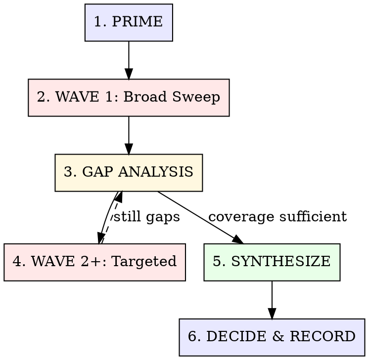

# Multi-Agent Research

Wave-based knowledge gathering with deferred synthesis. Mined from 300+ real research dispatches — the pattern that consistently produces actionable intelligence.

**Core insight:** Research breadth-first, synthesize after. Don't draw conclusions from the first 3 results. Deploy agents in waves, accumulate findings, then synthesize with the full picture.

## The Process



---

## Phase 1: PRIME

**Search what you already know before spawning a single agent.**

### Actions

1. **Search Sibyl first:**
   ```
   sibyl search "<research topic>"
   sibyl search "<related technology>"
   sibyl search "<prior decision in this area>"
   ```

2. **Check for stale knowledge:**
   - If Sibyl has entries older than 3 months on fast-moving topics (frameworks, models, cloud services) → research anyway, but use existing knowledge as baseline
   - If Sibyl has recent entries → present them first, ask if deeper research is needed

3. **Define the research question clearly:**
   - NOT: "research databases" (too vague)
   - YES: "compare PostgreSQL vs CockroachDB for multi-region write-heavy workloads with <10ms p99 latency requirement"

4. **Set the research budget:**

   | Depth | Agents | Time | When |
   |-------|--------|------|------|
   | **Quick scan** | 2-3 | 2-5 min | Known domain, just need latest info |
   | **Standard** | 5-10 | 10-15 min | Technology evaluation, architecture options |
   | **Deep dive** | 10-30 | 20-40 min | Greenfield decisions, SOTA analysis |
   | **Exhaustive** | 30-60+ | 40-90 min | New project inception, competitive landscape |

---

## Phase 2: WAVE 1 — Broad Sweep

**Deploy the first wave of agents across the full research surface.**

### Agent Design Principles

Each agent gets:
- **One specific topic** (not "research everything about X")
- **An output file path** (no ambiguity about where to write)
- **Search hints** (include year: "search [topic] 2026")
- **8-12 numbered coverage items** (scope the research precisely)
- **Source quality guidance** ("prefer official docs and GitHub repos over blog posts")

### Wave 1 Template

```markdown
Research [SPECIFIC_TOPIC] for [PROJECT/DECISION].

Create a research doc at docs/research/[filename].md covering:

1. Current state (latest version, recent changes)
2. [Specific capability A relevant to our use case]
3. [Specific capability B]
4. [Integration with our stack: list specific technologies]
5. Performance characteristics / benchmarks
6. Known limitations and gotchas
7. Community health (stars, activity, maintenance)
8. Comparison with alternatives (name 2-3 specific alternatives)

Use WebSearch for current information. Include dates on all facts.
Cite sources with URLs.
```

### Deployment Rules

- **ALL Wave 1 agents run in background** — no dependencies between them
- **3-4 seconds between dispatches** — avoid rate limiting
- **Each agent writes its own file** — no shared outputs
- **Group by theme:** If researching 12 topics, group into 3-4 thematic clusters

### Coverage Strategy

For technology evaluations, cover these dimensions:

| Dimension | Question |
|-----------|----------|
| **Capability** | Does it do what we need? |
| **Performance** | Is it fast enough? |
| **Ecosystem** | Does it integrate with our stack? |
| **Maturity** | Is it production-ready? |
| **Community** | Will it be maintained in 2 years? |
| **Cost** | What does it cost at our scale? |
| **Migration** | How hard is it to adopt/abandon? |

---

## Phase 3: GAP ANALYSIS

**After Wave 1 completes, identify what's missing before synthesizing.**

### Actions

1. **Read all Wave 1 outputs** — skim each research doc
2. **Identify gaps:**
   - Dimensions not covered?
   - Contradictory findings between agents?
   - Questions raised but not answered?
   - Missing comparisons?

3. **Check for bias:**
   - Are all findings positive? (Suspicious — look for failure cases)
   - Did agents only find official docs? (Need community/real-world experience)
   - Same sources cited by multiple agents? (Need diversity)

### Decision Point

| Finding | Action |
|---------|--------|
| Good coverage, minor gaps | Synthesize now, note gaps |
| Significant gaps | Deploy Wave 2 targeted agents |
| Contradictory findings | Deploy verification agents to resolve |
| Entirely new direction emerged | Deploy Wave 2 in new direction |

---

## Phase 4: WAVE 2+ — Targeted Research

**Fill specific gaps identified in the analysis.**

### Wave 2 Agents Are Different

- **Smaller scope** — one specific question per agent
- **Higher quality bar** — "find production experience reports, not just docs"
- **Cross-reference** — "Agent X found [claim]. Verify this against [alternative source]"
- **Deep reads** — "Read the full README and API docs for [library], not just the landing page"

### When to Stop

Stop deploying waves when:
- The research question can be answered with confidence
- Additional agents would produce diminishing returns
- You have >= 2 independent sources for key claims
- The user signals "enough, let's decide"

**Max 3 waves for most research.** If 3 waves haven't answered the question, the question needs reframing.

---

## Phase 5: SYNTHESIZE

**Combine all findings into actionable intelligence. This is where the magic happens.**

### Synthesis Structure

```markdown
## Research: [Topic]

### TL;DR
[2-3 sentences. The answer, not the journey.]

### Recommendation
[Clear choice with justification. Don't hedge — pick one.]

### Options Evaluated

| Option | Fit | Maturity | Perf | Ecosystem | Verdict |
|--------|-----|----------|------|-----------|---------|
| A | ... | ... | ... | ... | Best for [X] |
| B | ... | ... | ... | ... | Best for [Y] |
| C | ... | ... | ... | ... | Avoid: [reason] |

### Key Findings
1. [Most important finding with source]
2. [Second most important]
3. [Third most important]

### Risks & Gotchas
- [Known issue or limitation]
- [Migration complexity]
- [Hidden cost]

### Sources
- [Source 1](url) — [what it contributed]
- [Source 2](url) — [what it contributed]
```

### Synthesis Rules

1. **Lead with the recommendation.** Don't make the reader wade through findings to find the answer.
2. **Separate facts from opinions.** "PostgreSQL supports JSONB" (fact) vs "PostgreSQL is better for this use case" (opinion backed by evidence).
3. **Include dissenting evidence.** If one source contradicts the recommendation, say so. Don't cherry-pick.
4. **Date everything.** "As of Feb 2026, [library] is at v4.2" — research spoils fast.
5. **Note confidence level.** "High confidence: well-documented. / Low confidence: based on one blog post."

---

## Phase 6: DECIDE & RECORD

**Lock in the decision and capture it for future sessions.**

### Actions

1. **Present the synthesis** to the user with a clear recommendation

2. **Record in Sibyl:**
   ```
   sibyl add "Research: [topic]" "Evaluated [options]. Chose [X] because [reasons]. Key risk: [Y]. Sources: [primary URLs]. Date: [today]."
   ```

3. **Archive research docs** — keep the wave outputs for reference:
   - If in a project: `docs/research/[topic]/`
   - If general knowledge: Sibyl learning entry is sufficient

4. **Exit to next action:**

   | Next Step | When |
   |-----------|------|
   | `/hyperskills:brainstorm` | Research surfaced multiple viable approaches |
   | `/hyperskills:plan` | Decision made, ready to decompose implementation |
   | `/hyperskills:orchestrate` | Decision made, work is parallelizable |
   | Direct implementation | Research confirmed a simple path |

---

## Quick Research Mode

For focused questions that don't need the full wave protocol:

1. **Search Sibyl** (always)
2. **2-3 targeted searches** (WebSearch + WebFetch on key URLs)
3. **Synthesize inline** (no separate docs)
4. **Record if non-obvious** (Sibyl learning)

**Use when:** "What's the latest version of X?", "Does Y support Z?", "What's the recommended way to do W?"

---

## Research Patterns by Type

### Technology Evaluation
```
Wave 1: Official docs + GitHub README for each option (parallel)
Wave 2: Production experience + benchmarks (parallel)
Synthesize: Comparison matrix + recommendation
```

### Codebase Archaeology
```
Wave 1: Explore agents mapping each subsystem (parallel)
Wave 2: Grep for specific patterns / usage (parallel)
Synthesize: Architecture diagram + dependency map
```

### SOTA Analysis
```
Wave 1: WebSearch for latest papers, blog posts, releases (parallel)
Wave 2: Deep read the most relevant 3-5 sources (parallel)
Synthesize: What's genuinely novel vs rehashed + recommendation
```

### Competitive Landscape
```
Wave 1: Feature matrix for each competitor (parallel)
Wave 2: Pricing, community size, trajectory (parallel)
Synthesize: Positioning matrix + gap analysis
```

---

## Anti-Patterns

| Anti-Pattern | Fix |
|-------------|-----|
| Synthesizing after Wave 1 only | Wait for gap analysis — premature conclusions miss nuance |
| 50 agents with "research everything" | Specific scope per agent — vague prompts produce vague results |
| Only official documentation | Include community experience — docs show intent, community shows reality |
| No dates on findings | Date everything — research spoils faster than produce |
| No recommendation | Force a decision — "more research needed" is only valid with a specific question |
| Researching what Sibyl already knows | Always prime first — don't burn tokens re-discovering known patterns |

---

## What This Skill is NOT

- **Not a substitute for reading code.** If the answer is in the codebase, read the codebase.
- **Not an infinite loop.** Max 3 waves. If that's not enough, reframe the question.
- **Not required for known domains.** If you already know the answer, just say so and cite your knowledge.
- **Not a delay tactic.** Research serves a decision. If no decision follows, the research was waste.
