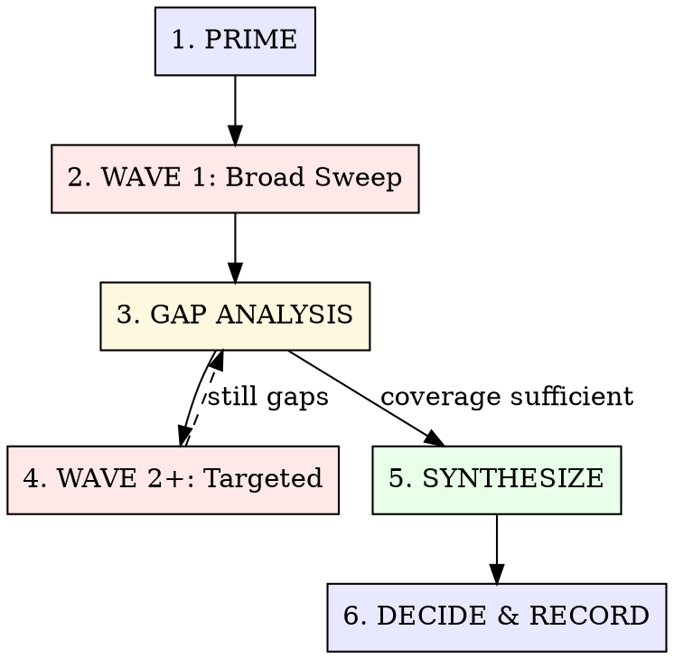

# Multi-Agent Research

Wave-based knowledge gathering with deferred synthesis. Mined from 300+ real research dispatches: the pattern that consistently produces actionable intelligence.

**Core insight:** Research breadth-first, synthesize after. Conclusions drawn from the first three results miss nuance the fourth wave would have surfaced. Deploying agents in waves and accumulating findings before synthesizing produces sharper recommendations.

**How to read this skill:** the wave structure below is a shape, not a procedure. Quick mode skips most of it. Standard research uses one wave plus targeted follow-ups. Deep dives genuinely need the full pattern. Calibrate to the question, not the framework.

## The Shape


```dot
digraph research {
    rankdir=TB;
    node [shape=box];

    "1. PRIME" [style=filled, fillcolor="#e8e8ff"];
    "2. WAVE 1: Broad Sweep" [style=filled, fillcolor="#ffe8e8"];
    "3. GAP ANALYSIS" [style=filled, fillcolor="#fff8e0"];
    "4. WAVE 2+: Targeted" [style=filled, fillcolor="#ffe8e8"];
    "5. SYNTHESIZE" [style=filled, fillcolor="#e8ffe8"];
    "6. DECIDE & RECORD" [style=filled, fillcolor="#e8e8ff"];

    "1. PRIME" -> "2. WAVE 1: Broad Sweep";
    "2. WAVE 1: Broad Sweep" -> "3. GAP ANALYSIS";
    "3. GAP ANALYSIS" -> "4. WAVE 2+: Targeted";
    "4. WAVE 2+: Targeted" -> "3. GAP ANALYSIS" [label="still gaps", style=dashed];
    "3. GAP ANALYSIS" -> "5. SYNTHESIZE" [label="coverage sufficient"];
    "5. SYNTHESIZE" -> "6. DECIDE & RECORD";
}
```

---

## Phase 1: PRIME

Lean on existing knowledge before spawning agents. Re-running research that already lives in Sibyl burns tokens and produces duplicate entries.

### Common moves

- **Search Sibyl first:** `sibyl search "<research topic>"`, `sibyl search "<related technology>"`, `sibyl search "<prior decision in this area>"`. Surface what's already known before generating new findings.
- **Check for staleness.** Fast-moving topics (frameworks, models, cloud services) usually warrant re-research even when Sibyl has recent entries; treat the existing knowledge as a baseline. Stable topics with recent entries often don't need a fresh pass at all. One class is never exempt: version, "latest", and SOTA facts expire no matter how recent the entry feels — recalled memory routes the investigation, live state decides. Re-verify those against the primary source before they drive a dispatch or a recommendation. Same rot law for prior research docs: anything older than the reality it describes gets a per-claim liveness check against live sources and current code before it shapes a decision.
- **Premise-check the target.** Confirm the data, repo, or question actually exists — and disambiguate which one — before any agent launches. A wave pointed at a wrong or empty target manufactures findings.
- **Sharpen the research question.** "Research databases" is too vague to dispatch on. "Compare PostgreSQL vs CockroachDB for multi-region write-heavy workloads with <10ms p99 latency" gives agents enough scope to do useful work.
- **Calibrate the research budget** to the decision the research is feeding:

  | Depth          | Agents | When                                         |
  | -------------- | ------ | -------------------------------------------- |
  | **Quick scan** | 2-3    | Known domain, just need latest info          |
  | **Standard**   | 5-10   | Technology evaluation, architecture options  |
  | **Deep dive**  | 10-30  | Greenfield decisions, SOTA analysis          |
  | **Exhaustive** | 30-60+ | New project inception, competitive landscape |

### Source quality contract

This bit is non-negotiable: the value of research collapses when claims rest on stale blog posts. Specific claim types deserve specific source standards:

| Claim type              | Preferred source                                 |
| ----------------------- | ------------------------------------------------ |
| Current version         | Package registry, release page, or official CLI  |
| CLI flags / config keys | Official docs or local `--help` output           |
| Security frameworks     | OWASP, NIST, SLSA/OpenSSF, CIS, ISO, PCI sources |
| Cloud/provider behavior | Provider docs and current changelog              |
| Research papers / SOTA  | Paper, benchmark repo, or authors' artifact      |
| Community health        | Repository activity plus issue/release cadence   |

When primary sources disagree with secondary ones, trust the primary source and note the discrepancy. Date volatile facts explicitly, and prefer commands/sources the next agent can rerun over screenshots that go stale.

**The hierarchy: a version-pinned artifact you can actually run beats official docs, which beat blog posts, which beat memory.** Names that cross a system boundary — metric names, config keys, CRD fields — get read from the actual emitter or consumer at the pinned version. And facts reported by your own research agents are claims, not evidence: before synthesis builds on a load-bearing claim, open the primary source yourself.

---

## Phase 2: WAVE 1: Broad Sweep

Deploy the first wave of agents across the full research surface. The goal is breadth; accept that some agents will produce mediocre output, that's what gap analysis is for.

### What good agent prompts have

Vague prompts produce vague research. Each agent benefits from:

- **One specific topic** (not "research everything about X")
- **An output file path** (no ambiguity about where to write)
- **Temporal grounding** (current month stated, memory declared stale, `[unverified]` flags required)
- **Search hints** (include year: "search [topic] 2026")
- **8-12 numbered coverage items** that scope the research precisely
- **Source quality guidance** ("prefer official docs and GitHub repos over blog posts")

### Wave 1 Template

```markdown
Research [SPECIFIC_TOPIC] for [PROJECT/DECISION].

Create a research doc at docs/research/[filename].md covering:

1. Current state (latest version, recent changes)
2. [Specific capability A relevant to our use case]
3. [Specific capability B]
4. [Integration with our stack: list specific technologies]
5. Performance characteristics / benchmarks
6. Known limitations and gotchas
7. Community health (stars, activity, maintenance)
8. Comparison with alternatives (name 2-3 specific alternatives)

Current month is [MONTH YEAR]. Your training data is stale — do NOT
answer from memory for versions, features, pricing, or capabilities.
Use WebSearch for current information. Include dates on all facts.
Cite sources with URLs. Flag any claim you can't pin to a primary
source as [unverified].
```

### Deployment notes

- **Use the host's fan-out verb.** Claude Code: parallel background `Agent` calls. Codex: `spawn_agent`. Pi (pi-nova pack): the `dispatch` tool with `"mode": "parallel"` researcher tasks — keep each task narrow, source-quality explicit, and output-oriented.
- **Background by default.** Research agents have no inter-dependencies, so foreground execution serializes work that should run in parallel.
- **Mind the delegation gate.** Some hosts (Codex, as of Jul 2026) only allow spawning subagents when the user explicitly asked for delegation. Without that ask, run the research lanes sequentially yourself.
- **One file per agent.** Shared outputs create write contention and lose attribution.
- **Group by theme** when researching many topics. 12 separate dispatches become 3-4 thematic clusters with clearer synthesis later.

### Coverage Strategy

For technology evaluations, cover these dimensions:

| Dimension       | Question                          |
| --------------- | --------------------------------- |
| **Capability**  | Does it do what we need?          |
| **Performance** | Is it fast enough?                |
| **Ecosystem**   | Does it integrate with our stack? |
| **Maturity**    | Is it production-ready?           |
| **Community**   | Will it be maintained in 2 years? |
| **Cost**        | What does it cost at our scale?   |
| **Migration**   | How hard is it to adopt/abandon?  |

**Run an internal lane alongside the web wave.** When research feeds a decision about an existing system, the decisive constraint usually lives in your own repo or live state — the auth pattern, session semantics, or pinned version the winning option must survive. Finding it is a grep, not a research agent, and it costs zero agents. A web-perfect answer can still ship a broken migration.

---

## Phase 3: GAP ANALYSIS

After Wave 1, look for what's missing before synthesizing. Premature synthesis is the most common research failure: the answer feels obvious after three docs and turns out to be wrong after eight.

### What to look for

- **Coverage gaps**: dimensions the wave didn't touch, missing comparisons, questions raised but not answered
- **Contradictions**: agents reaching different conclusions on the same question (often signal for verification agents)
- **Bias signals**: all-positive findings (suspicious, look for failure cases), only-official-docs (need community experience), same sources cited repeatedly (need source diversity)
- **False consensus**: agents — or a second model — converging on the same version or SOTA fact is not confirmation; shared training data agrees with itself. A live registry or release-page fetch settles version claims, never vote count.

### Decision Point

| Finding                        | Action                                |
| ------------------------------ | ------------------------------------- |
| Good coverage, minor gaps      | Synthesize now, note gaps             |
| Significant gaps               | Deploy Wave 2 targeted agents         |
| Contradictory findings         | Deploy verification agents to resolve |
| Entirely new direction emerged | Deploy Wave 2 in new direction        |

---

## Phase 4: WAVE 2+: Targeted Research

Fill specific gaps identified in the analysis. Wave 2 agents differ from Wave 1 in shape:

- **Smaller scope**: one specific question per agent
- **Higher quality bar**: "find production experience reports, not just docs"
- **Cross-reference prompts**: "Agent X found [claim], verify against [alternative source]"
- **Deep reads**: "Read the full README and API docs for [library], not just the landing page"

### When to stop

Stop deploying waves when the research question can be answered with confidence, when key claims have 2+ independent sources, or when the user signals "enough, let's decide." The real stopper is yield: a wave that surfaces no new load-bearing findings is the last wave.

Kill low-yield lanes out loud mid-wave — "this search isn't paying rent" — and re-anchor to a higher-signal source rather than re-running variants of the same walk.

Three waves is a sound default budget, not a hard stop. Waves that keep surfacing new load-bearing findings can continue past it; waves that oscillate instead of narrowing mean the question itself needs reframing.

---

## Phase 5: SYNTHESIZE

**Combine all findings into actionable intelligence.**

### Synthesis Structure

```markdown
## Research: [Topic]

### TL;DR

[2-3 sentences. The answer, not the journey.]

### Recommendation

[Clear choice with justification. Don't hedge, pick one.]

### Options Evaluated

| Option | Fit | Maturity | Perf | Ecosystem | Verdict         |
| ------ | --- | -------- | ---- | --------- | --------------- |
| A      | ... | ...      | ...  | ...       | Best for [X]    |
| B      | ... | ...      | ...  | ...       | Best for [Y]    |
| C      | ... | ...      | ...  | ...       | Avoid: [reason] |

### Key Findings

1. [Most important finding with source]
2. [Second most important]
3. [Third most important]

### Risks & Gotchas

- [Known issue or limitation]
- [Migration complexity]
- [Hidden cost]

### Sources

- [Source 1](url): [what it contributed]
- [Source 2](url): [what it contributed]
```

### Synthesis principles

- **Lead with the recommendation.** Forcing the reader to wade through findings to find the answer is the most common synthesis failure.
- **Separate facts from opinions.** "PostgreSQL supports JSONB" (fact) vs "PostgreSQL is better for this use case" (opinion backed by evidence). Both are useful; conflating them isn't.
- **Include dissenting evidence.** If one source contradicts the recommendation, name it. Cherry-picked synthesis is worse than no synthesis.
- **Date everything.** "As of [month] [year], [library] is at v4.2." Research spoils fast.
- **Note confidence level.** "High confidence: well-documented" / "Low confidence: based on one blog post" gives the reader the calibration they need.

---

## Phase 6: DECIDE & RECORD

**Lock in the decision and capture it for future sessions.**

### Actions

1. **Present the synthesis** to the user with a clear recommendation

2. **Record in Sibyl.** The capture carries: options evaluated, the choice and why, the key risk, primary source URLs, and today's date. Use the `sibyl` skill for the current verbs — CLI shapes drift faster than skills. If the capture fails (server down, verb changed), park the entry verbatim in the synthesis flagged "NOT captured" — never silently drop the Record beat, and never block on it.

3. **Archive research docs**: keep the wave outputs for reference:
   - If in a project: `docs/research/[topic]/`
   - If general knowledge: Sibyl learning entry is sufficient

4. **Exit to next action:**

   | Next Step                  | When                                             |
   | -------------------------- | ------------------------------------------------ |
   | `/hyperskills:brainstorm`  | Research surfaced multiple viable approaches     |
   | `/hyperskills:plan`        | Decision made, ready to decompose implementation |
   | `/hyperskills:orchestrate` | Decision made, work is parallelizable            |
   | Direct implementation      | Research confirmed a simple path                 |

### The exit artifact

Research output is not a build contract. Before it feeds `plan`, force the product cuts: the first workflow, the minimal boundaries, one vertical slice. When the decision is "build," prefer exiting into the riskiest narrow slice — a canary wedge that proves or breaks the approach before anything gets polished — over a fleet-wide plan. Triage findings as adopt / borrow the ideas / ignore with confidence.

---

## Quick Research Mode

For focused questions that don't need the full wave protocol:

1. **Search Sibyl** (always)
2. **2-3 targeted searches** (WebSearch + WebFetch on key URLs)
3. **Synthesize inline** (no separate docs)
4. **Record if non-obvious** (Sibyl learning)

**Use when:** "What's the latest version of X?", "Does Y support Z?", "What's the recommended way to do W?"

---

## Research Patterns by Type

| Type                      | The non-obvious move                                                                                                                                                                                     |
| ------------------------- | -------------------------------------------------------------------------------------------------------------------------------------------------------------------------------------------------------- |
| **Technology evaluation** | Wave 2 hunts production experience reports and benchmarks, not more docs — and the internal lane runs alongside the whole time.                                                                            |
| **Codebase archaeology**  | Synthesize into an architecture diagram + dependency map, not prose. Often it IS the internal lane of a larger evaluation.                                                                                 |
| **SOTA analysis**         | Vet headline claims for comparability — same benchmark version? harness released? tuned on test? gold leakage? — and verdict as "adopt the architecture, ignore the ritual." A debunked premise is a first-class result. |
| **Competitive landscape** | Absence is a finding: report what nobody is doing as deliberately as what everyone is. Verify from opened artifacts, not search-result snippets.                                                           |

---

## Anti-Patterns

| Anti-Pattern                         | Fix                                                                             |
| ------------------------------------ | ------------------------------------------------------------------------------- |
| Synthesizing after Wave 1 only       | Wait for gap analysis, premature conclusions miss nuance                        |
| 50 agents with "research everything" | Specific scope per agent, vague prompts produce vague results                   |
| Only official documentation          | Include community experience, docs show intent, community shows reality         |
| No dates on findings                 | Date everything, research spoils faster than produce                            |
| No recommendation                    | Force a decision, "more research needed" is only valid with a specific question |
| Researching what Sibyl already knows | Always prime first, don't burn tokens re-discovering known patterns             |

---

## What This Skill is NOT

- **Not a substitute for reading code.** If the answer is in the codebase, read the codebase.
- **Not an infinite loop.** Three waves is the default budget; the stopper is yield, not count. When waves oscillate instead of narrowing, reframe the question.
- **Not required for known domains.** If you already know the answer, just say so and cite your knowledge.
- **Not a delay tactic.** Research serves a decision. If no decision follows, the research was waste.
