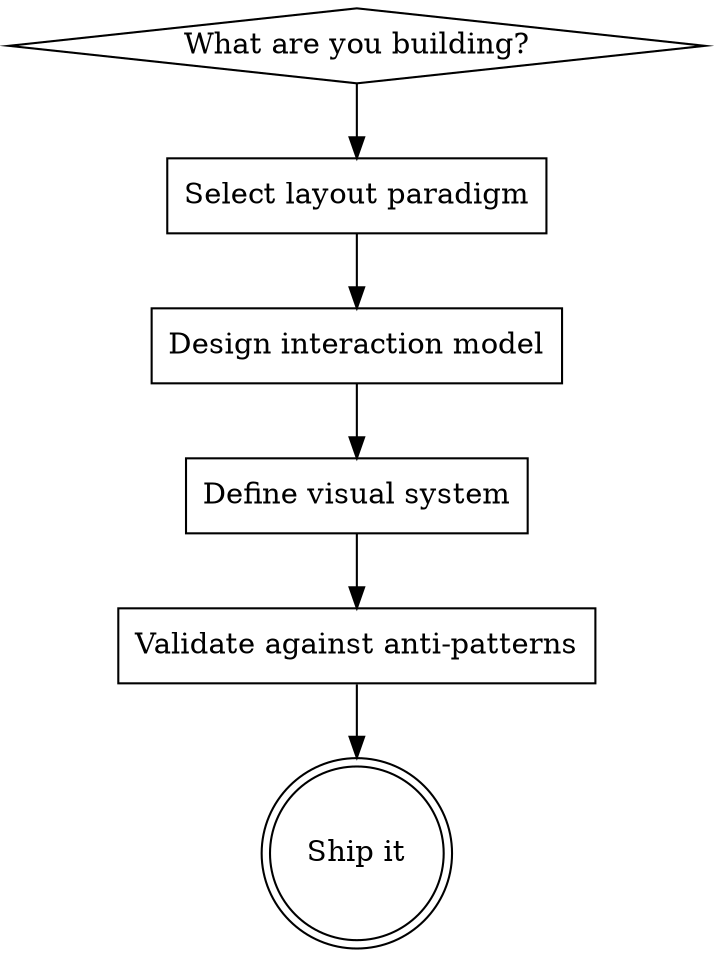

# TUI Design System

Universal design patterns for building exceptional terminal user interfaces. Framework-agnostic — works with Ratatui, Ink, Textual, Bubbletea, or any TUI toolkit.

**Core philosophy:** TUIs earn their power through spatial consistency, keyboard fluency, and information density that respects human attention. Design for the expert's speed without abandoning the beginner's discoverability.

## TUI Design Process



---

## 1. Layout Paradigm Selector

Choose your primary layout based on what you're building:

| App Type | Paradigm | Examples |
|----------|----------|----------|
| File manager | Miller Columns | yazi, ranger |
| Git / DevOps tool | Persistent Multi-Panel | lazygit, lazydocker |
| System monitor | Widget Dashboard | btop, bottom, oxker |
| Data browser / K8s | Drill-Down Stack | k9s, diskonaut |
| SQL / HTTP client | IDE Three-Panel | harlequin, posting |
| Shell augmentation | Overlay / Popup | atuin, fzf |
| Log / event viewer | Header + Scrollable List | htop, tig |

### Persistent Multi-Panel
All panels visible simultaneously. Focus shifts between them. Users build spatial memory — "branches are always top-left."

```
┌─ Status ──┬─────────── Detail ──────────┐
├─ Files ───┤                              │
│ > file.rs │  diff content here...        │
│   main.rs │                              │
├─ Branches ┤                              │
│ * main    │                              │
│   feat/x  │                              │
├─ Commits ─┤                              │
│ abc1234   │                              │
└───────────┴──────────────────────────────┘
  [q]uit [c]ommit [p]ush [?]help
```

**When to use:** Multi-faceted tools where users need simultaneous context (git clients, container managers, monitoring).
**Key rule:** Panels maintain fixed positions across sessions. Never rearrange without user action.

### Miller Columns
Three-pane past/present/future navigation. Parent directory (left), current (center), preview (right).

```
┌── Parent ──┬── Current ──┬── Preview ────────┐
│   ..       │ > config/   │ port: 8080        │
│   src/     │   lib/      │ host: localhost    │
│ > config/  │   main.rs   │ log_level: debug   │
│   tests/   │   mod.rs    │ db_url: postgres://│
└────────────┴─────────────┴───────────────────┘
```

**When to use:** Hierarchical data navigation (file systems, tree structures, nested configs).
**Key rule:** Preview pane content adapts to selection type — code gets highlighting, images render, directories show contents.

### Drill-Down Stack
`Enter` descends, `Esc` ascends. Browser-like navigation through hierarchical data.

**When to use:** Deep hierarchies where showing all levels simultaneously is impractical (Kubernetes resources, database schemas).
**Key rule:** Always show the current navigation path as a breadcrumb. Provide `:resource` command-mode for direct jumps.

### Widget Dashboard
Self-contained widget panels with independent data. All information visible at once, no navigation required.

```
┌─── CPU ──────────────┬─── Memory ──────────┐
│ ▁▂▃▅▇█▇▅▃▂▁▂▃▅▇     │ ████████░░ 78%      │
│ core0: 45% core1: 67%│ 12.4G / 16.0G       │
├─── Network ──────────┼─── Disk ────────────┤
│ ▲ 1.2 MB/s  ▼ 340KB/s│ /: 67%  /home: 45%  │
├─── Processes ────────┴─────────────────────┤
│ PID   USER  CPU%  MEM%  CMD                 │
│ 1234  root  23.4  4.5   postgres             │
└─────────────────────────────────────────────┘
```

**When to use:** Monitoring, real-time status, system dashboards.
**Key rule:** Each widget is self-contained with its own title. Use braille/block characters for high-density data.

### IDE Three-Panel
Sidebar (left), editor/main (center), detail/output (bottom). Tab bar along top.

**When to use:** Editing-focused tools (SQL clients, HTTP tools, config editors).
**Key rule:** Sidebar toggles with a single key. Center panel supports tabs. Bottom panel can expand to full height.

### Overlay / Popup
TUI appears on demand over the shell, disappears after use.

**When to use:** Shell augmentations (history search, file picker, command palette).
**Key rule:** Configurable height. Return selection to the caller. Never disrupt scrollback.

### Header + Scrollable List
Fixed header with meters/stats, scrollable data below, function bar at bottom.

**When to use:** Single-list tools with metadata (process viewers, log viewers, sorted listings).
**Key rule:** The header creates a natural "overview then detail" reading flow. Sort by the most actionable dimension by default.

---

## 2. Responsive Terminal Design

Terminals resize. Your TUI must handle it gracefully.

| Strategy | When |
|----------|------|
| **Proportional split** | Panels maintain percentage ratios on resize |
| **Priority collapse** | Less important panels hide first below minimum width |
| **Stacking** | Panels collapse to title-only bars, active one expands (zellij pattern) |
| **Breakpoint modes** | Switch layout entirely below a threshold (e.g., multi-panel → single panel) |
| **Minimum size gate** | Display "terminal too small" if below usable minimum |

**Rules:**
- Define a minimum terminal size (typically 80x24). Below that, show a resize message.
- Never crash on resize. Handle `SIGWINCH` gracefully.
- Use constraint-based layouts (percentages, min/max, ratios) — not absolute positions.
- Test at 80x24, 120x40, and 200x60 to verify scaling.

---

## 3. Interaction Model

### Navigation Style Selector

| App Complexity | Recommended Model |
|----------------|-------------------|
| Single-purpose, <20 actions | Direct keybinding (every key = action) |
| Multi-view, complex | Vim-style modes + contextual footer |
| IDE-like, many features | Command palette + tabs + vim motions |
| Data browser | Drill-down + fuzzy search + `:` command mode |

### Keyboard Design Layers

Design keybindings in four progressive layers:

| Layer | Keys | Audience | Always show? |
|-------|------|----------|--------------|
| **L0: Universal** | Arrow keys, Enter, Esc, q | Everyone | Yes (footer) |
| **L1: Vim motions** | hjkl, /, ?, :, gg, G | Intermediate | Yes (footer) |
| **L2: Actions** | Single mnemonics: d(elete), c(ommit), p(ush) | Regular users | On `?` help |
| **L3: Power** | Composed commands, macros, custom bindings | Power users | Docs only |

**Keybinding conventions (lingua franca):**
- `j`/`k` — move down/up
- `h`/`l` — move left/right (or collapse/expand)
- `/` — search
- `?` — help overlay
- `:` — command mode
- `q` — quit (or `Esc` to go back one level)
- `Enter` — select / confirm / drill in
- `Tab` — switch focus between panels
- `Space` — toggle selection
- `g`/`G` — jump to top/bottom

**Never bind:** `Ctrl+C` (interrupt), `Ctrl+Z` (suspend), `Ctrl+\` (quit signal). These belong to the terminal.

### Focus Management

- Only one widget receives keyboard input at a time
- **Tab** cycles focus forward, **Shift+Tab** backward
- Focus indicator: highlighted border, color change, or cursor presence
- Unfocused panels: dimmed or thinner borders
- Modal dialogs create focus traps — background receives no events
- Nested focus: outer container routes events to focused child

### Search & Filtering

The universal pattern: press `/`, type query, results filter live.

- `n`/`N` — next/previous match
- `Esc` — dismiss search
- Fuzzy matching by default, `'` prefix for exact match
- Highlight matched characters in results
- Preview pane updates for highlighted result

### Help System — Three Tiers

| Tier | Trigger | Content | Audience |
|------|---------|---------|----------|
| **Always visible** | Footer bar | 3-5 essential shortcuts | Everyone |
| **On demand** | `?` key | Full keybinding overlay for current context | Regular users |
| **Documentation** | `--help`, man page | Complete reference | Power users |

**Footer format:** `[q]uit [/]search [?]help [Tab]focus [Enter]select`

Context-sensitive footers update based on the active panel or mode. Show only what's actionable *right now*.

### Dialogs & Confirmation

| Action Severity | Pattern |
|-----------------|---------|
| Reversible | Just do it, show brief confirmation in status bar |
| Moderate (delete file) | Inline "Press y to confirm" |
| Severe (drop database) | Modal dialog requiring resource name input |
| Irreversible batch | `--dry-run` flag + explicit confirmation |

- Modal overlays: render popup on top of dimmed/blurred background
- Toast notifications: auto-dismiss after 3-5 seconds, no interaction required
- Status bar messages: vim-style one-liner feedback, auto-fade

---

## 4. Color Design System

### Terminal Color Tiers

Design for graceful degradation across all three tiers:

| Tier | Escape Sequence | Colors | Strategy |
|------|----------------|--------|----------|
| **16 ANSI** | `\033[31m` | 16 (relative) | Foundation. Terminal theme controls appearance. |
| **256 Color** | `\033[38;5;{n}m` | 256 (16 relative + 240 fixed) | Extended palette. Fixed colors may clash with themes. |
| **True Color** | `\033[38;2;{r};{g};{b}m` | 16.7M (absolute) | Full control. Requires `COLORTERM=truecolor`. |

**Detection hierarchy:**
1. `$COLORTERM` = `truecolor` or `24bit` → true color
2. `$TERM` contains `256color` → 256 colors
3. `$NO_COLOR` is set → disable all color
4. Default → 16 ANSI colors

**Golden rule:** Your TUI must be *usable* in 16-color mode. True color *enhances* — it never *creates* the hierarchy.

### Semantic Color Slots

Define colors by function, not appearance. Map semantics to actual colors through your theme:

| Slot | Purpose | Typical Dark Theme |
|------|---------|-------------------|
| `fg.default` | Body text | Off-white (#c0caf5) |
| `fg.muted` | Secondary text, metadata | Gray (#565f89) |
| `fg.emphasis` | Headers, focused items | Bright white (#e0e0e0) |
| `bg.base` | Primary background | Near-black (#1a1b26) |
| `bg.surface` | Panel/widget backgrounds | Slightly lighter (#24283b) |
| `bg.overlay` | Popup/dialog backgrounds | Lighter still (#414868) |
| `bg.selection` | Selected item highlight | Distinct (#364a82) |
| `accent.primary` | Interactive elements, focus | Brand color (#7aa2f7) |
| `accent.secondary` | Supporting interactions | Complementary (#bb9af7) |
| `status.error` | Errors, deletions | Red (#f7768e) |
| `status.warning` | Warnings, caution | Yellow (#e0af68) |
| `status.success` | Success, additions | Green (#9ece6a) |
| `status.info` | Informational | Cyan (#7dcfff) |

**Never hardcode hex values in widget code.** Always reference semantic slots.

### Visual Hierarchy Techniques

Color is one tool among several. Use them in combination:

| Technique | Effect | Use For |
|-----------|--------|---------|
| **Bold** (SGR 1) | Increases visual weight | Headers, labels, active items |
| **Dim** (SGR 2) | Decreases visual weight | Metadata, timestamps, secondary info |
| **Italic** (SGR 3) | Semantic distinction | Comments, types, annotations |
| **Underline** (SGR 4) | Links, actionable items | Clickable elements, URLs |
| **Reverse** (SGR 7) | Swaps fg/bg | Selection highlight (always works!) |
| **Strikethrough** (SGR 9) | Negation | Deleted items, deprecated features |

**Hierarchy recipe:** 80% of content in `fg.default`. Headers in bold + `fg.emphasis`. Metadata in dim + `fg.muted`. Status in their semantic colors. Accents for interactive elements only.

### Background Layering

Create depth without borders by layering background lightness:

```
bg.base (darkest) → bg.surface → bg.overlay (lightest)
```

Each step ~5-8% lighter in dark themes. The eye perceives depth from the contrast gradient. This reduces the need for box-drawing borders while maintaining clear visual zones.

### Theme Architecture

Follow the Base16 pattern: define 16 named color slots, map them semantically:
- **8 monotones** (base00-base07): background/foreground gradient
- **8 accents** (base08-base0F): syntax/semantic colors

Ship a dark theme by default. Detect light/dark terminal via OSC escape query or `terminal-light` crate. Provide at least one light variant. Respect `NO_COLOR`.

### Accessibility Requirements

- **WCAG AA contrast**: 4.5:1 ratio for body text, 3:1 for large text/UI elements
- **Never use color alone**: Pair with symbols (checkmark, X, triangle), text labels, position, or typography
- **Color blindness safe pairs**: blue+orange, blue+yellow, black+white. Avoid relying on red vs green.
- **Test**: monochrome mode, color blindness simulator, 3+ terminal emulators, light and dark themes

---

## 5. Data Visualization

### Character-Resolution Building Blocks

| Element | Characters | Resolution | Use For |
|---------|-----------|------------|---------|
| **Full blocks** | `█▉▊▋▌▍▎▏` | 8 steps/cell | Progress bars, bar charts |
| **Shade blocks** | `░▒▓█` | 4 densities | Heatmaps, density plots |
| **Braille** | `⠁⠂⠃...⣿` (U+2800-U+28FF) | 2x4 dots/cell | High-res line graphs, scatter plots |
| **Sparkline** | `▁▂▃▄▅▆▇█` | 8 heights | Inline mini-charts |

### Common Widgets

| Widget | Pattern | Tips |
|--------|---------|------|
| **Progress bar** | `[████████░░░░] 67%` | Show percentage + ETA. Color gradient green→yellow→red by urgency. |
| **Sparkline** | `▁▂▃▅▇█▇▅▃▂` | Perfect for inline time-series in headers/status bars. |
| **Gauge** | `CPU [██████████░░] 83%` | Label + bar + value. Color by threshold. |
| **Table** | Sortable columns, zebra stripes | Align numbers right, text left. Truncate with `…`. |
| **Tree** | `├── `, `└── `, `│   ` guides | Indent 2-4 chars per level. Expand/collapse with Enter. |
| **Diff** | Green `+` lines, red `-` lines | Word-level highlighting within changed lines elevates quality. |
| **Log** | Colored level, timestamp, message | TRACE=dim, DEBUG=cyan, INFO=default, WARN=yellow, ERROR=red, FATAL=red+bold. |

### Spinner Selection

| Context | Spinner | Interval |
|---------|---------|----------|
| Default / modern | Braille dots `⠋⠙⠹⠸⠼⠴⠦⠧⠇⠏` | 80ms |
| Minimal | Line `-\|/` | 130ms |
| Heavy processing | Blocks `▖▘▝▗` | 100ms |
| Fun / branded | Custom frames | 70-100ms |

Use spinners for indeterminate operations. Progress bars for determinate. Show spinners only after 200ms delay to avoid flash on fast operations.

---

## 6. Animation & Motion

### Flicker-Free Rendering Stack

Three layers, all required for smooth TUI rendering:

1. **Double buffering** — Render to off-screen buffer, diff against previous frame, emit only changed cells
2. **Synchronized output** — Wrap frame in `CSI ? 2026 h` ... `CSI ? 2026 l` for atomic terminal render
3. **Batched writes** — Combine all escape sequences into a single `write()` syscall

### When to Animate

| Situation | Animation | Duration |
|-----------|-----------|----------|
| View transition | Fade or slide | 100-200ms |
| Selection change | Instant highlight | 0ms (never animate) |
| Data loading | Spinner or skeleton | Until complete |
| Success feedback | Brief flash/checkmark | 1-2 seconds |
| Panel resize | Immediate reflow | 0ms |
| Chart data update | Smooth value transition | 200-500ms |

**Rule:** Animations must never delay user input. If the user presses a key during a transition, cancel it and respond immediately.

### Real-Time Updates

- Cap refresh to 15-30 FPS for dashboards (saves CPU, prevents flicker)
- Use differential updates — only redraw changed cells
- Stream text (AI responses, logs) at a readable pace, not network burst speed
- Background operations: show status in a status bar widget, never block the main loop

---

## 7. The Seven Design Principles

1. **Keyboard-first, mouse-optional** — Every feature accessible via keyboard. Mouse enhances but never replaces. `Shift+click` must bypass mouse capture for text selection.

2. **Spatial consistency** — Panels stay in fixed positions. Users build mental maps. Never rearrange without explicit user action. Tabs provide stable landmarks.

3. **Progressive disclosure** — Show 5 essential shortcuts in the footer. Full help behind `?`. Complete reference in docs. The floor is accessible, the ceiling is unlimited.

4. **Async everything** — Never freeze the UI. File operations, network requests, scans all run in the background with progress indication. Cancel with `Esc`.

5. **Semantic color** — Color encodes meaning, not decoration. If you removed all color, the interface should still be *usable* through layout, typography, and symbols.

6. **Contextual intelligence** — Keybindings update per panel. Status bars reflect current state. Help shows what's actionable right now, not everything ever.

7. **Design in layers** — Start monochrome (usable?). Add 16 ANSI colors (readable?). Layer true color (beautiful?). Each tier must stand independently.

---

## 8. Anti-Pattern Checklist

Validate your design against these ranked pitfalls (ordered by real-world complaint frequency):

| # | Anti-Pattern | Fix |
|---|-------------|-----|
| 1 | **Colors break on different terminals** | Use 16 ANSI colors as foundation. Test 3+ emulators + light/dark themes. |
| 2 | **Flickering / full redraws** | Double buffer + synchronized output + batched writes. Overwrite, never clear. |
| 3 | **Undiscoverable keybindings** | Context-sensitive footer + `?` help overlay + Which-Key-style hints. |
| 4 | **Broken on Windows / WSL** | Test on Windows Terminal. Avoid advanced Unicode beyond box-drawing. |
| 5 | **Unicode rendering inconsistency** | Stick to box-drawing + block elements. Restrict emoji to Unicode 9.0. |
| 6 | **Terminal multiplexer incompatibility** | Test inside tmux and zellij. Mouse capture must not break selection. |
| 7 | **No accessibility support** | Respect `NO_COLOR`, provide monochrome mode, never color-only meaning. |
| 8 | **Blocking UI during operations** | Show feedback within 100ms. Use async + spinners + progress bars. |
| 9 | **Modal confusion** | Always show current mode in status bar. Cursor shape changes per mode. |
| 10 | **Over-decorated chrome** | Borders and colors serve content, not ego. The content IS the interface. |

## 9. Compatibility Checklist

Before shipping, verify:

- [ ] Works at 80x24 minimum terminal size
- [ ] Handles terminal resize without crash
- [ ] Looks correct on dark AND light terminal themes
- [ ] Respects `NO_COLOR` environment variable
- [ ] Works inside tmux / zellij / screen
- [ ] Functions over SSH (no features require local-only protocols)
- [ ] Mouse capture doesn't break text selection (`Shift+click`)
- [ ] All features accessible via keyboard alone
- [ ] No ANSI escape sequence leaks to piped/redirected output
- [ ] Exits cleanly on `Ctrl+C` / `SIGINT` (restores terminal state)

---

For Unicode character reference tables and border style gallery, see [visual-catalog.md](references/visual-catalog.md).
For real-world TUI app design analysis and inspiration, see [app-patterns.md](references/app-patterns.md).
